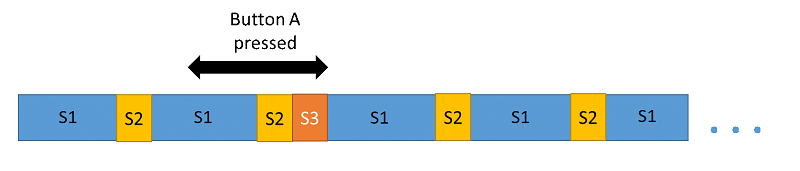

# micro:bit

## Про платформу

https://makecode.com/about

Microsoft MakeCode — це платформа для створення інтерактивного та захоплюючого досвіду програмування для новачків у світі програмування. Платформа забезпечує основу для адаптованого кодування для створення та запуску програм користувача на реальному апаратному забезпеченні або в симульованій цілі.

Основна мета MakeCode — представити програмування доступним і привабливим способом. Для цього MakeCode використовує модель програмування блоків, щоб дозволити користувачеві вивчити концепції кодування більш відчутним способом. Коли користувач навчиться працювати з елементами та структурою кодування, він зможе створювати більш складні програми. Блоки відображаються безпосередньо на фактичні рядки коду на мові програмування. Отже, як тільки користувач відчує впевненість і знайомство з тим, як працюють блоки, він може переходити до написання більш складних програм на самій мові програмування.

MakeCode — це не універсальна платформа програмування, а розширювана структура для створення будь-якої кількості можливостей на основі MakeCode, налаштованих для конкретної мети. Ці цілі зазвичай являють собою одноплатні комп’ютери в стилі виробника або освітні, але також можуть бути імітованими лише «м’якими» цілями. Список підтримуваних MakeCode цілей можна знайти на MakeCode.com.

Цільові розробники використовують структуру MakeCode і розширюють її, налаштовуючи інтерфейс користувача та додаючи додаткові блоки та функції, специфічні для їх апаратного забезпечення.

## Основи MakeCode

Усі частини процесу програмування MakeCode разом створюють те, що зазвичай називають «редактором». Незважаючи на те, що MakeCode включає набагато більше, ніж просто редактори, цей конкретний термін використовується частіше, а не посилається на мету MakeCode як на «досвід програмування».

Щоб описати основи редактора MakeCode, це поєднання: редактора блоків, редактора мови, цільового симулятора та генератора цільового коду.

### Blocks editor

The Blocks editor is where  the user can interactively create a program by “pulling” or “dragging”  blocks onto the editor workspace. The blocks are found under the  categories available in the Blocks Toolbox aligning next to the  workspace.

Blocks represent coding actions and programming structures that would traditionally be written in text. Coding elements such as loops,  conditonal statements, and events are containing blocks with other  blocks fitting inside. Functions and assignments are “flat” blocks that  fit into others. Variables, values, and properties are mini-blocks that  fit into slots of functions, assignments, or evaluators.


A single discrete block may have selectors for values or variables, and possibly slots for values or parameters.


### Мовний редактор

Редактор мови доповнює редактор блоків у MakeCode. Коли для функцій, операторів і призначень визначено блоки, відповідний код у редакторі мови представлятиме відповідні блоки в редакторі блоків. Однак у редакторі мови користувач може написати додатковий код більшої складності, ніж той, який доступний із блоками.


### Симулятор

Симулятор має візуальні елементи, які представляють функції цільової дошки. Розробники мети MakeCode можуть додавати елементи зображення та дії коду, щоб імітувати те, що відбувається, коли програма запускається на дошці.


Коли програма готова до тестування або використання на цільовій платі, користувач починає завантаження. У MakeCode дія завантаження перетворить код у редакторі у рідний формат цільового коду та згенерує [HEX-файл](https://github.com/microsoft/uf2) для копіювання на дошку.


The board appears as a file storage device connected to a user’s  computer. The HEX file is simply copied directly to this storage  location. A program loader already present on the board reads the HEX  file. It flashes it into memory and then runs the new program.


## MakeCode and PXT

Microsoft MakeCode is based on the open source project [Microsoft Programming Experience Toolkit (PXT)](https://github.com/microsoft/pxt). The project is hosted as a public repository on [GitHub](https://github.com).


MakeCode [target](https://makecode.com/target-creation) — це повний редактор MakeCode, розроблений для певної плати чи цільової платформи. Функціонуючий редактор створено на основі PXT або успадковано від нього. Код і ресурси цільового редактора знаходяться в окремому репозиторії GitHub.


Завдяки розширюваності PXT можна створювати та публікувати проекти [розширень](https://makecode.com/extensions), щоб додавати додаткові блоки та інші функції до існуючих редакторів. Розширення просто підключаються до редактора під час його роботи, додаючи нові функції.


## micro:bit - реактивна система

https://makecode.microbit.org/device/reactive

### Обчислювальні системи

Яким типом *обчислювальної системи* є micro:bit?

Існують різні типи обчислювальних систем для вирішення різних проблем, які виникають на практиці: *системи обробки транзакцій* використовуються банками для обробки величезної кількості фінансових операцій своїх клієнтів; *розподілені системи* роблять набір мережевих комп’ютерів одним великим комп’ютером (як пошукова система Google); існують також *паралельні системи*, такі як графічні карти, які виконують величезну кількість примітивних операцій одночасно, використовуючи велику кількість малих процесорних ядер.

Micro:bit є *реактивною системою* – вона безперервно реагує на зовнішні події, такі як натискання людиною кнопки **A** на micro:bit або трясіння пристрою. Реакцією на подію може бути виконання обчислень, оновлення змінних і зміна відображення. Після того, як пристрій відреагує на подію, він готовий реагувати на наступну. Якщо це звучить як комп’ютерна гра, це тому, що більшість комп’ютерних ігор також є реактивними системами!

### Чуйність (Responsiveness)

Ми хочемо, щоб реактивні системи були чуйними, тобто своєчасно реагували на події. Наприклад, коли ви граєте в комп’ютерну гру, буде неприємно, якщо ви натиснете кнопку, щоб змусити персонажа стрибнути, але він не стрибне відразу. Затримка в реакції або недостатня реакція може бути різницею між життям і смертю як у реальному, так і у віртуальному світі.

Розглянемо простий приклад: ви хочете запрограмувати свій micro:bit на точний підрахунок кількості натиснень кнопки **A** і безперервне відображення поточного підрахунку на світлодіодному екрані 5x5. Оскільки світлодіодний екран невеликий, ми можемо відображати на ньому лише одну цифру числа за раз. Функція shownumber прокрутить цифри числа на екрані, щоб ви могли його прочитати.

Припустімо, поточний рахунок становить 42, а число 42 прокручується на світлодіодному екрані. Це означає, що для виконання прокручування виконується певний код. Отже, що має статися, якщо натиснути кнопку **A** під час прокручування? Було б поганою ідеєю ігнорувати натискання кнопки, тому якийсь код повинен записати натискання кнопки. Але ми щойно сказали, що вже запущений код, щоб прокрутити число 42! Якщо ми дочекаємося, поки код, який прокручує 42, завершить пошук натискання кнопки, ми пропустимо натискання кнопки. Ми хочемо уникнути такого роду нереагування.

### Паралелізм (Concurrency)

Щоб реагувати, реактивна система повинна мати можливість робити кілька речей одночасно (паралельно), як і ви. Але micro:bit має лише один ЦП для виконання вашої програми, що означає, що він може виконувати лише одну програмну інструкцію за раз. Однак він може виконувати мільйони інструкцій за одну секунду. Це вказує шлях до вирішення.

Подумайте про те, як працює кінопроектор – він проектує лише 24 кадри за секунду, але цього достатньо, щоб створити ілюзію плавного руху на екрані. Micro:bit може виконувати мільйони інструкцій за секунду, тому здається цілком можливим, щоб пристрій плавно прокручував число 42 на світлодіодному екрані, шукаючи натискання кнопок і підраховуючи їх.

Давайте подумаємо про три послідовності інструкцій:

- Послідовність **S1**: містить інструкції (скажімо, кілька сотень тисяч або близько того), які прокручують число 42 на світлодіодному екрані.
- Послідовність **S2**: містить кілька інструкцій, щоб перевірити, чи натиснуто кнопку **A**.
- Послідовність **S3**: містить кілька інструкцій для збільшення лічильника.

Щоб бути чуйними, ми хотіли б *переривати* виконання послідовності **S1** *періодично* для виконання послідовності **S2**, яка перевірятиме, чи натиснуто кнопку **A**, яка виглядає подіюно цьому:


У результаті для виконання послідовності **S1** потрібно трохи більше часу через переривання виконання послідовності **S2**, але ми перевіряємо досить часто, щоб виявити натискання кнопки **A**. Коли **S2** виявляє натискання кнопки **A**, послідовність **S3** може бути виконана до того, як **S1** поновиться:



Як ми незабаром побачимо, існують інші варіанти впорядкування послідовностей для досягнення бажаного результату.

### Планувальник micro:bit і підпрограми постановки в чергу

*Планувальник* micro:bit надає можливість одночасного виконання різних послідовностей коду, звільняючи нас від великої кількості низькорівневого програмування. Насправді планування настільки корисне, що воно є частиною кожної *операційної системи*!

Перше завдання планувальника — дозволити кілька *підпрограм* поставити в чергу для подальшого виконання. Для наших цілей підпрограма – це просто оператор або послідовність операторів у контексті більшої програми. Розглянемо наведену нижче програму для підрахунку натискань кнопок.

```js
let count = 0

input.onButtonPressed(Button.A, () => {
    count++;
})

basic.forever(() => {
    basic.showNumber(count)
})
```

Програма вище містить три оператори, які виконуються в порядку зверху вниз. Перший оператор ініціалізує глобальну змінну `count` нулем.

```js
// statement 1 
let count = 0
```

Другий оператор повідомляє планувальнику, що при кожній події натискання кнопки **A** підпрограма (звана обробником подій) повинна бути поставлена в чергу на виконання. Код обробника подій міститься в дужках `{...}`; він збільшує глобальну змінну `count` на одиницю.

```js
// statement 1
let count = 0
// statement 2
input.onButtonPressed(Button.A, () => {
    count++;
})
```

Третій оператор ставить у чергу цикл `forever` для подальшого виконання планувальником; тіло цього циклу (також у фігурних дужках `{...}`) відображає поточне значення глобальної змінної `count` на світлодіодному екрані.

```js
// statement 1
let count = 0
// statement 2
input.onButtonPressed(Button.A, () => {
    count++;
})
// statement 3
basic.forever(() => {
    basic.showNumber(count)
})
```

Після виконання цих трьох операторів більше немає операторів, але це ще не кінець виконання програми! Це тому, що програма поставила в чергу цикл `forever` для виконання планувальником (і зареєструвала обробник подій для натискань кнопки A).

Друге завдання планувальника полягає в тому, щоб періодично переривати виконання, щоб зчитувати (опитувати) різні вхідні дані для micro:bit (кнопки, шпильки тощо) і запускати події (наприклад, «кнопка A натиснута»). Згадайте, що запуск події призводить до того, що підпрограма обробника подій, пов’язана з цією подією, ставиться в чергу для подальшого виконання. Планувальник використовує таймер, вбудований в апаратне забезпечення micro:bit, щоб переривати виконання кожні 6 мілісекунд і опитувати вхідні дані, що більш ніж достатньо швидко, щоб вловити найшвидше натискання кнопки.

### Кооперативне проходження керування

Як цикл `forever` починає виконуватися? Більше того, коли цикл `forever` запущено, як будь-яка інша підпрограма (наприклад, обробник подій, що збільшує кількість) коли-небудь отримує шанс на виконання?

Відповідь – «співпраця» і «перехід». Уявіть собі футбольну команду, яка виконує вправу – є один м’яч, і кожен футболіст може вести м’яч певну кількість дотиків, після чого вони передають інший футболіст. Футболіст, який ніколи не пасує, заважає іншим футболістам вести м'яч. Кооперативний футболіст завжди пасує до іншого футболіста після кількох дотиків.

Якщо ви ще не здогадалися, футболіст представляє підпрограму, і ведення м’яча відповідає виконанню цієї підпрограми. Тільки одна підпрограма може виконуватися одночасно, оскільки є лише один м'яч (процесор). Футболістка Аліса, яка передає м’яч футболісту Бобу, відповідає зупинці виконання підпрограми Аліси (і запам’ятовуванню, де вона зупинилася) і запуску/відновленню виконання підпрограми Боба.

Ми будемо називати це «керуванням виконання передач», а не «передачею м’яча». Однак у світі micro:bit підпрограми, що виконуються одночасно, не знають одна про одну, тому вони фактично не передають керування безпосередньо одна одній. Натомість вони передають керування виконанням назад до планувальника, а планувальник визначає підпрограму, якій слід передати керування. Програміст вставляє виклик функції `pause`, щоб вказати точку в підпрограмі, де керування виконання переходить до планувальника. Крім того, коли підпрограма завершує виконання, керування переходить до планувальника.

Давайте подивимося на реалізацію функції `basic.forever`, щоб побачити приклад спільного планування:

```js
function forever_(body: () => void) {
    control.inBackground(() => {
        while(true) {
            body()
            basic.pause(20)
        }
    })
}
```

Цикл `forever` насправді є функцією, яка приймає підпрограму (іншу функцію) як параметр. Ця функція використовує функцію `control.inBackground` середовища виконання micro:bit, щоб поставити в чергу цикл `while true` для виконання планувальником. Цикл while має два оператори. Перший оператор запускає підпрограму, представлену параметром `body`. Другий оператор передає керування планувальнику (запитує «sleep» протягом 20 мілісекунд).

Хоча цикл `while true` буде багаторазово виконувати підпрограму тіла, між кожним виконанням тіла він дозволить планувальнику виконувати інші підпрограми. Якби цикл while не містив виклику `pause`, тоді як тільки управління перейшло б до циклу while, воно б ніколи не передалося назад до планувальника, і жодна інша підпрограма не зможе виконати (якщо тільки основна підпрограма не містить виклик  сама `pause`).

### Циклічний розклад

Тепер ми підійшли до третьої й останньої роботи планувальника, яка полягає у визначенні, якій підпрограмі передати керування наступною. Планувальник використовує дві черги для виконання цього завдання: чергу сплячого режиму та чергу виконання. Черга сплячого режиму містить підпрограми, які викликали функцію паузи та мають ще час для сну. Черга виконання містить усі несплячі підпрограми, такі як обробники подій, поставлені в чергу після запуску події.

Планувальник переміщує підпрограму, яку щойно призупинив, до черги сну, а потім видаляє підпрограму на початку черги виконання та відновлює її виконання. Після завершення періоду сну підпрограми планувальник переміщує її з черги сну на кінець черги виконання.

Властивість такого циклічного планування полягає в тому, що за припущення, що кожна підпрограма періодично потрапляє в чергу очікування, кожна підпрограма періодично отримує шанс на виконання.

### Все разом

Давайте повернемося до програми підрахунку натискань кнопок і переглянемо її виконання на основі того, що ми дізналися про планувальник micro:bit. Як описано раніше, програма виконує три кроки, щоб:

1. Ініціалізує глобальну змінну `count` нулем
2. Налаштовує обробник подій для кожного натискання кнопки **A**
3. Ставить вічний цикл у чергу виконання

Потім програма завершує виконання, а керування переходить назад до планувальника. Припустімо, що користувач не натиснув жодної кнопки. Планувальник знаходить цикл `forever` у черзі виконання та передає йому керування. Цикл спочатку викликає `basic.showNumber(0)`. На діаграмі нижче ми використовуємо “Show 0” для позначення виконання цієї функції:


Поки працює «Show 0» (синя послідовність), періодичні переривання планувальником (кожні 6 мілісекунд) опитують натискання кнопок і ставлять у чергу обробник подій для кожного натискання кнопки **A**. Скажімо, протягом цього часу відбувається одне натискання кнопки, як показано вище. Це призведе до того, що обробник подій (з позначкою «inc») буде поставлено в чергу для подальшого виконання планувальником. Після завершення «Show 0» цикл викликає `basic.pause(20)`, щоб перевести цикл forever в сплячий режим на 20 мілісекунд і надати планувальнику можливість запустити будь-який щойно поставлений у чергу обробник подій. Керування переходить до обробника події «inc», який збільшує глобальну змінну `count` з 0 до 1, а потім завершує, повертаючи керування планувальнику. У якийсь момент цикл `forever` переміщується з черги сну до черги виконання; потім цикл `forever` відновиться та викличе `basic.showNumber(1)`.

### Останні думки

У цьому прикладі ми побачили, що планувальник micro:bit дає змогу створити програму, яка складається з паралельних підпрограм. По суті, програміст повинен думати лише про те, що паралельні підпрограми спільно передають контроль назад до планувальника, переконавшись, що жодна підпрограма не перешкоджає контролю (або «веде м’яч без пасу») занадто довго. Під час виконання підпрограми планувальник опитує кнопки та інші периферійні пристрої вводу/виводу з високою частотою, щоб запустити події та поставити обробники подій у чергу для подальшого виконання, але це невидимо для програміста.

У результаті ви можете легко додати нову можливість до micro:bit, просто додавши нову підпрограму. Наприклад, якщо ви хочете додати функцію скидання до програми лічильника, усе, що вам потрібно зробити, це додати новий обробник подій для натискання кнопки **B**, який встановлює глобальну змінну «count» на нуль, як показано нижче:

```js
let count = 0

input.onButtonPressed(Button.A, () => {
    count = count + 1
})

basic.forever(() => {
    basic.showNumber(count)
})

input.onButtonPressed(Button.B, () => {
    count = 0
})
```