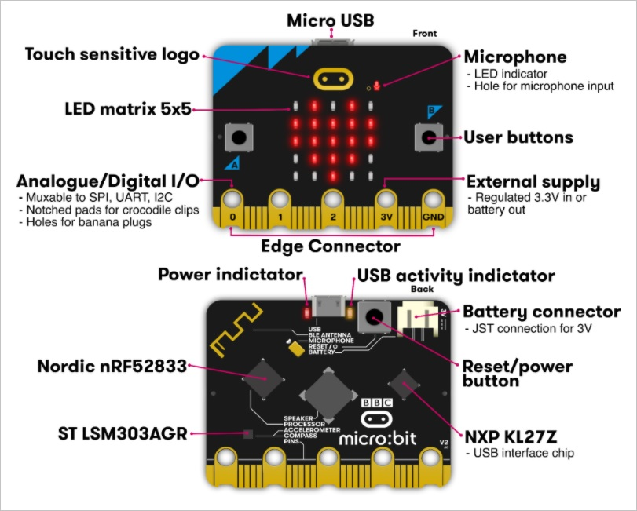

# Апаратне забезпечення micro:bit

## Загальний опис

Оригінальний опис доступний [за посиланням](https://makecode.microbit.org/device), там також доступні відео для демонстрації.

На рис.1 показані усі фрагменти, які складають BBC micro:bit V2.

рис.1. 

Світлодіодний екран 5 x 5 (**LED Screen**) дає можливість ввімкнути/вимкнути кожен окремий діод та керувати яскравістю. Жовттй світлодіод на задній панелі micro:bit є індикатором стану (**Status LED**). Він блимає жовтим, коли система хоче повідомити користувачеві про подію.

Кнопки **A** і **B** (**User Buttons**) дають можливість програмно обробляти натискання/відпускання. Кнопка **R** (**Reset/power button**) на задній панелі micro:bit є системною кнопкою, і має різне використання. Наприклад пілся завантаження і запуску коду  кнопка **R** дає можливість перезапустити програму.

Додатково контакти **0**, **1**, **2** і логотип (logo) плати можуть працювати як сенсорні кнопки, якщо вони запрограмовані для введення.

Порт Micro **USB** призначений для підключення ПК. Коли ви підключаєте micro:bit через [USB](https://makecode.microbit.org/device/usb), він має відображатися як диск `MICROBIT`. Якщо ви випадково утримаєте кнопку скидання під час підключення micro:bit, micro:bit відображатиметься як диск `MAINTENANCE` замість `MICROBIT`. Це називається режим обслуговування. Щоб продовжити програмування свого micro:bit, ВАМ ПОТРІБНО від’єднати USB-накопичувач і підключити його знову. Переконайтеся, що диск тепер відображається як `MICROBIT`.

micro:bit має вбудований **компас**, який може виявляти магнітні поля, такі як магнітне поле Землі. За ним можна визначити напрямок, у якому він рухається. Micro:bit може визначити, куди він спрямований, і рух у градусах. Ці дані можуть бути використані micro:bit у програмі або надіслані на інший пристрій.

На micro:bit є **акселерометр**, який визначає зміну швидкості micro:bit, що перетворює аналогову інформацію в цифрову форму, яку можна використовувати в програмах micro:bit. Вихід показується у міллі-g (дорівнює 0.001 гравітаційного прискорення на Землі). Пристрій також виявить деякі стандартні дії, наприклад струс (shake), нахил (tilt) і вільне падіння (free-fall).

Контакти (pins) використовуються для підключення електричних входів або виходів, нижче вони розписані детальніше. 

Micro:bit може надсилати й отримувати дані через послідовний зв’язок (**serial communication**). Послідовні дані можна передавати через USB, BLE або перенаправляти на контакти на крайовому з’єднувачі. 

Ви побачите позначку `BLE ANTENNA` на задній панелі micro:bit. Це призначено для служби обміну повідомленнями, щоб пристрої могли спілкуватися один з одним через Bluetooth Low Energy (BLE).. Micro:bit — це Edge пристрій, який може зв’язуватися з центральним пристроєм, таким як смартфон або планшет, який має Bluetooth Low Energy (BLE). Micro:bit може надсилати та отримувати сигнали від центрального пристрою, щоб інший пристрій через BLE міг керувати micro:bit або micro:bit міг контролювати інший пристрій BLE.

## Контакти (pins)

Оригінальна довідка доступна [за посиланням](https://makecode.microbit.org/device/pins)

Micro:bit має **25** зовнішніх з’єднань на крайовому (**edge**) роз’ємі плати, які називаються «pins». Крайовий роз’єм — це позлочена область на правій стороні плати, як показано на рисунку нижче.

Є **5 великих контактів**, які також під’єднані до отворів на платі, позначених як: **0**, **1**, **2**, **3V** і **GND**,  до яких можна легко прикріпити затискачі типу «крокодил» або 4-міліметрові бананові штекери. Уздовж того самого краю є **20 маленьких контактів**, які можна використовувати, підключаючи micro:bit до крайового роз’єму

Перші три, позначені **0**, **1** і **2**, є гнучкими і можуть використовуватися для багатьох речей, тому їх часто називають «введенням і виведенням загального призначення» (скорочено до **GPIO**). Ці три контакти також мають можливість зчитувати аналогову напругу за допомогою так званого аналого-цифрового перетворювача (АЦП). Усі вони мають однакову функцію:

- **0**: GPIO (цифровий вхід і вихід загального призначення) з аналого-цифровим перетворювачем (АЦП).
- **1**: GPIO з АЦП
- **2**: GPIO з АЦП

За допомогою micro:bit V2 контакти **0**, **1**, **2** і **LOGO** також можна налаштувати на роботу як [ємнісної сенсорної](https://makecode.microbit.org/reference/pins/touch-set-mode) кнопки. 

Інші два великих контакти (**3V** і **GND**) пов’язані з джерелом живлення плати, і їх НІКОЛИ не можна з’єднувати разом.

Докладніше про обмеження живлення, струму та напруги плати див. [Джерело живлення](https://tech.microbit.org/hardware/powersupply/).

- **3V**: 3 вльт вихідного або вхідного живлення: 
  - вихід живлення: якщо micro:bit живиться від USB або батареї, ви можете використовувати контакт **3V** як вихідна потужність для живлення периферійних пристроїв
  - вхід живлення: якщо micro:bit НЕ живиться від USB або батареї, ви можете використовувати контакт **3V** для подачі живлення на micro:bit.

- **GND**: приєднується до землі для завершення ланцюга (потрібно при використанні контакту **3V**)

Якщо ви тримаєте штифт **GND** однією рукою, ви можете запрограмувати microbit так, щоб виявляти, що ви торкаєтеся іншою рукою до контактів **0**, **1** або **2**, що дасть вам три додаткові кнопки, з якими можна поекспериментувати (ви щойно використали ваше тіло, щоб завершити електричне коло, щоб створити «резистивні сенсорні» кнопки). 

Інші 20 маленьких контактів пронумеровані від **3-22** (ці контакти не позначені на micro:bit, однак вони позначені на рис. вище). На відміну від трьох великих контактів, які призначені для зовнішніх з’єднань, деякі маленькі контакти використовуються спільно з іншими компонентами на платі micro:bit. Наприклад, контакт **3** спільний з деякими світлодіодами на екрані micro:bit, тому, якщо ви використовуєте екран для прокручування повідомлень, ви також не можете використовувати цей контакт.

Існують деякі відмінності у призначенні функцій для малих контактів між версіями micro:bit. У наведених нижче таблицях пінів описано функції пінів для кожної версії.

V1 pin map

| Контакт    | Опис                                                         |
| ---------- | ------------------------------------------------------------ |
| **3**      | GPIO shared with LED Col 1 of the LED screen; can be used for ADC and digital I/O when the LED screen is turned off. GPIO shared with LED Col 1 of the LED screen; can be used for ADC and digital I/O when the LED screen is turned off. |
| **4**      | GPIO shared with LED Col 2 of the LED screen; can be used for ADC and digital I/O when the LED screen is turned off. |
| **5**      | GPIO shared with Button A. This lets you trigger or detect a button  “A” click externally. This pin has a pull-up resistor, which means that  by default it is at voltage of 3V. To replace button A on the micro:bit  with an external button, connect one end of the external button to pin 5 and the other end to GND. When the button is pressed, the voltage on  pin 5 is pulled down to 0, which generates a button click event. |
| **6**      | GPIO shared with LED Col 9 of the LED screen; can be used for digital I/O when the LED screen is turned off. |
| **7**      | GPIO shared with LED Col 8 of the LED screen; can be used for digital I/O when the LED screen is turned off. |
| **8**      | Dedicated GPIO, for sending and sensing digital signals.     |
| **9**      | GPIO shared with LED Col 7 of the LED screen; can be used for digital I/O when the LED screen is turned off. |
| **10**     | GPIO shared with LED Col 3 of the LED screen; can be used for ADC and digital I/O when the LED screen is turned off. |
| **11**     | GPIO shared with Button B. This lets you trigger or detect a button “B” click externally. |
| **12**     | This GPIO pin has been reserved to provide support for accessibility. |
| **13**     | GPIO that is conventionally used for the serial clock (SCK) signal of the 3-wire Serial Peripheral Interface (SPI) bus. |
| **14**     | GPIO that is conventionally used for the Master In Slave Out (MISO) signal of the SPI bus. |
| **15**     | GPIO that is conventionally used for the Master Out Slave In (MOSI) signal of the SPI bus. |
| **16**     | Dedicated GPIO (conventionally also used for SPI ‘Chip Select’ function). |
| **17, 18** | These pins are wired to the 3V supply, like the large ‘3V’ pad. |
| **19, 20** | Implement the clock signal (SCL) and data line (SDA) of the I2C bus  communication protocol. With I2C, several devices can be connected on  the same bus and send/read messages to and from the CPU. Internally, the accelerometer and the compass are connected to i2c. |
| **21, 22** | These pins are wired to the GND pin and serve no other function. |

V2 pin map

| Контакт    | Опис                                                         |
| ---------- | ------------------------------------------------------------ |
| **3**      | GPIO shared with LED Col 3 of the LED screen; can be used for ADC and digital I/O when the LED screen is turned off. |
| **4**      | GPIO shared with LED Col 1 of the LED screen; can be used for ADC and digital I/O when the LED screen is turned off. |
| **5**      | GPIO shared with Button A. This lets you trigger or detect a button  “A” click externally. This pin has a pull-up resistor, which means that  by default it is at voltage of 3V. To replace button A on the micro:bit  with an external button, connect one end of the external button to pin 5 and the other end to GND. When the button is pressed, the voltage on  pin 5 is pulled down to 0, which generates a button click event. |
| **6**      | GPIO shared with LED Col 2 of the LED screen; can be used for digital I/O when the LED screen is turned off. |
| **7**      | GPIO shared with LED Col 4 of the LED screen; can be used for digital I/O when the LED screen is turned off. |
| **8, 9**   | Dedicated GPIO, for sending and sensing digital signals; can also be configured for NFC. |
| **10**     | GPIO shared with LED Col 5 of the LED screen; can be used for ADC and digital I/O when the LED screen is turned off. |
| **11**     | GPIO shared with Button B. This lets you trigger or detect a button “B” click externally. |
| **12**     | This GPIO pin has been reserved to provide support for accessibility. |
| **13**     | GPIO that is conventionally used for the serial clock (SCK) signal of the 3-wire Serial Peripheral Interface (SPI) bus. |
| **14**     | GPIO that is conventionally used for the Master In Slave Out (MISO) signal of the SPI bus. |
| **15**     | GPIO that is conventionally used for the Master Out Slave In (MOSI) signal of the SPI bus. |
| **16**     | Dedicated GPIO (conventionally also used for SPI ‘Chip Select’ function). |
| **17, 18** | These pins are wired to the 3V supply, like the large ‘3V’ pad. |
| **19, 20** | Implement the clock signal (SCL) and data line (SDA) of the I2C bus  communication protocol. With I2C, several devices can be connected on  the same bus and send/read messages to and from the CPU. Internally, the accelerometer and the compass are connected to i2c. |
| **21, 22** | These pins are wired to the GND pin and serve no other function. |

Для підключення до малих контактів рекомендується використовувати крайовий (Edge) роз’єм, призначений для micro:bit. Для доступних крайових з’єднувачів введіть «крайові з’єднувачі для micro:bit» у своїй пошуковій системі в Інтернеті, щоб знайти постачальника аксесуарів.

