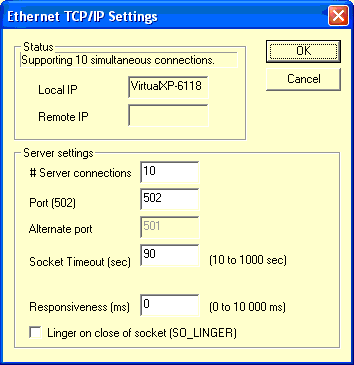
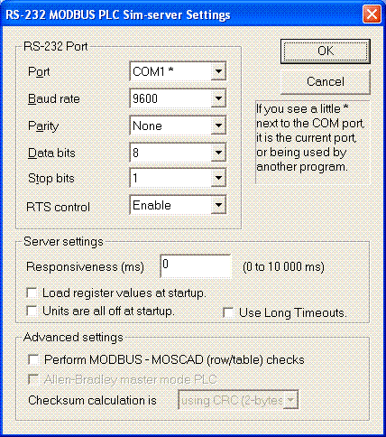
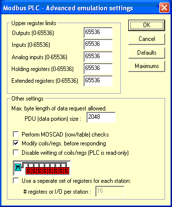
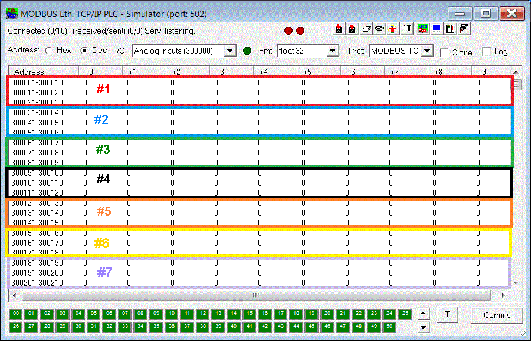
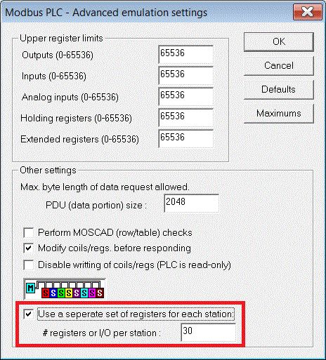
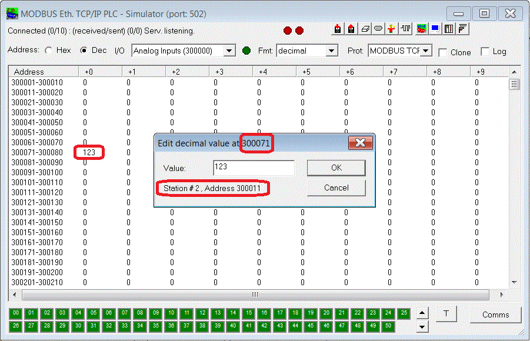
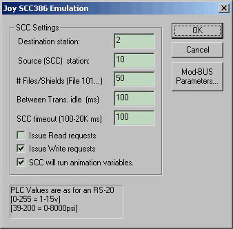
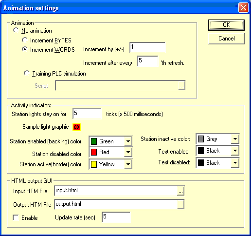
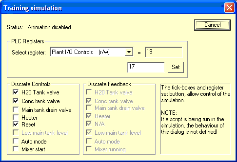
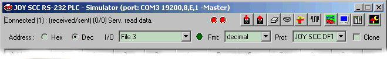

# MODBUS RTU, TCP/IP and Allen Bradley DF1 PLC Simulator

Use the back button in your browser to aid navigation.
    Original Homepage: [www.plcsimulator.org](http://www.plcsimulator.org) --- Updated Homepage: [www.sourceforge.net/projects/modrssim2](http://www.sourceforge.net/projects/modrssim2)

**Contents:**

- [Overview](file:///E:/san/AKIT/ДИСЦИП/Скриптові мови в Інтернеті речей/modbus/index.html#Overview) 
- [Running the program](file:///E:/san/AKIT/ДИСЦИП/Скриптові мови в Інтернеті речей/modbus/index.html#Running) 
- [Ethernet Setup](file:///E:/san/AKIT/ДИСЦИП/Скриптові мови в Інтернеті речей/modbus/index.html#Ethernet Setup) 
- RS-232 Setup
  - [...RS232 Wiring](file:///E:/san/AKIT/ДИСЦИП/Скриптові мови в Інтернеті речей/modbus/index.html#RS232C diagram)    
  - [...RS232 Hints](file:///E:/san/AKIT/ДИСЦИП/Скриптові мови в Інтернеті речей/modbus/index.html#RS232C hints) 
- [Protocols - Advanced Emulation Settings](file:///E:/san/AKIT/ДИСЦИП/Скриптові мови в Інтернеті речей/modbus/index.html#Protocols)
- [Modbus Function Codes Supported](file:///E:/san/AKIT/ДИСЦИП/Скриптові мови в Інтернеті речей/modbus/index.html#Modbus Function Codes) 
- [Animation](file:///E:/san/AKIT/ДИСЦИП/Скриптові мови в Інтернеті речей/modbus/index.html#Animation) 
- [Juice Plant](file:///E:/san/AKIT/ДИСЦИП/Скриптові мови в Інтернеті речей/modbus/index.html#Juice Plant) 
- [Script Automation](file:///E:/san/AKIT/ДИСЦИП/Скриптові мови в Інтернеті речей/modbus/index.html#Script Automation)    
- [CSV Import](file:///E:/san/AKIT/ДИСЦИП/Скриптові мови в Інтернеті речей/modbus/index.html#CSV Import) 
- [Hotkeys & UI](file:///E:/san/AKIT/ДИСЦИП/Скриптові мови в Інтернеті речей/modbus/index.html#Hotkeys) 
- F.A.Q.
  - [Links](file:///E:/san/AKIT/ДИСЦИП/Скриптові мови в Інтернеті речей/modbus/index.html#Links) 
- [Notices.](file:///E:/san/AKIT/ДИСЦИП/Скриптові мови в Інтернеті речей/modbus/index.html#Notices)


------


## Overview

This simulator was originally designed to allow testing of MODBUS master devices.     As such it also allows itself to be used as a "virtual" PLC for training.

Setting up the simulation for use will cover it's configuration for different applications in detail. The first point we come to however is which [media type](file:///E:/san/AKIT/ДИСЦИП/Скриптові мови в Інтернеті речей/modbus/index.html#Media Types) the simulation should use.

### Purpose & features

This simulator was written to allow the testing of a MODBUS RTU serial driver without having to get 255 little MODBUS PLCs into one office. It is not, by any means, a full implementation of the protocol; it implements only the common functions used in MODBUS and other protocols supported here.


It surpasses the limitations in other programs we have found in the past by:

- Simulating more than one RTU at once. (register values are shared for all RTUs).
- Allows editing and display of all the registers.
- Allow scanning of registers not actually in the display.
- Running on >1 comm ports (You have to run two copies of the program.). You need to run the    first copy; then, when you run it again, it defaults to use the next free RS-232 port, alternately launch copies using [command-line options](file:///E:/san/AKIT/ДИСЦИП/Скриптові мови в Інтернеті речей/modbus/index.html#Hotkeys).
- A way of disabling just certain stations. (Just click on the boxes at the bottom.)
- Load and save values you type into each register (the file is saved in the same folder) as well as simulate changes in the values. Hotkey <CTRL>-L =Load and <CTRL>-A for sAve.
- You can specify the MODBUS PDU length (Protocol Data Unit) to simulate RTU's with different internal telegram buffer sizes. Hotkey <CTRL>-M
- Displaying values in different formats hex/dec etc.
- Allowing specificcation of responsiveness of the simulator to simulate slow hardware. Hotkey <CTRL>-S .
- Simulating certain types of comms errors that would be hard to do in a "lab" situation.
- Contains a basic comms debugger showing request/response. Hotkey : <CTRL>-C.
- Emulation to simulate MODBUS MOSCAD RTU on MODBUS. Hotkey <CTRL>-S or <CTRL>-M . 
- Simulating noisy comms lines. Hotkey <CTRL>-N. 
- It does check the CRC of all messages.
- It attempts to handle noisy comms properly.

### Not supported

- MODBUS ASCII protocol support :-(.
- This application is not intended as a full implementation of MODBUS RTU nor TCP/IP nor Allen-Bradley DF1.       It is not commercially supported and no liability is held for any damage or application changes made as    a result of it's use.

------


## Running this program

This is not a full feature list, just the basics, which most will get in 5 minutes anyway.

- Launch the application, "ModRSsim2.exe" and it should open the 1st free (RS-232 by default)port,    select the desired protocol (if Ethernet, no serial port is used/needed), and then    click on the **Port Settings..."** button to change any settings. Settings are saved    to WindowsTM registry.  
- *Serial protocols:*Hook up a cable (just 2 & 3 crossed and 7 connected with 4       & 5 looped, and 6, 8 & 20 looped should be fine).
      *Ethernet:* You must have an Ethernet adapter or loop-back adapter installed.
- The boxes at the bottom work like indicators to show which stations are active; the gray    outline of each box will change color (they turn off after five seconds), and clicking them    disables each station (only 50 are shown). The green background turns red to show a disabled    station. Disabled stations will still show activity, but the sim. will just not respond back.
- Double-click on the list-view over a register, to edit it's value, double-clicking on    digital I/O just toggles them.
- Switch between the Hex and Decimal views. (addresses also come in hex.)
- For mouse-haters like me, a list of [Hotkeys](file:///E:/san/AKIT/ДИСЦИП/Скриптові мови в Інтернеті речей/modbus/index.html#Hotkeys) is provided.
- 
- *Some advanced options:*
- New option for starting with all devices offline added under the "Settings"       dialog box.
- **Load** will not work unless you have saved first.
- **Save** will  will save all the register values to a flat binary file (don't edit it, I can't)    called 'MODDATA.DAT', (ABDATA.DAT if using the DF1 protocol) in the current folder. This is nice    to allow you to fill the registers with values, and then come back latter to the same setup.    Comms will be slow and may time out during load/save, since they are interlocked.
- Click on **Animation Settings...** to change the color of the indicators at the bottom,    and set up some simulation data.
- **Zero values** will clear all values (also the digitals become 0).
- The "responsiveness" setting changes the delay in the program before it responds to a valid request.
- Report any problems after trying for at least a day to figure out where you went wrong :-)

------


## Modbus Ethernet Setup



- **Local IP** *Not settable,* the local IP or computer name.
- **Remote IP** *Not settable,* the remote IP or computer name of the last connected socket.
- **# Server connections** The number of sockets the server will listen on.
- **Port (502)** The port number to listen on. The default Modbus TCP port is       502, but other port numbers can be used.
- **Alternate Port** Not used at this time.
- **Socket Timeout** Ethernet Socket Timeout..
- **Responsiveness** Delay in milliseconds after receiving a request, before       the simulator will send a response, this setting allows simulation of       turn-around time on a slower device.

**Note:** If the station indicator button for a station is off,  the simulator will not respond to data requests for that station ID,  even though the client is connected.

------


## RS-232 Setup



All the settings here should just explain themselves, 

- **Port** if a * appears next to the port, and it is not the current port, that port is in use by another application.  
- **Baud rate** , it is possible to select a baud rate not supported by your UART, typically nothing over 115K except if you have the hardware.  
- **parity, data and stop bits** The modbus default is 8E1, and 8N1 on some newer devices.  
- **RTS control** This setting allows you to tell the driver the RTS line       should operate as: handshake, always on, always off or toggle, which is the default setting.  
- **Responsiveness** default = 0. A delay in milliseconds  (approximate to within 20) that is instituted before sending a response  to any valid or invalid frame.  
- **Load register values...** like it says.  
- **Units are all off..** this puts all stations as off-line initially, so you have to turn each one on.  
- **Use Long Timeouts** changes RS-232 Timeout values from 100ms/500ms to 250ms/1000ms to better handle slow input data.  
- **Perform MOSCAD checks** this one helps testing for a Motorola MOSCAD/Mostrac radio-telemetry unit, then just rejects all requests which would just     end up reading "empty" data from one of those units, and returns a exception code to warn the master.


#### RS232 Wiring

Use this layout below to translate 9-25-pin connectors on your PC and DTE equipment.

```
9 pin	25 pin	Signal name
1	8	CD (Carrier detect)
2	3	RX (Receive Data)
3	2	TX (Transmit Data)
4	20	DTR (Data Terminal Ready)
5	7	SG (Signal Ground)
6	6	DSR (Data Set Ready)
7	4	RTS (Request to Send)
8	5	CTS (Clear to Send)
9	22	RI (Ring Indicator)
```

A 9-pin null modem wiring diagram looks like this...

```
3----------2
2----------3
5----------5
```

The handshake control lines can also be *looped* back. This is easiest done by  putting a blob of solder between 2 adjacent pins or using a very short piece of insulated  wire between the 2 pins that must be looped. Translate the pin #s below for a 9-pin connector.

```
4+
 |
5+

6 +
  |
8 +
  |
20+
```


#### RS 232 hints

When in a RS-232 protocol, (P.S. nothing stops you using 422/485 via a converter) the comms screen shows a running dump of stuff sent/received. use the *show timestamps* tick-box to show timing information.

This screen also shows the 3 incoming modem control line states, both through 3 indicators, and then also in the list-box view whenever a line-state changes.

Loops are sometimes needed by the device, for instance DTR output normally drives     the DSR/DTR input on a device (your modem if it is an older one with millions of     lights has it) modems are DCE (Data communication equipment), and this means the     pins do not correspond to the pin convention above, but in fact are straight     through.

Using a modem with this simulator does work, and even 232/485  converters. The     slave (receiving) side of a dial-up will not auto-answer however.  You need to put the modem into auto-answer and suppress the modem  connect messages yourself using AT codes.

------


## Protocols - Advanced Emulation Settings

Allows you to configure parameters for a specific protocol, the parameters that can be changed differ per protocol, so some values shown may not have relevance. This section goes on to explain what the parameters mean and what affect that have.


#### MODBUS Protocol



Settings for Ethernet and RTU protocols.

- **Upper register limits** Highest register or I/O number the  simulator will allow. Reading/writing registers/bits above this address  give an Exception response
- **PDU (data portion) size** Max length of the data in a message frame.
- **Perform MOSCAD (row/table) checks** If this means nothing to you, do not use it.
- **Modify coils/regs. before responding** Allows the returned  register value in telegrams that return the current register contents to either reflect the new values, or not in the responses.
- **Disable writing of coils/regs** or (read-only) mode was added because some       PLCs are just plain not writeable, in this mode, it is an error to send any       command that might modify the PLC. Read-only mode can also be toggled from the       "System" menu.
- **Use a separate set of registers** is a simple mapping which works like so:

​    

​    In the above screen I have set an upper limit of only 30 registers in the PLC.     What then happens is you will have 30*255 registers allocated in batches of 30     per station. It's not often you need this mode, and it is not intuitive in the     way it works in the user-interface, but that's just the way it works.



​    You can still see which station and point you are editing when you double click     as shown below:

​    

------


#### MODBUS Function Codes Supported

```
Function	Meaning
Code

Class 0: the bare minimum
03 hex 		Read Multiple Holding Registers
10 hex 		Preset Multiple Holding Registers

Class 1: ideal
01 hex 		Read Multiple Coil Status Bits
02 hex 		Read Multiple Input Status Bits
04 hex 		Read Multiple Input Registers
05 hex 		Force Single Coil
06 hex 		Preset Single Register
07 hex 		Read Exception Status

Class 2: almost overkill
0F hex 		Force Multiple Coils
16 hex 		Mask Write Holding Register

Machine/Vendor/Network specific functions
08 hex Sub 00   Diagnostic - Return Query Data
11 hex          Report Slave ID
```


#### Allen Bradley DF1

This protocol has no settings actually, all PLC files (0-250) all have 255 words!)


- **PDU (data portion) size** Max length of the data in a message frame.


#### JOY SCC386 Protocol

This protocol is experimental and should not be used at this time.



This dialog allows settings for the DF1 Master simulation, which emulates a Joy Mining Machinery device

- **Destination station** you! 
- **Source station** this get placed into the source field of all messages sent 
- **#Files/Shields** this is the number of roof supports. 
- **Between Trans...** delay in milliseconds between 2 messages. 
- **SCC timeout** time in milliseconds before the sim times out and tries the next transaction. 
- **Issue read/ write** at least one of these must be on to be useful. 
- **SCC will run animation...** the sim simulates the movement of the machine cutter head.


------


## Animation




The above setup shows how to increment the WORDS by 1 every 5th refresh. A refresh is scheduled every 500 mSec.


**Sample HTML code:**

```html
<html>
  <head>
     <meta charset="utf-8">
     <title>ModRSsim2 Test Page</title>
  </head>
  <body>
      <p clas=MsoNormal>Decimal Value: <SIMUL>3,0,1</SIMUL;>.</p>
      <progress value="<SIMUL>3,0,1</SIMUL>" max="100"></progress>
      <p class=MsoNormal>Hex Value: <SIMUL>3,10,2</SIMUL>.</p>
      <p class=MsoNormal>Word Value: <SIMUL>3,20,3</SIMUL>.</p>
      <p class=MsoNormal>DWord Value: <SIMUL>3,30,4</SIMUL>.</p>
      <p class=MsoNormal>Long Value: <SIMUL>3,40,5</SIMUL>.</p>
      <p class=MsoNormal>Float Value: <SIMUL>3,50,6</SIMUL>.</p>
      <p class=MsoNormal>Chars Value: <SIMUL>3,60,7</SIMUL>.</p>
  </body>
</html>
```

The above sample illustrates how to read and display registers of each type. Included is a PROGRESS BAR that is available in HTML5 to show other capabilities. To run this you must enter the code shown above into a file named "input.html" that resides in the same directory as ModRSsim2. To enable this you must check the "Enable" box in the "HTML output GUI" section of the Animation Dialog Box. To view the results just double-click on the file named "output.html" in the ModRSsim2 directory. This should cause the "output.html" file to open in your default web browser and show you your values. The "Update rate" is in seconds from 1 to 30 and tells your web browser how often to re-read the file to perform updates.

This could be used to set up a custom display that mixes different Modbus types and Formatting on a single screen.

------


## Juice Plant

Select the Training PLC Simulation with the Script box left empty in [animation settings](file:///E:/san/AKIT/ДИСЦИП/Скриптові мови в Інтернеті речей/modbus/index.html#Animation) to enable the *Juice Plant*.

The *juice plant* diagnostic dialog is shown below



------

## Script Automation

Симулятор можна автоматизувати за допомогою сценарію, симулятор використовує Microsoft Script Host, наразі доступна лише мова VB.

Основна функція сценарію — дозволити емуляцію нормальної діяльності ПЛК. Діяльність може ґрунтуватися на елементах управління SCADA/HMI і бути у формі відповідної дії, або бути повністю автономною. Щоб увімкнути виконання сценарію, введіть назву VBS-файлу сценарію в поле, відведене в діалоговому вікні налаштувань «Training». Типовими для цього типу сценаріїв є деякі функції автоматизації. Сценарій намагається запускатися кожні 500 мілісекунд, але якщо сценарій завеликий, він пропускатиме цикли.

**Script function reference:**

- **GetRegisterValue (REG_TYPE as long , ADDRESS as long)**
   	   Returns the current value in the modbus/AB register specified as an Integer.
   	   REG_TYPE = register type `0=input`, `1=output`,`2=analog in`, `3=holding reg`. `4=extended reg`(For AB, this is the file #.)
   	   ADDRESS = register or I/O point number (Zero always corresponds to the first item.)
             Note: This function requires the use of parenthesis.
             Example: `GetRegisterValue(2, 100)`
   	   *E.g.* `0` is similar to 40001 if REG_TYPE is 3
   	   *E.g.* `63` would be 64th output coil if REG_TYPE=1
   	
- **SetRegisterValue (REG_TYPE as long, ADDRESS as long, REGISTERVALUE as long)**
   	   Set the value in the modbus/AB register specified.
   	   REG_TYPE = register type 0=input, 1=output,2=analog in, 3=holding reg. 4=extended reg. (For AB, this is the file #.)
   	   ADDRESS = register or I/O point number (Zero always corresponds to the first item.)
             Note: This function does not allow parenthesis. Just put the values after the function name.
             Example: SetRegisterValue 2, 100, 50
   	     *E.g.* 0 is similar to 40001 if REG_TYPE is 3
   	     *E.g.* 63 would be 64th output coil if REG_TYPE=1
   	   REGISTERVALUE = register value, permitted range (-32767 to +32767) other values are clipped, and thus undefined
   	
- **DisableStation (STATIONID as int)**
          Disable a modbus slave station. This function can be used to take the station out of the ring,        as if it was not present in the system/network
          STATIONID = modbus station number (valid values 0 to 255; 0 = broadcast station)
             Note: This function does not allow parenthesis. Just put the values after the function name.
             Example: DisableStation 10
   	
- **EnableStation (STATIONID as int)**
          Enable a modbus slave station. This function can be used to restore a station to the ring. see DisableStation
          STATIONID = modbus station number (valid values 0 to 255; 0 = broadcast station)
             Note: This function does not allow parenthesis. Just put the values after the function name.
             Example: EnableStation 10
   	
- **DisplayAbout( )**
          Display the application about box, the script is suspended until the "About" window is closed by the user.
             Warning: if this is executed every time in a script, it will popup every scan.
                      This will stop the script until you acknowledge it.
   	
- **GetLastRunTime( )**
          Return the duration in milliseconds that it took for the last execution of the script as a long. This value will         be -1 on the first script execution, or if the scrip fails to execute to completion without errors.
             Example: runtime = GetLastRunTime
   	
- **StationEnabled (STATIONID as int)**
          Return the enable state of the station (0=disabled, 1=enabled) as a long.
             Note: This function requires the use of parenthesis.
             Example: StationEnabled(10)
   	
- **TransmitRegisters (STATIONSRC as int, STATIONDEST as int, REG_TYPE as long, ADDRESS as long, REGISTERS as long)**
   	   Sends a value to the desired slave PLC (Simulation must be in and support master mode.)
   	   Currently not supported on MODBUS.
   	   STATIONSRC = Allen-Bradley Source station (ignored for modbus protocol).
   	   STATIONDEST = Destination or target station ID register type  0=input, 1=output,2=analog in, 3=holding reg. 4=extended reg. (For AB,  this is the file #)
   	   REG_TYPE = register type 0=input, 1=output,2=analog in, 3=holding reg. 4=extended reg. (For AB, this is the file #)
   	   ADDRESS = register or I/O point number (Zero always corresponds to the first item.)
   	     *E.g.* 0 is similar to 40001 if REG_TYPE is 3
   	     *E.g.* 63 would be 64th output coil if REG_TYPE=1
   	   REGISTERS = Number of registers to transmit, protocol specific framing or [PDU](file:///E:/san/AKIT/ДИСЦИП/Скриптові мови в Інтернеті речей/modbus/index.html#PDU) limits are not tested before sending.
   	
- **AddDebugString (STATIONID as string)**
          Sends text to the communications debugger, the text will appear with a double hash ## in front of it.
             Note: This function requires the use of parenthesis.
             Example: AddDebugString ("test one")
   
- **TransactionBusy ()**
          Returns TRUE if this simulation device supports master-mode, and is not busy with a transaction at this time.

**Sample script code:**

```vbscript
dim x
dim n
dim runtime
dim station

n=0
for n=0 to 240
   x = getregistervalue(3,n)
   SetRegisterValue 3, n, x+1
next
runtime = Getlastruntime
SetRegisterValue 3, 241, runtime

if (StationEnabled (station)) then
   Disablestation station
else
   enablestation station
end if

SetRegisterValue 3, 242, station

station = station + 1
if station > 12 then station = 0
```

The above sample illustrates how to increment a few registers, and also turn the communication for the 1st 12 stations on and off continuously. The script runs on every animation update.

#### CSV Import

CSV File Automatic Importer: To get to the importer, right-click on the     title-bar to get the system menu and select "CSV Importer". Basically the     simulator looks at a  folder for a time-based file name, and when it exists, it loads it automatically. It was  designed for playback - and auto-opens a file every minute. The folder name must be     equal to the current date and the  filename must be equal to the current time. The filename format is HHMM.csv     - and must reside in a folder for the date in format YYYYMMDD.

​    CSV File Manual Importer: It is possible to load one file manually  by selecting     the "CSV Importer" and then selecting "Load File..." and browsing to the file name When OK is clicked the file is loaded.  When using this     method do not enable the auto-importer function checkbox. This is  probably what you will want to use most of the time. Each line loads one register and has four parts seperated by commas. The top  row of the file is ignored by the import. It is basically there for the  convenience of     adding a header or comments. 

Here is a simple file listing..

```
The first line is ignored and can be used for a header or comments and all of the following lines are used to load values
0,0,50,1 # The first number is a zero for single register/bit load and one for a double register load for a floating point value
0,1,100,1 # The second number is the Modbus type you want to load (0 = Coils; 1 = Inputs; 3 = Analog Input Regs; 4 = Holding Regs)
1,3,10,34.5 # The third number is the register number that will receive the value (This line loads Float addresses 300010/11 with 34.5)
1,4,20,12.34 # The fourth number is the value to load into the register (12.34 in this case)
```


------

#### Media Types

Media types relate to the physical layers used for any communication process. An example media type could be a telephone line. Humans popularly use air as a media type; whales use sea-water. computing devices typically use a copper conductor as a media. Just in the same way that the amount of air (distance) between two participants and it's temperature etc. affects the kind of communication that can take place, a physical media type must be clearly defined.

Device manufacturers typically will refer to a copper conductor of a certain maximum length and thickness, and then go on to describe other electrical properties of it. So the kind of wire used is important, but the color is not directly important.
 In some cases a media type variations can also be so clearly defined, that even though 2 media look the same, they are not. Ethernet 10 base-T is a good example of this kind of case. It even defines transmission rates of 10 million and 100 million bits per second. In addition, because Ethernet is so well defined as a media type of it's own, converters to other physical media such as fibre or radio are popular, and elevate it to the status of a protocol. (To be true Ethernet is a protocol, but still referred to as a general media type.)
 
 The simulator supports 2 media types: [Serial](file:///E:/san/AKIT/ДИСЦИП/Скриптові мови в Інтернеті речей/modbus/index.html#RS-232 Setup) and [Ethernet](file:///E:/san/AKIT/ДИСЦИП/Скриптові мови в Інтернеті речей/modbus/index.html#Ethernet Setup).


#### PDU - Protocol Data Unit

A protocol data unit is that part of a protocol message or frame that contains the data. Data in 99% of protocols is not simply sent without some kind of mechanism to format the data, explain what data it is, and ensure data integrity and/or security. In total these mechanisms make up a message frame. The message frame contains the data, and since a message frame cannot be of infinite length, so too, the data is restricted. The restriction thus becomes the maximum amount of data transmittable in one packet, and will differ as the maximum message or frame length changes.

DF1 specifies a PDU of 234 , 223 bytes if over IP : for SLC5/03 or 5/04
 for the SLC 5/01 or 5/02 only 82 bytes (equivalent to 41 words)

------

Hotkeys ,UI and Launch

 I will try to keep this a full Hotkey and GUI (or **U**ser-**I**nterface) listing.

### Hotkeys

- <CTRL>-A = Save register values 
- <CTRL>-B = About box 
- <CTRL>-C = Toggle display registers/comms debugger mode 
- <CTRL>-E = Erase, clears all register values
- <CTRL>-F = File,     Toggles On and Off Log File (DEBUG.TXT - Shown as Log checkbox on Main Form)
- <CTRL>-J = inJect error, injects a char on the RS232 protocol used 
- <CTRL>-L = Load (opposite of save) 
- <CTRL>-M = Open emulation settings dialog for the current protocol 
- <CTRL>-N = Noise, opens noise settings dialog (RS232 protocols only) 
- <CTRL>-S = Settings, opens dialog for current protocols's settings  
- <CTRL>-T = Transparency, toggles to the next alpha-blend level 1=opaque,                      2=semi see-thru, 3=very see-thru, this is more a fancy feature  					 that is useful in that the program becomes transparent, so you can sometimes superimpose it over another program 
- <CTRL>+<INS> = Copy Comms Debug Window to Clipboard
- F1 = Help, opens the help file you are looking at now in your browser.

### GUI

- Double-click - on the list/grid of registers will edit or in the case of a bit, toggle the register. 

- Single-click - on any station ID tickbox at the bottom of the window enables or disables comms to that station. 

- Drag - the window borders to make the display smaller. 

- Right-click Title-bar - pop-up menu for the GUI options in ModRSsim2 such as "Always on Top" and "Alpha Blending". 

  

  ​	Toolbar area indicators: From top-left we have: 

  - A status indication string  	
  - 2 LEDs, there show RX and TX of data respectively. 	
  - Toolbar 	
  - Next: Radio selection for toggling the address column in HEX or Decimal format 	
  - The currently shown area/file or register type can be selected. 	
  - A little green LED which is on if the training simulation mode is active. 	
  - Data formatting selection to specify presentation of data displayed. 	
  - The current *Prot*ocol can be selected here. when changing protocol,  	   the currently running protocol engine stops, and a new one starts up. 	
  - The modbus clone button: Only use this one on modbus, it does the word-swap  	correction for proper presentation of values in a clone PLC. This mainly affects  	the display of 32-bit float values.
  - The Log button which will send output from             the Comms Debug window to a file named "DEBUG.TXT" in the directory where the             program resides.
  - If the Comms screen is shown there will be a checkbox for             "Log Decode" which will send decoding information along with the byte stream to             the "DEBUG.TXT" file when Logging is active. 

  ​	Along the bottom: 

  - All these green boxes: they are actually toggle-buttons, making them red disables the  	associated station, the border animates briefly when a station is accessed as well to show 	activity on that node. 	
  - T button,  this opens up the [training simulation](file:///E:/san/AKIT/ДИСЦИП/Скриптові мови в Інтернеті речей/modbus/index.html#Juice Plant), which was developed in-house kind of,  	it simulates a water-tank, a inflow and outflow valve, and a heater, which attempts to heat  	the water depending on it's volume. It's an attempt to make the simulation more real. 	
  - Comms button, this toggles to the communications breakdown or comms log screen,  	which is useful to help interpret the protocol.        
  - A Version string is also shown for reference when screen shots are taken.

### Launching: Command-line Interface

This option was added to make it possible to run 2 simulators on  different ports or protocols at the same time without using the rule of  launch-> configure, launch ->configure, repeat until you get tired of clicking. 

```
mod_rssim modtcp:512
.. will select modbus TCP/IP and port 512 (note how the port number follows the modtcp parameter)
mod_rssim modrtu 
will select RTU mode, you can also add a serial port setting
mod_rssim port:com3 baud=38400 rts=on
will select com3, and use RTS on, the serial options are the same as for the mode command. rts can be on off hs or tg
but normally modbus devices use the 1st 2 forms.
The available protocols are modrtu modtcp abslave abmaster
```

For examples of the format, simply type "mode ?" in a command-prompt

```
More examples are:
mod_rssim port:com2
just change the comm port number by itself leave all other settings
mod_rssim 19200,n,e,8,p
use the older DOS parameter set which have a 'p' at the end.
```

It's not advisable (nor necessary) to have multiple TCP simulator  sessions, since the concept of memory block separation is described in  the [Modbus Advanced Emulation Settings](file:///E:/san/AKIT/ДИСЦИП/Скриптові мови в Інтернеті речей/modbus/index.html#Protocols) screen.

 Settings changed from the command-line take effect for any future  sessions of the simulator that get launched without parameters too.

 

------

F.A.Q. More info.

- **Q:** What is a MODBUS RTU? 
      **A:** The initials stand for Remote Terminal Unit and sometimes  it refers to a remote PLC (usually small).      If this refers to a protocal it implies 8-bit units of data  followed by a Cyclical Redundacy Check (CRC) for verification. if that  does not    make sense, visit [www.modicon.com](http:\\www.modicon.com) .
- **Q:** Where do I get the protocol? 
      **A:** Visit www.modicon.com, and search for PI-MBUS 300.
- **Q:** How do I do XYZ? 
      **A:** Some program features are not documented at this time, look around.
- **Q:** MODBUS function 5 returns the old value
    **A:** There is however one variation on the MODBUS documentation, for function force single coil 0x05 -the simulator    responds with the value before modifying the actual coil, not after modifying the coil. This was wrong, but    was easiest to implement, and there is now a setting for this. (See Emulation settings - Hotkey <CTRL>-M)
- **Q:** Where is the help file?
    **A:** The help-file is all in HTML, all images and the text are stored in the program, and placed into the current working folder.      Editing them will have no affect without re-compiling the simulator.
- **Using Matlab driver?** The Matlab driver starts at address 1, not 40001, so Holding registers 1,2,3 in Matlab are modbus registers 1,2,3.     
- **Questions/problems :** see website http://www.plcsimulator.org.


#### Links

- [Original project homepage](http://www.plcsimulator.org)   
- [www.modicon.com](http://www.modicon.com)   
- [www.schneider-electric.com](http://www.schneider-electric.com)   
- [www.control.com](http://www.control.com)   
- [www.modbus.org](http://www.modbus.org)    
- [My Codeguru project article](http://www.codeguru.com\network\mod_rssim.html)    
- Original Source Code [Orignial Sourceforge project source](http://sourceforge.net/projects/modrssim/)    
- Latest Source Code [Latest Sourceforge project source](http://sourceforge.net/projects/modrssim2/)

------


**Notices**br>Allen-Bradley is a trademark of Rockwell  Corporation USA; MODBUS of Modicon USA (owned by Schneider Automation  France now); JOY is a trademark of Joy Mining Machinery UK; Windows is a trademark of Microsoft Corporation USA.
 Every attempt to ensure accuracy has **not** been taken by the author to ensure no accidental damage or injury intentional or otherwise.  Reasonable corrections are welcomed.

ZåPHoÐ