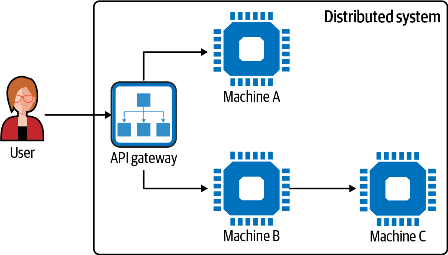

# Темна сторона розподілених систем

Тепер, коли ви краще розумієте Reactive і маєте короткий огляд Quarkus, давайте зосередимося на тому, чому ви хотіли б їх використовувати, і, точніше, створювати реактивні системи. Причина походить від хмари та, загалом, у необхідності створювати *кращі* розподілені системи. Хмара змінила правила гри. Це полегшує створення розподілених систем. Ви можете створювати віртуальні ресурси на льоту та використовувати готові сервіси. Однак *легше* не означає *простіше*. Побудова таких систем є серйозною проблемою. чому Оскільки хмара — це розподілена система, а розподілені системи складні. Нам потрібно зрозуміти, яку тварину ми намагаємося приручити.

**Що таке розподілена система?**

Існує багато визначень розподілених систем. Але давайте почнемо з вільного, написаного почесним професором Ендрю Таненбаумом, і подивимося, чого ми можемо навчитися: Розподілена система — це сукупність незалежних комп’ютерів, яка виглядає для своїх користувачів як єдина злагоджена система.

Це визначення підкреслює два важливі аспекти розподілених систем:

- Розподілена система складається з *незалежних* машин, які є автономними. Їх можна запустити і зупинити в будь-який момент. Ці машини працюють одночасно і можуть виходити з ладу незалежно, не впливаючи на час безвідмовної роботи всієї системи (принаймні теоретично).

- Споживачі (користувачі) не повинні знати про структуру системи. Це має забезпечувати постійний досвід. Як правило, ви можете використовувати службу HTTP, яка обслуговується шлюзом API (рис. 3-1), делегуючи запити на різні *машини*.

Для вас, абонента, розподілена система поводиться як єдина узгоджена система: у вас є єдина точка входу та ігнорується базова структура системи.



Щоб досягти такого рівня узгодженості, автономні машини повинні так чи інакше співпрацювати. Ця співпраця та потреба в хорошій комунікації, що виникає з неї, є серцевиною розподілених систем, але також і їх основною проблемою. Але це визначення не пояснює, чому ми створюємо розподілені системи. Спочатку розподілені системи були обхідними шляхами. Ресурси кожної машини були надто обмежені. Підключення кількох машин було розумним способом збільшити пропускну здатність усієї системи, зробивши ресурси доступними для інших учасників мережі. Сьогодні мотивація дещо інша. Використання набору розподілених машин дає нам більше *гнучкості* для бізнесу, полегшує еволюцію, скорочує час виходу на ринок, а з операційної точки зору дозволяє нам швидше масштабуватися, покращує стійкість за допомогою реплікації тощо.

Розподілені системи перетворилися з обхідного шляху на норму. чому Ми не можемо побудувати жодну машину, достатньо потужну, щоб задовольнити всі потреби великої корпорації, водночас *також* доступну за ціною. Якби ми могли, ми всі використовували б гігантську машину та розгортали на ній незалежні програми. Але ця потреба в розповсюдженні створює нові операційні та бізнес-межі на основі меж фізичної системи. Мікросервіси, безсерверна архітектура, сервіс-орієнтована архітектура (SOA), кінцеві точки REST, мобільні програми — усе це розподілені системи.

Цей розподіл ще більше підкреслює необхідність співпраці між усіма компонентами, що утворюють систему. Коли програма (наприклад, реалізована на Java) потребує локальної взаємодії, вона просто використовує виклик методу. Наприклад, щоб співпрацювати зі службою, що розкриває метод hello, ви використовуєте service.hello. Ми залишаємося в тому самому процесі. Виклики можуть бути синхронними; мережевий ввід-вивід не задіяний.

Однак розосереджена природа розподілених систем передбачає взаємодію між процесами, і здебільшого через мережу (рис. 3-2). Робота з введенням/виведенням і проходженням мережі значно відрізняє ці взаємодії. Багато проміжних програм намагалися зробити розповсюдження прозорим, але, не помиляйтеся, повна прозорість — це брехня, як пояснюється в [«Примітка щодо розподілених обчислень» ](https://oreil.ly/iCz3c) Джим Волдо та ін. Це завжди має зворотний ефект, так чи інакше. Вам потрібно зрозуміти унікальну природу віддаленого зв’язку та усвідомити, наскільки вони відмінні, щоб побудувати надійні розподілені системи.


Перша відмінність – тривалість. Віддалений виклик займе набагато більше часу, ніж місцевий. Цей час на кілька градусів вище. Коли все гаразд, надсилання запиту з Нью-Йорка до Лос-Анджелеса займає приблизно 72 мс. Виклик локального методу займає менше наносекунди.

Віддалений виклик також залишає простір процесу, тому нам потрібен протокол обміну. Цей протокол визначає всі аспекти обміну, наприклад, хто ініціює зв’язок, як інформація записується в канал (серіалізація та десеріалізація), як повідомлення направляються до місця призначення тощо.

Коли ви розробляєте свою програму, більшість цих варіантів приховані від вас, але присутні під капотом. Давайте візьмемо кінцеву точку REST, яку ви хочете викликати. Для надсилання даних та інтерпретації відповіді ви використовуватимете HTTP та, швидше за все, деяке представлення JSON. Ваш код відносно простий, як ви бачите в прикладі 3-1.

```java
HttpClient client = HttpClient.newHttpClient(); HttpRequest request = HttpRequest.newBuilder()
.uri(URI.create("https://httpbin.org/anything")) .build();

HttpResponse<String> response = client.send(request, HttpResponse.BodyHandlers.ofString());

System.out.println(response.body());
```

Давайте опишемо, що відбувається, коли ви його виконуєте:

1. Ваша програма створює HTTP-запит (запит).
2. Встановлюється HTTP-з’єднання з віддаленим сервером. 
3. Записує HTTP-запит відповідно до протоколу.
4. Запит передається на сервер.
5. Сервер інтерпретує запит і шукає ресурс.
6. Сервер створює HTTP-відповідь із представленням стану ресурсу в JSON.
7. Пише відповідь після протоколу.
8. Програма отримує відповідь і витягує тіло (як String у цьому прикладі).

Проміжне програмне забезпечення (HTTP-сервер і клієнт, програми відображення JSON…) — полегшити цю взаємодію для нас, розробників. У нашому попередньому прикладі всі кроки з 2 по 8 приховані в методі надсилання. Але ми маємо їх знати. Особливо сьогодні, з хмарою, розподілені системи та розподілені комунікації всюди. Стає рідкістю створення програми, яка не є розподіленою системою. Щойно ви викликаєте віддалену веб-службу, друкуєте документ або використовуєте онлайн-інструмент для співпраці, ви створюєте розподілену систему.

## Cloud Native і Kubernetes

Роль хмари важко переоцінити, і це значний фактор у популяризації розподілених систем. Якщо вам потрібна нова машина, база даних, шлюз API або постійне сховище, хмара може забезпечити надання цих обчислювальних послуг на вимогу. Нагадуємо, що, незважаючи на те, що хмара покращує ефективність, ви ніколи не повинні забувати, що запуск вашої програми в хмарі еквівалентний роботі на чужій машині. Десь є процесори, диски та пам’ять, які використовуються для виконання вашої програми, і хоча хмарні постачальники відповідають за підтримку цих систем і створили репутацію завдяки надійності, апаратне забезпечення поза вашим контролем.

Хмарні постачальники надають фантастичні інфраструктурні засоби, що робить запуск програм набагато простішим. Завдяки динамічним ресурсам ви можете створити багато екземплярів своєї програми та навіть автоматично налаштувати цю кількість на основі поточного навантаження. Він також пропонує механізми відновлення після збоїв, такі як маршрутизація запитів до справного екземпляра, якщо інший екземпляр вийшов з ладу. Хмара допомагає досягти високої доступності, роблячи вашу службу завжди доступною, перезапускаючи непрацездатні частини ваших систем тощо. Це перший крок до еластичних і пружних систем.

З огляду на це, ваша програма виграє від цього не тому, що вона може працювати в хмарі. Вам потрібно адаптувати свою програму для ефективного використання хмари, і розподілена природа хмари є великою частиною цього. *Cloud native* — це підхід до створення та запуску програм, які використовують модель доставки хмарних обчислень. Хмарні рідні програми мають легко розгортатися на віртуальних ресурсах, підтримувати еластичність через екземпляри програми, покладатися на прозорість розташування, забезпечувати відмовостійкість тощо. [Twelve-Factor App](https://12factor.net) перелічує деякі характеристики, щоб стати *хорошим громадянином хмари*:

*Codebase* - Одна кодова база, що відстежується в системі керування версіями, багато розгортань.

*Dependencies* - Явно оголошуйте та ізолюйте залежності.

*Config* - зберегти конфігурацію в середовищі.

*Backing services* - Розглядайте резервні служби як прикріплені ресурси.

*Build, release, run* - Строго розділені етапи збірки та запуску.

*Processes* - Виконайте програму як один або кілька процесів без стану.

*Port binding* - Експорт послуг через прив’язку порту.

*Concurrency* - Масштабування за допомогою моделі процесу.

*Disposability* - Збільште надійність завдяки швидкому запуску та плавному завершенню роботи.

*Dev/prod parity* - Зберігайте розробку, постановку та виробництво якомога подібнішими.

*Logs* - Розглядайте свої журнали як потоки подій.

*Admin processes* - Виконуйте завдання адміністрування/керування як одноразові процеси.

Реалізація цих факторів допомагає сприйняти хмарну нативну ідеологію. Але створення нативної хмари – завдання не з легких. Кожен фактор має технічні проблеми та архітектурні обмеження.

Крім того, кожен постачальник хмарних послуг надає власний набір засобів і API. Ця гетерогенність робить хмарні програми непереносимими від одного хмарного постачальника до іншого. Дуже швидко ви потрапляєте в певний тип блокування постачальника через певний API або служби, або інструменти, або навіть формат опису. Можливо, зараз це не проблема для вас, але можливість переміщувати та об’єднувати кілька хмар покращує вашу гнучкість, доступність та покращує взаємодію з користувачем. Наприклад, гібридні хмарні програми працюють у кількох хмарах, змішуючи приватні та загальнодоступні хмари, щоб зменшити час відповіді та запобігти глобальній недоступності.

На щастя, публічні та приватні хмари, як правило, об’єднуються навколо Kubernetes, платформи оркестровки контейнерів. Kubernetes абстрагує відмінності між постачальниками, які використовують *стандартні* засоби розгортання та виконання.

Щоб використовувати Kubernetes, ви пакуєте та запускаєте свою програму всередині контейнера. *Контейнер* — це коробка, в якій запускатиметься ваша програма. Отже, ваша програма є певною мірою ізольованою від інших програм, що працюють у власному вікні.

Для створення контейнерів потрібне зображення. *Зображення контейнера* — це легкий, виконуваний пакет програмного забезпечення. Коли ви розгортаєте контейнер, ви фактично розгортаєте образ, і цей образ створюється для створення контейнера.

Образ містить усе необхідне для запуску програми: код, час виконання, системні бібліотеки та конфігурацію. Ви можете створювати зображення контейнерів за допомогою різних інструментів і дескрипторів, таких як *Dockerfile*. Як ви бачили в розділі 2, Quarkus пропонує засоби створення зображень без необхідності писати жодного рядка коду.

Щоб розповсюдити свій образ, ви надсилаєте його до реєстру зображень, наприклад [Docker Hub. ](https://hub.docker.com) Потім ви можете витягнути його та нарешті створити екземпляр, щоб запустити вашу програму (Малюнок 3-3).


Хоча контейнеризація є добре відомою технікою, коли у вас з’являються десятки контейнерів, керування ними стає складнішим. Kubernetes надає засоби для зменшення цього тягаря. Він створює екземпляри контейнерів і контролює їх, переконуючись у тому, що ваша програма продовжує працювати.2 Як ви можете собі уявити, це може бути корисним для реалізації характеристик чутливості та стійкості реактивних систем.

Хоча Kubernetes сприяє створенню реактивних систем завдяки швидкості реагування та стійкості, це не означає, що ви не можете реалізувати реактивну систему поза Kubernetes. Це точно можливо. У цій книзі ми використовуємо Kubernetes, щоб уникнути необхідності впровадження основних інфраструктурних функцій, таких як розгортання, реплікація та виявлення помилок.

Під капотом Kubernetes отримує зображення контейнерів, створює екземпляри контейнерів і контролює їх. Щоб досягти цього, Kubernetes повинен мати доступ до *вузлів* для запуску контейнерів. Цей набір вузлів утворює *кластер*. Уявлення про машину як про вузол дозволяє нам вставити рівень абстракції. Неважливо, чи є ці машини примірниками Amazon Elastic Compute Cloud (EC2), фізичним обладнанням із центру обробки даних чи віртуалізованими. Kubernetes контролює ці вузли та вирішує, яка частина системи де працюватиме.

Коли Kubernetes отримає доступ до вашого образу контейнера, ви можете наказати Kubernetes створити екземпляр зображення, щоб воно стало запущеним контейнером. Kubernetes вирішує, на якому вузлі буде запущено контейнер. Він навіть може перенести його пізніше, щоб оптимізувати використання ресурсів, ще одна характеристика, яка підходить для реактивних архітектур.

Подібно до того, як програми мають бути вбудованими в хмару, щоб отримати вигоду від хмари, вони мають бути рідними для Kubernetes, щоб отримати вигоду від Kubernetes. Це включає підтримку виявлення служби Kubernetes, показ перевірок працездатності, які використовуються для моніторингу, і, що більш важливо, ефективну роботу в контейнері. У наступному розділі ви побачите, наскільки ці три характеристики важливі з точки зору Reactive. Ви можете загорнути практично будь-яку аплікацію в контейнер. Але це може бути не гарною ідеєю.

Під час роботи в контейнері ваша програма живе в спільному середовищі. Кілька контейнерів спільно використовують ресурси від *хосту*, машини, яка їх виконує. Вони спільно використовують центральний процесор, пам'ять і так далі. Якщо один контейнер занадто жадібний, він карає інші контейнери, які можуть голодувати. Звичайно, ви можете використовувати квоти, але як би поводився жадібний контейнер в умовах обмеження ресурсів? Отже, так, контейнери забезпечують ізоляцію *і* спільне використання ресурсів.

Однією з ролей контейнерів і Kubernetes є збільшення щільності розгортання: більше роботи з використанням кінцевого набору доступних ресурсів. Щільність розгортання стає важливою для багатьох організацій через економічні вигоди. Це дозволяє зменшити витрати, зменшивши щомісячний рахунок за хмару або запустивши більше програм на поточній внутрішній інфраструктурі.

## Темна сторона розподілених систем

Наша система проста, але навіть така базова система може проілюструвати сувору реальність розподілених систем. Хмарні провайдери та Kubernetes забезпечують чудову інфраструктуру, але закони розподілених систем все ще керують системою, яку ви будуєте. Технічну складність, пов’язану з забезпеченням і доставкою, замінили фундаментальними проблемами природи розподілених систем. Розмір і складність сучасних програм роблять їх незаперечними.

На початку цього розділу ви побачили перше визначення розподілених систем. Він враховував потребу у співпраці та спілкуванні, щоб забезпечити стабільний досвід. [Леслі Лемпорт, ](http://www.lamport.org), комп’ютерний науковець і лауреат премії Тюрінга, дає інше визначення, яке описує темну природу розподілених систем: «Розподілена система — це система, в якій збій комп’ютер, про існування якого ви навіть не підозрювали, може зробити ваш власний комп’ютер непридатним для використання».

Іншими словами, невдачі неминучі. Вони є невід’ємним компонентом розподілених систем. Незалежно від того, як побудована ваша система, вона вийде з ладу. Як наслідок, чим більша розподілена система, тим вищий рівень *динамізму* (коливання доступності навколишніх послуг) і тим більша ймовірність відмови.

З якими невдачами ми можемо зіткнутися? Є три види:

*Минуща помилка* - Виникає один раз, а потім зникає, як тимчасове порушення мережі

*Періодична несправність* - Виникає, потім зникає, а потім знову з’являється, як невдача, яка час від часу трапляється без видимої причини

*Постійний збій* - Продовжує існувати, доки несправний компонент (програмне чи апаратне забезпечення) не буде виправлено

Кожен тип відмови може мати два види наслідків. По-перше, це може привести до збою програми. Ми називаємо це відмовами *fail-stop*. Звісно, є *погані*, але ми можемо легко їх виявити та відремонтувати систему. По-друге, збій може призвести до непередбачуваних реакцій у випадковий час. Ми називаємо їх *візантійськими провалами*. Їх набагато важче виявити та обійти.

## Питання часу: синхронне спілкування

Час часто неправильно розуміють. Коли два комп’ютери спілкуються та обмінюються повідомленнями, ми робимо природне припущення, що обидві машини доступні та доступні. Ми часто довіряємо мережі між ними. Чому б він не був повністю робочим? Чому ми не можемо викликати віддалені служби, як це було б для локальної служби?

Але це може бути не так, і неврахування цієї можливості призводить до крихкості. Що станеться, якщо машина, з якою ви хочете взаємодіяти, недоступна? Чи готові ви до такої невдачі? Чи варто поширювати провал? Повторити?

У гіпотетичному прикладі на основі мікросервісів зазвичай використовують синхронний HTTP як основний протокол зв’язку між сервісами. Ви надсилаєте запит і очікуєте відповіді від викликаної вами служби. Ваш код є синхронним, він очікує на відповідь перед тим, як продовжити його виконання. Синхронні виклики легше міркувати. Ви структуруєте свій код послідовно, ви робите одну річ, потім наступну і так далі. Це призводить до *зв’язку часу*, однієї з менш обдуманих і часто неправильно зрозумілих форм зв’язку. Давайте проілюструємо цей зв’язок і невизначеність, яка з нього виникає.

Коли ми викликаємо нашу службу синхронно (очікуючи відповідь, наприклад, за допомогою curl або браузера), може статися три типи збою:

- Запит між абонентом і службою може бути втрачений. Це призводить до того, що послуга не викликається. Абонент чекає, поки не буде досягнуто тайм-ауту. Це імітує тимчасовий розділ мережі. Цей тип помилки можна ввімкнути за допомогою режиму INBOUND_REQUEST_LOSS.

- Служба отримує запит, але не може правильно його обробити. Він може повернути неправильну відповідь або, можливо, не відповісти взагалі. У найкращому випадку абонент отримає повідомлення про помилку або зачекає, доки не буде досягнуто тайм-ауту. Це імітує періодичну помилку у викликаній службі. Цей тип збою можна ввімкнути за допомогою режиму SERVICE_FAILURE.

- Служба отримує запит, обробляє його та записує відповідь, але відповідь втрачається на зворотному шляху, або з’єднання закривається до того, як відповідь досягне абонента. Служба отримала запит, обробила його та видала відповідь. Абонент просто не розуміє. Як і в першому типі помилки, зазначеному раніше, відповідь знаходиться в тимчасовому розділі мережі, але відбувається після виклику служби. Цей тип помилки можна ввімкнути за допомогою режиму OUT BOUND_RESPONSE_LOSS.

Не забудьте оновити порт у попередній і наступних командах, оскільки minikube випадково вибирає порт.

## Summary

Distributed systems are challenging. To build distributed systems, you need to under‐ stand their nature and always plan for the worst-case scenario. Hiding the nature of distributed systems to seek simplicity does not work. It results in fragile systems.

This chapter covered the following:

• The erratic nature of distributed systems

• The evolution of distributed systems from a workaround to the norm

• Use of the cloud and Kubernetes to simplify the construction of distributed systems

• Potential failures of distributed communications caused by network disruptions, or slowness

But we won’t stop on a failure! Time to rebound! Let’s look a bit more into Reactive and see how it proposes to address these issues.

## Резюме

Розподілені системи викликають труднощі. Щоб побудувати розподілені системи, вам потрібно розуміти їх природу та завжди планувати найгірший сценарій. Приховування природи розподілених систем у пошуках простоти не працює. Це призводить до крихких систем.

Цей розділ охоплював наступне:

- Нестабільна природа розподілених систем

- Еволюція розподілених систем від обхідного шляху до норми

- Використання хмари та Kubernetes для спрощення побудови розподілених систем

- Потенційні збої розподіленого зв'язку, спричинені перебоями в мережі або повільністю