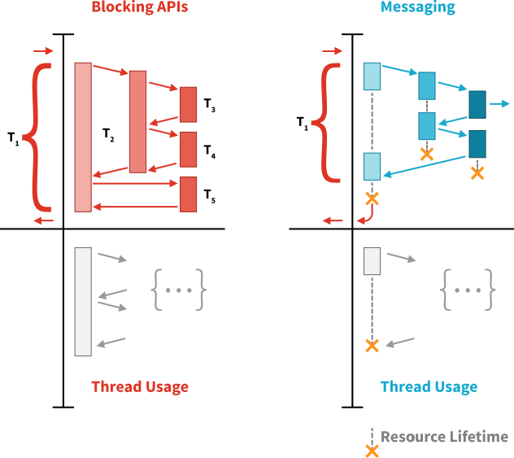
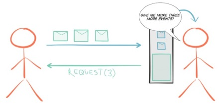
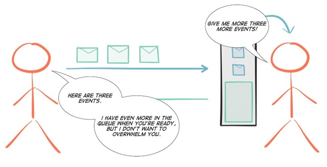
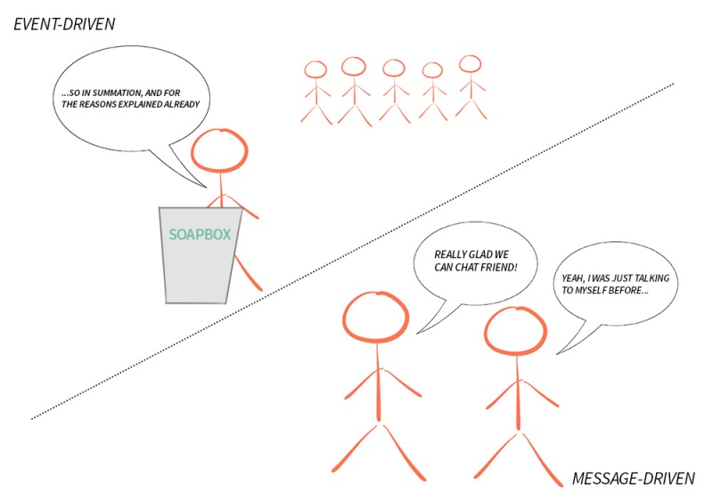
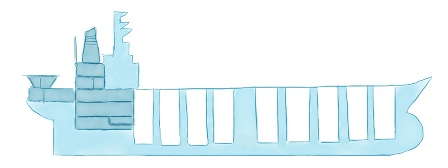
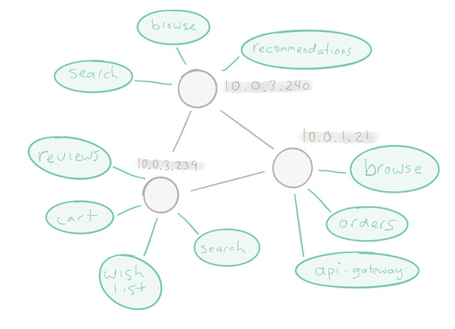

# Реактивне програмування проти реактивних систем

Reactive Programming versus Reactive Systems. Jonas Bonér and Viktor Klang, Lightbend Inc

https://www.lightbend.com/white-papers-and-reports/reactive-programming-versus-reactive-systems

Приземлення на набір простих принципів дизайну Reactive у морі постійної плутанини та перевантажених очікувань.

## Резюме

Після того, як ми стали співавторами [Reactive Manifesto](http://www.reactivemanifesto.org/) у 2013 році, ми спостерігали, як тема Reactive перестала бути практично невизнаною технікою створення програм, яка використовується лише в маргінальних проектах у рамках виберіть декілька корпорацій, щоб стати частиною загальної стратегії платформи багатьох великих гравців у сфері проміжного ПЗ.

Метою цієї білої книги є визначення та роз’яснення різних аспектів «Reactive», розглядаючи відмінності між написанням коду в стилі реактивного програмування та дизайном Reactive Systems як єдиного цілого.

## Ключові висновки (TL;DR)

- З 2015 року, а особливо в 2016 році, спостерігається величезне зростання інтересу до Reactive — як з боку комерційних постачальників проміжного ПЗ, так і з боку користувачів.
- Реактивне програмування є окремою підмножиною реактивних систем на рівні впровадження.
- Реактивне програмування забезпечує продуктивність для розробників — завдяки продуктивності та ефективності ресурсів — на рівні компонентів для внутрішньої логіки та керування потоком даних.
- Reactive Systems забезпечує продуктивність для архітекторів і DevOps — завдяки стійкості та еластичності — на рівні системи, для створення «Cloud Native»[1](https://www.lightbend.com/white-papers-and-reports/reactive- programming-versus-reactive-systems#notes) або інші великомасштабні розподілені системи.
- Дуже вигідно використовувати реактивне програмування в компонентах реактивної системи.
- Дуже вигідно використовувати Reactive Systems для створення системи навколо компонентів, написаних за допомогою Reactive Programming.

## Reactive - набір принципів проектування

Одним із нещодавніх показників успіху є те, що Reactive став перевантаженим терміном і тепер для різних людей асоціюється з кількома різними речами — у хорошій компанії такими словами, як «потокове передавання», «легкий» і «реальний час».

З точки зору цього документу, «Reactive» — це набір принципів проектування для створення згуртованих систем. Це спосіб мислення про архітектуру та дизайн систем у розподіленому середовищі, де методи впровадження, інструменти та шаблони проектування є компонентами більшого цілого.

Розглянемо таку аналогію: спортивна команда (наприклад, футбольна, баскетбольна тощо) часто складається з виняткових людей. Тим не менш, поразка від «нижчої» команди все одно є звичайним явищем, коли команда збирається разом і щось не клацає. Ми бачимо брак синергії для ефективної командної роботи.

Ця аналогія ілюструє різницю між набором окремих реактивних сервісів, зібраних бездумно, навіть якщо окремо вони чудові, та реактивною системою.

У реактивній системі головне — взаємодія між окремими частинами, яка полягає в здатності працювати індивідуально, але разом з тим діяти узгоджено для досягнення наміченого результату.

Реактивна система заснована на архітектурному стилі, який дозволяє цим численним окремим службам об’єднуватися в єдине ціле та реагувати на навколишнє середовище, залишаючись обізнаними одна про одну — це може проявлятися в можливості масштабування, балансування навантаження та навіть використання деякі з цих кроків проактивно.

Таким чином, ми бачимо, що можна написати одну програму в реактивному стилі (тобто за допомогою реактивного програмування); однак це лише одна частина головоломки. Хоча кожен із наведених вище аспектів може здатися кваліфікованим як «реактивний», самі по собі вони не роблять систему реактивною.

Коли люди говорять про Reactive у контексті розробки та дизайну програмного забезпечення, вони зазвичай мають на увазі одну з трьох речей:

- Реактивні системи (архітектура та дизайн)
- Реактивне програмування (декларативне на основі подій)
- Функціональне реактивне програмування (FRP)

Ми розглянемо, що означає кожна з цих практик і технік, з акцентом на перших двох. Точніше, ми обговоримо, коли їх використовувати, як вони пов’язані між собою та яких переваг ви можете очікувати від кожного, зокрема в контексті побудови систем для багатоядерних, хмарних і мобільних архітектур.

У 2013 році, після тривалого досвіду створення, підтримки та введення в дію систем на основі Akka — і побачивши величезні переваги порівняно з традиційними підходами до вирішення проблем паралелізму та розповсюдження — дея офіційного оформлення досвіду та отриманих уроків виникла [ Reactive Manifesto](http://www.reactivemanifesto.org/).

Основним рушієм сучасних систем є поняття швидкості реагування: визнання того, що якщо клієнт/замовник не отримає цінності вчасно, він піде кудись в інше місце. По суті, немає різниці між тим, щоб не отримати цінність і не отримати цінність, коли вона потрібна.

Щоб сприяти швидкому реагуванню, необхідно зіткнутися з двома проблемами: бути чуйним у разі відмови, що визначається як стійкість, і бути чуйним під навантаженням, що визначається як еластичність. Реактивний маніфест передбачає, що для досягнення цього система повинна керуватися повідомленнями.

​								 							The four tenets of the Reactive Manifesto. 					

У 2016 році кілька великих постачальників у сфері JVM оголосили про основні ініціативи щодо впровадження реактивного програмування — це надзвичайне підтвердження проблем, з якими сьогодні стикаються компанії.

Здійснення цієї зміни в напрямку традиційних методів програмування є великим і складним завданням; необхідно підтримувати сумісність з уже існуючими технологіями, а також перевести базу користувачів на інше мислення, а також накопичувати внутрішній досвід розробників і операцій. Таким чином, інвестиції цих компаній є нетривіальними, і немає потреби згадувати, що це великий інженерний виклик.

Хоча здається, що в просторі реактивного програмування є багато активності, на рівні системної архітектури потрібен час для накопичення архітектурного та операційного досвіду — те, що автоматично не вирішується шляхом прийняття іншої парадигми програмування. Буде цікаво подивитися, що з’явиться на цьому фронті, враховуючи зростаючу частку розуму, що стоїть за Reactive Manifesto — необхідність створення Reactive Systems.

Давайте почнемо з розмови про функціональне реактивне програмування та про те, чому ми вирішили виключити його з подальших обговорень у цій статті.

## Функціональне реактивне програмування (FRP)

Функціональне реактивне програмування, яке зазвичай називають «FRP», часто неправильно розуміють. FRP було [точно визначено](http://conal.net/papers/icfp97/) 20 років тому Коналом Елліоттом. Останнім часом цей термін використовувався неправильно [2](https://www.lightbend.com/white-papers-and-reports/reactive-programming-versus-reactive-systems#notes) для опису таких технологій, як Elm, Bacon. js і Reactive Extensions (RxJava, Rx.NET, RxJS) серед інших. Більшість бібліотек, які стверджують, що підтримують FRP, майже виключно говорять про реактивне програмування, тому це не буде обговорюватися далі.

## Реактивне програмування

Реактивне програмування, яке не слід плутати з функціональним реактивним програмуванням, є підмножиною асинхронного програмування та парадигмою, де доступність нової інформації рухає логіку вперед, а не потік керування, керований потоком виконання.

Він підтримує декомпозицію проблеми на кілька окремих кроків, кожен з яких може виконуватися асинхронним і неблокуючим способом, а потім складатися для створення робочого процесу — можливо, необмеженого в своїх входах і виходах.

[Асинхронний](http://www.reactivemanifesto.org/glossary#Asynchronous) визначається Оксфордським словником як «не існує або не відбувається одночасно», що в цьому контексті означає, що обробка повідомлення або події відбувається в якийсь довільний час, можливо, в майбутньому.

This is a very important technique in Reactive Programming since it allows for [non-blocking](http://www.reactivemanifesto.org/glossary#Non-Blocking) execution—where threads of execution competing for a shared resource  don’t need to wait by blocking (preventing the thread of execution from  performing other work until current work is done), and can as such  perform other useful work while the resource is occupied. Amdahl’s Law[3](https://www.lightbend.com/white-papers-and-reports/reactive-programming-versus-reactive-systems#notes) tells us that contention is the biggest enemy of scalability, and  therefore a Reactive program should rarely, if ever, have to block.

Це дуже важливий прийом у реактивному програмуванні, оскільки він дозволяє виконувати [неблокуюче](http://www.reactivemanifesto.org/glossary#Non-Blocking) виконання, коли потоки виконання, що конкурують за спільний ресурс, не потребують чекати шляхом блокування (запобігаючи виконанню іншої роботи потоком виконання, доки поточна робота не буде виконана), і як така може виконувати іншу корисну роботу, поки ресурс зайнятий. Закон Амдала [3](https://www.lightbend.com/white-papers-and-reports/reactive-programming-versus-reactive-systems#notes) говорить нам, що суперечка є найбільшим ворогом масштабованості, а тому Реактивну програму рідко, якщо взагалі потрібно блокувати.

​								 

рис. Синхронний блокуючий зв’язок (ліворуч) є неефективним ресурсом і його легко заблокувати. Реактивний підхід (праворуч) зменшує ризики, зберігає цінні ресурси та потребує менше апаратного забезпечення/інфраструктури.

Реактивне програмування, як правило, керується подіями, на відміну від реактивних систем, які керуються повідомленнями. Різниця між керованими подіями та керованими повідомленнями пояснюється в наступному розділі.

Інтерфейс прикладної програми (API) для бібліотек реактивного програмування зазвичай:

- На основі зворотного виклику, де анонімні зворотні виклики, що мають побічний ефект, приєднуються до джерел подій і викликаються, коли події проходять через ланцюг потоку даних.
- Декларативний—через функціональну композицію, як правило, з використанням усталених комбінаторів, таких як карта, фільтр, згортання тощо.

Більшість бібліотек забезпечують поєднання цих двох стилів, часто з додаванням потокових операторів, таких як вікна, підрахунки, тригери тощо.

Було б розумно стверджувати, що реактивне програмування пов’язане з [програмуванням потоків даних](https://en.wikipedia.org/wiki/Dataflow_programming), оскільки акцент робиться на потоці даних, а не на потоці керування.

Приклади абстракцій програмування, які підтримують цю техніку програмування:

- [Futures/Promises](https://en.wikipedia.org/wiki/Futures_and_promises) — контейнери єдиного значення, семантика багатьох читань/одного запису, де можна додавати асинхронні перетворення значення, навіть якщо воно не є ще в наявності.
- Потоки, як у [Reactive Streams](http://www.reactive-streams.org/): необмежені потоки обробки даних, які забезпечують асинхронні, неблокуючі конвеєри перетворення зі зворотним тиском між безліччю джерел і місць призначення.
- [Змінні потоку даних](https://en.wikipedia.org/wiki/Oz_(programming_language)#Dataflow_variables_and_declarative_concurrency)—окремі змінні призначення (комірки пам’яті), які можуть залежати від вхідних даних, процедур та інших комірок, тому зміни вносяться автоматично оновлено. Практичним прикладом є електронні таблиці, де зміна значення в комірці протікає через усі залежні функції, створюючи нові значення «за потоком».

Популярні бібліотеки, що підтримують методи реактивного програмування на JVM, включають, але не обмежуються цим, Akka Streams, Ratpack, Reactor, RxJava та Vert.x. Ці бібліотеки реалізують специфікацію Reactive Streams, яка є стандартом для взаємодії між бібліотеками реактивного програмування на JVM, і, згідно з її власним описом, є «...ініціативою для забезпечення стандарту для обробки асинхронних потоків із неблокуючим зворотним тиском. »

## Переваги (і обмеження) реактивного програмування

Основними перевагами реактивного програмування є: збільшення використання обчислювальних ресурсів на багатоядерному та багатопроцесорному обладнанні; і підвищення продуктивності за рахунок зменшення точок серіалізації згідно із законом Амдала та, як розширення, універсальним законом масштабованості Гюнтера. [4](https://www.lightbend.com/white-papers-and-reports/reactive-programming-versus-reactive-systems#notes)

Другою перевагою є продуктивність розробника, оскільки всі традиційні парадигми програмування намагалися забезпечити простий і зручний підхід до роботи з асинхронними та неблокуючими обчисленнями та введенням-виведенням. Реактивне програмування вирішує більшість проблем, оскільки зазвичай усуває потребу в явній координації між активними компонентами.

Де реактивне програмування сяє у створенні компонентів і композиції робочих процесів. Щоб повністю скористатися перевагами асинхронного виконання, включення [зворотного тиску](http://www.reactivemanifesto.org/glossary#Back-Pressure) має вирішальне значення, щоб уникнути надмірного використання або, точніше, необмеженого споживання ресурсів.

  

Щоб забезпечити стабільний стан з точки зору потоку даних, зворотний тиск на основі витягування надсилає попит угору та отримує повідомлення, що надходять униз, що дозволяє уникнути перевантаження виробником споживача(ів). Зображення Кевіна Веббера (@kvnwbbr). 

Але навіть незважаючи на те, що реактивне програмування є дуже корисним елементом при створенні сучасного програмного забезпечення, щоб міркувати про систему на вищому рівні, потрібно використовувати інший інструмент: реактивну архітектуру — процес проектування реактивних систем. Крім того, важливо пам’ятати, що існує багато парадигм програмування, і реактивне програмування є лише однією з них, тому, як і будь-який інший інструмент, воно не призначене для будь-яких випадків використання.

## Керований подіями VS Керований повідомленнями

Як згадувалося раніше, реактивне програмування, яке зосереджується на обчисленнях через ефемерні ланцюжки потоків даних, зазвичай *керується подіями*, тоді як реактивні системи, які зосереджуються на стійкості та еластичності через зв’язок і координацію розподілених систем, є [Message-driven](http://www.reactivemanifesto.org/glossary#Message-Driven) [5](https://www.lightbend.com/white-papers-and-reports/reactive-programming-versus-reactive-systems#notes ) (також називається обмін повідомленнями).

Основна відмінність між системою, керованою повідомленнями з довгостроковими адресованими компонентами, та моделлю, керованою потоком даних, керованою подіями, полягає в тому, що повідомлення *за своєю суттю керуються*, а події – ні. **Повідомлення мають чітке, єдине призначення; в той час як Події є фактами для спостереження за іншими**. Крім того, передача повідомлень переважно є асинхронною, при цьому надсилання та отримання відокремлені від відправника та одержувача відповідно.

 

У той час як комунікація, керована подіями, використовує підхід «мильної коробки (soapbox)», транслюючи факти (події), щоб інші могли їх спостерігати (якщо вони слухають), комунікація, керована повідомленнями, має адресного одержувача та єдину мету.	

Глосарій у Reactive Manifesto визначає концептуальну різницю так:

> Повідомлення – це елемент даних, який надсилається певному адресату. Подія - це сигнал, який випромінює компонент після досягнення заданого стану. У системі, керованій повідомленнями, адресні одержувачі очікують надходження повідомлень і реагують на них, інакше залишаються бездіяльними. У керованій подіями системі слухачі сповіщень приєднуються до джерел подій таким чином, що вони викликаються, коли подія випущена. *Це означає, що система, керована подіями, зосереджена на адресних джерелах подій, тоді як система, керована повідомленнями, зосереджена на адресних одержувачах*.

Повідомлення необхідні для обміну даними через мережу та є основою для зв’язку в розподілених системах, тоді як події, з іншого боку, надсилаються локально. Звичайним є використання системи обміну повідомленнями під капотом для з’єднання системи, керованої подіями, через мережу шляхом надсилання подій усередині повідомлень. Це дозволяє підтримувати відносну простоту моделі програмування, керованої подіями, у розподіленому контексті та може дуже добре працювати для спеціалізованих і добре охоплених випадків використання (наприклад, AWS Lambda, продукти розподіленої потокової обробки, такі як Spark Streaming, Flink, Kafka та Akka Streams). через Gearpump і продукти Distributed Publish Subscribe, такі як Kafka і Kinesis).

Однак існує компроміс: те, що ви отримуєте в абстрактності та простоті моделі програмування, втрачаєте в плані керування.

Обмін повідомленнями змушує нас сприймати реальність і обмеження розподілених систем — такі речі, як часткові збої, виявлення збоїв, видалені/дубльовані/перевпорядковані повідомлення, можлива узгодженість, керування декількома одночасними реальностями тощо — і вирішувати їх прямо замість того, щоб ховати їх за негерметична абстракція — вдавання, що мережі немає — як це робилося занадто багато разів у минулому (наприклад, EJB, [RPC](https://christophermeiklejohn.com/pl/2016/04/12/rpc.html), [CORBA](https://queue.acm.org/detail.cfm?id=1142044) і [XA](https://cs.brown.edu/courses/cs227/archives/2012/papers/weaker/cidr07p15.pdf)).

Ці відмінності в семантиці та застосовності мають глибокі наслідки в дизайні програми, включаючи такі речі, як стійкість, еластичність, мобільність, прозорість розташування та управління складністю розподілених систем, які будуть пояснені далі в цьому документі.

У реактивній системі, особливо в тій, яка використовує реактивне програмування, будуть присутні як події, так і повідомлення —**оскільки одне є чудовим інструментом для спілкування (повідомлення), а інше — чудовий спосіб представлення фактів (подій)**.

## Реактивні системи та архітектура

*Reactive Systems* — як визначено в Reactive Manifesto — це набір принципів архітектурного проектування для побудови сучасних систем, добре підготовлених для задоволення зростаючих вимог, з якими сьогодні стикаються програми.

Принципи реактивних систем, безперечно, не є новими, їх можна простежити до 70-х і 80-х років і основоположної роботи Джима Грея та Пета Хелланда над [Tandem System](http://www.hpl.hp.com/techreports/tandem/TR-86.2.pdf) і Джо Армстронг і Роберт Вірдінг на [Erlang](http://erlang.org/download/armstrong_thesis_2003.pdf). Однак ці люди випередили свій час, і лише за останні 5-10 років індустрія технологій була змушена переглянути поточні «найкращі практики» для розвитку корпоративних систем. Це означає навчитися застосовувати важко здобуті знання про принципи Reactive у сучасному світі багатоядерності, хмарних обчислень та Інтернету речей.

Основою для реактивної системи є *Передача повідомлень*, яка створює тимчасову межу між компонентами, що дозволяє їм бути відокремленими в *часі* — це забезпечує паралельність — і *простір* — що забезпечує розподіл і мобільність. Це відокремлення є вимогою для повної [ізоляції](http://www.reactivemanifesto.org/glossary#Isolation) між компонентами та формує основу як для *Стійкості*, так і для *Гнучкості*.

## Від програм до систем

> Ми більше не будуємо програми — наскрізну логіку для обчислення чогось для одного оператора — стільки, скільки будуємо системи.

Світ стає все більш взаємопов’язаним. Системи складні за визначенням, кожна з яких складається з безлічі компонентів, які самі по собі також можуть бути системами, а це означає, що програмне забезпечення все більше залежить від іншого програмного забезпечення для належного функціонування.

Системи, які ми створюємо сьогодні, повинні працювати на малих і великих комп’ютерах, небагатьох і багатьох, поруч один з одним або на відстані півсвіту. І в той же час, очікуванням користувачів стає все важче і важче відповідати, оскільки повсякденне життя людини все більше залежить від наявності систем для безперебійного функціонування.

Щоб запропонувати системи, на які можуть покластися користувачі та компанії, вони мають бути швидко реагуючими, оскільки не має значення, чи щось дає правильну відповідь, якщо відповідь недоступна, коли вона потрібна. Щоб досягти цього, нам потрібно переконатися, що здатність реагувати може підтримуватися в разі відмови (*Стійкість*) і при навантаженні, що динамічно змінюється (*Еластичність*). Щоб це сталося, ми робимо ці системи *Керованими повідомленнями* і називаємо їх *Реактивними системами*.

## Стійкість реактивних систем

Стійкість — це *відповідь* на відмову, і це невід’ємна функціональна властивість системи, те, для чого потрібно розробляти, а не те, що можна додати заднім числом.

> Стійкість — це не тільки відмовостійкість — справа не в плавній деградації — хоча це дуже корисна риса для систем — а в здатності повністю відновлюватися після збою: самовідновлюватися.

Це вимагає ізоляції компонентів і стримування збоїв, щоб уникнути поширення збоїв на сусідні компоненти, що призводить до, часто катастрофічних, каскадних сценаріїв збоїв.

Отже, ключ до побудови стійких, самовідновлюваних систем полягає в тому, щоб дозволити збоям бути: стриманими, конкретизованими у вигляді повідомлень, надсилання іншим компонентам (які діють як супервізори) та керування ними з безпечного контексту за межами несправного компонента. Тут керованість повідомленнями є основним фактором: відмова від сильно пов’язаних, крихких, глибоко вкладених синхронних ланцюжків викликів, через які всі навчилися страждати… або ігнорувати. Ідея полягає в тому, щоб відокремити керування збоями від ланцюжка викликів, звільнивши клієнта від відповідальності за обробку збоїв сервера.

## Пружність реактивних систем

[Еластичність (Elasticity)](http://www.reactivemanifesto.org/glossary#Elasticity) — це *відповідь під навантаженням*, що означає, що пропускна здатність системи також збільшується або зменшується (тобто додавання чи видалення ядер на одній машині). як вхід або вихід (тобто додавання або видалення вузлів/машин у центрі обробки даних) автоматично для задоволення різного попиту, коли ресурси пропорційно додаються або видаляються. Це важливий елемент, необхідний, щоб скористатися перевагами хмарних обчислень: дозволити системам бути ресурсоефективними, економічними, екологічно чистими та платними за використання.

Системи мають бути адаптивними — дозволяти автоматичне масштабування без будь-якого втручання, реплікацію стану та поведінки, балансування навантаження зв’язку, відновлення після збоїв і оновлення — все це без переписування чи навіть зміни конфігурації системи. Засобом для цього є *Прозорість розташування*: можливість масштабувати систему однаково, використовуючи ті самі абстракції програмування, з тією самою семантикою в усіх вимірах масштабування — від ядер ЦП до центрів обробки даних.

As the Reactive Manifesto [puts it](http://www.reactivemanifesto.org/glossary#Location-Transparency):

> Однією з ключових ідей, яка надзвичайно спрощує цю проблему, є усвідомлення того, що ми всі робимо розподілені обчислення. Це вірно незалежно від того, чи ми запускаємо наші системи на одному вузлі (з декількома незалежними процесорами, які спілкуються через канал QPI), чи на кластері вузлів (з незалежними машинами, які спілкуються через мережу). Прийняття цього факту означає, що немає концептуальної різниці між вертикальним масштабуванням на багатоядерних і горизонтальним масштабуванням на кластері.
>
> Це відокремлення в просторі [..], увімкнене через асинхронну передачу повідомлень, і відокремлення екземплярів середовища виконання від їхніх посилань — це те, що ми називаємо прозорістю розташування.

*Тож незалежно від того, де проживає одержувач, ми спілкуємося з ним однаково*. Єдиний спосіб, який може бути семантично еквівалентним, це за допомогою обміну повідомленнями.

## Продуктивність реактивних систем

Оскільки більшість систем за своєю природою є складними, одним із найважливіших аспектів є переконатися, що архітектура системи призведе до мінімального зниження продуктивності як у розробці, так і в обслуговуванні компонентів, водночас зменшуючи *випадкову складність* до мінімуму.

Це важливо, оскільки протягом життєвого циклу системи (якщо її не спроектовано належним чином) її буде ставати все важче і важче обслуговувати, і вимагатиме все більшої кількості часу та зусиль для розуміння, щоб локалізувати та усунути проблеми.

Reactive Systems представляють найпродуктивнішу системну архітектуру, яку ми знаємо (в контексті багатоядерної, хмарної та мобільної архітектур):

- Ізоляція несправностей пропонує [перегородки](http://skife.org/architecture/fault-tolerance/2009/12/31/bulkheads.html) між компонентами, запобігаючи каскаду відмов і обмежуючи обсяг і серйозність відмов.

- Ієрархії супервізора пропонують кілька рівнів захисту в поєднанні з можливостями самовідновлення, що позбавляє від будь-яких операційних витрат на розслідування багатьох тимчасових збоїв.
- Передача повідомлень і прозорість розташування дозволяють перевести компоненти в автономний режим, замінити або перенаправити, не впливаючи на роботу кінцевого користувача. Це зменшує вартість збоїв, їх відносну терміновість, а також ресурси, необхідні для діагностики та усунення.
- Реплікація зменшує ризик втрати даних і зменшує вплив збою на доступність пошуку та зберігання інформації.
- Еластичність дозволяє зберігати ресурси в міру коливань використання, дозволяючи мінімізувати експлуатаційні витрати, коли навантаження низьке, і мінімізувати ризик відключень або термінових інвестицій у масштабованість, коли навантаження зростає.

 						

рис. Хоча на «Титаніку» було зроблено погано, перегородки вже давно використовуються в суднобудівній промисловості, щоб уникнути впливу каскадних несправностей на інші операції.

Таким чином, Reactive Systems дозволяє створювати системи, які добре справляються зі збоями, змінним навантаженням і змінами з плином часу — і все це, пропонуючи низьку вартість володіння з часом.

## Яке відношення реактивне програмування має до реактивних систем?

Реактивне програмування — чудова техніка для керування внутрішньою логікою та перетворенням потоку даних локально в межах компонентів, як спосіб оптимізації чіткості коду, продуктивності та ефективності використання ресурсів. Reactive Systems, будучи набором архітектурних принципів, робить акцент на розподілених комунікаціях і дає нам інструменти для вирішення проблеми стійкості та еластичності розподілених систем.

Одна з поширених проблем із використанням лише реактивного програмування полягає в тому, що його тісний зв’язок між етапами обчислень у керованій подіями зворотній виклик або декларативній програмі ускладнює досягнення *стійкості*, оскільки його ланцюжки перетворень часто є ефемерними, а його етапи — зворотні виклики або комбінатори — є анонімними, тобто не адресними.

Це означає, що вони зазвичай справляються з успіхом або невдачею безпосередньо, *не повідомляючи про це зовнішньому світу*. Ця відсутність адресності ускладнює відновлення окремих етапів, оскільки зазвичай незрозуміло, куди повинні або навіть можуть поширюватися винятки. Як наслідок, збої пов’язані з ефемерними запитами клієнта, а не із загальною працездатністю компонента — якщо один із етапів у ланцюжку потоку даних виходить з ладу, то весь ланцюжок потрібно перезапустити та повідомити клієнта. Це на відміну від реактивної системи, керованої повідомленнями, яка має здатність до самовідновлення без необхідності сповіщення клієнта.

Інший контраст із підходом реактивних систем полягає в тому, що чисте реактивне програмування дозволяє відокремлюватися в часі, але не *в просторі* (якщо не використовувати передачу повідомлень для розподілу графа потоку даних під капотом у мережі, як обговорювалося раніше).

> Відокремлення в часі забезпечує паралельність, але саме відокремлення в просторі забезпечує розподіл і мобільність, дозволяючи не лише статичні, а й динамічні топології, що є важливим для еластичності.

Відсутність прозорості розташування ускладнює масштабування програми, що базується виключно на техніках реактивного програмування, адаптивним і еластичним способом, і тому вимагає розміщення додаткових інструментів поверх, таких як шина повідомлень, сітка даних або індивідуальні мережеві протоколи. Саме тут блищить керований повідомленнями підхід Reactive Systems, оскільки це комунікаційна абстракція, яка підтримує свою модель програмування та семантику в усіх вимірах масштабу, а отже, зменшує складність системи та когнітивні витрати.

Часто згадувана проблема програмування на основі зворотних викликів полягає в тому, що хоча написання таких програм може бути порівняно легким, це може мати реальні наслідки в довгостроковій перспективі.

Наприклад, системи, засновані на анонімних зворотних викликах, дають дуже мало інформації, коли вам потрібно міркувати про них, підтримувати їх або, найголовніше, з’ясувати, що, де і чому виникають збої у виробництві та неправильна поведінка.

Бібліотеки та платформи, розроблені для реактивних систем (такі як проект [Akka](http://akka.io/) і платформа [Erlang](https://www.erlang.org/)) давно засвоїли цей урок і покладаються на довговічні адресні компоненти, які легше міркувати про майбутнє. Коли виникають збої, компонент можна однозначно ідентифікувати разом із повідомленням, яке спричинило збій. Завдяки концепції адресності, яка лежить в основі моделі компонентів, рішення для моніторингу мають значущий спосіб подання зібраних даних, використовуючи ідентифікаційні дані, які поширюються.

Вибір хорошої парадигми програмування, яка забезпечує такі речі, як адресність і керування відмовами, виявився неоціненним у виробництві, оскільки він розроблений з урахуванням суворості реальності, щоб очікувати та прийняти невдачу, а не втрачену справу спробувати щоб запобігти цьому.

Загалом, реактивне програмування є дуже корисною технікою реалізації, яку можна використовувати в реактивній архітектурі. Пам’ятайте, що це допоможе керувати лише однією частиною історії: керування потоком даних через асинхронне та неблокуюче виконання — зазвичай лише в межах одного вузла чи служби. Коли з’являється кілька вузлів, необхідно почати серйозно думати про такі речі, як узгодженість даних, взаємозв’язок між вузлами, координація, керування версіями, оркестровка, керування відмовами, розподіл проблем і відповідальності тощо, тобто. архітектура системи.

 While Reactive 

Програмування зосереджено на асинхронному, неблокуючому управлінні потоком даних між одним вузлом або службою, складні архітектури реактивної системи потребують набагато більше для успішного розгортання кількох служб на вузлах і кластерах.

Тому, щоб максимізувати цінність реактивного програмування, використовуйте його як один із інструментів для побудови реактивної системи. Створення реактивної системи вимагає більшого, ніж абстрагування ресурсів, що стосуються ОС, і додавання асинхронних API і [автоматичних вимикачів](http://martinfowler.com/bliki/CircuitBreaker.html) поверх існуючого застарілого стеку програмного забезпечення. Йдеться про прийняття того факту, що ви будуєте розподілену систему, що складається з кількох служб, які повинні працювати разом, забезпечуючи послідовну та швидку роботу не лише тоді, коли все працює належним чином, але й у разі збоїв і непередбачуваного навантаження .

## Яке відношення реактивного програмування та систем до швидкої потокової передачі даних?

Швидка потокова передача даних (обробка розподіленого потоку)[6](https://www.lightbend.com/white-papers-and-reports/reactive-programming-versus-reactive-systems#notes) з точки зору користувача, як правило, Керовані подіями з використанням локальних і потокових абстракцій, що розкривають API кінцевого користувача, які покладаються на конструкції *реактивного програмування*, такі як функціональні комбінатори та зворотні виклики.

Потім, під API кінцевого користувача, він зазвичай використовує передачу повідомлень і принципи *Reactive Systems* між вузлами, що підтримують розподілену систему етапів потокової обробки, довговічні журнали подій, протоколи реплікації, хоча ці частини зазвичай не розкриваються. розробнику. Це хороший приклад використання *реактивного програмування* на рівні користувача та *реактивних систем* на рівні системи.

## Яке відношення реактивного програмування та систем до мікросервісів?

Архітектура на основі мікросервісів — розробка системи автономних[7](https://www.lightbend.com/white-papers-and-reports/reactive-programming-versus-reactive-systems#notes) розподілених сервісів, часто з Хмара як визначена платформа для розгортання — отримує багато переваг від використання Reactive.

Як ми бачили, як *реактивне програмування*, так і дизайн *реактивних систем* важливі — у різних контекстах і з різних причин:

- Реактивне програмування використовується в *одному* мікросервісі для реалізації внутрішньої логіки сервісу та керування потоком даних.
- Дизайн реактивних систем використовується *між* мікросервісами, дозволяючи створювати системи мікросервісів, які діють за правилами розподілених систем. Чуйність через стійкість і еластичність стала можливою завдяки керованості повідомленнями.

## Яке відношення реактивного програмування та систем до мобільних додатків та Інтернету речей (IoT)?

Інтернет речей (IoT) — з його величезною кількістю підключених датчиків, гаджетів і приладів — створює проблеми, пов’язані з тим, як працювати з усіма цими одночасно під’єднаними пристроями, які виробляють багато даних, які потрібно отримувати, агрегувати, аналізувати та надсилати назад. пристроїв, зберігаючи загальну швидкість реакції системи. Ці виклики включають керування значними спалахами трафіку під час отримання даних датчиків, обробку великих обсягів даних — у пакетних процесах або в режимі реального часу — та проведення дорогого моделювання моделей використання в реальному світі. Деякі розгортання IoT також вимагають, щоб серверні служби керували пристроями, а не просто споживали дані, надіслані з пристроїв.

При створенні сервісів, які потенційно можуть використовувати мільйони підключених пристроїв, існує потреба в моделі, яка справляється з потоком інформації в масштабі. Потрібні стратегії для усунення збоїв пристроїв, коли втрачається інформація та коли служби виходять з ладу, тому що вони будуть. Внутрішні системи, які керують усім цим, повинні мати можливість масштабуватись за вимогою та бути повністю стійкими, іншими словами, є потреба в *реактивних системах*.

Наявність великої кількості датчиків, які генерують дані, і нездатність впоратися зі швидкістю, з якою ці дані надходять — поширена проблема, яка спостерігається у внутрішній частині IoT — вказує на необхідність впровадження протитиску для пристроїв і датчиків. Дивлячись на наскрізний потік даних у системі IoT — із безліччю пристроїв: необхідність зберігати дані, очищати їх, обробляти, запускати аналітику без будь-яких перерв у службі — необхідність асинхронного, неблокуючого, повного потоки зі зворотним тиском стають критичними, ось тут справді сяє *реактивне програмування*.

## Яке відношення реактивного програмування та систем до традиційних веб-додатків?

Веб-додатки можуть отримати значну користь від стилю розробки *реактивного програмування*, що дає змогу створювати робочі процеси запит-відповідь, включаючи розгалуження до викликів служб, асинхронне отримання ресурсів, створення відповідей і подальшу маршалізацію клієнту. Останнім часом дедалі частіше використовуються серверні надсилання подій Server-Sent Events і WebSockets, і для виконання цього в масштабі потрібен ефективний спосіб утримання багатьох відкритих з’єднань, а там, де IO не блокує — *Reactive Programming* має інструменти для цього, точніше Streams and Futures, що спрощує виконання неблокуючих і асинхронних перетворень і надсилання їх клієнтам. *Реактивне програмування* також може бути корисним на рівні доступу до даних — оновлення та запит до даних у ресурсоефективний спосіб — переважно з використанням баз даних SQL або NoSQL з асинхронними драйверами.

Веб-програми також виграють від дизайну *Reactive System* для таких речей, як: розподілене кешування, узгодженість даних і сповіщення між вузлами. Традиційні веб-програми зазвичай використовують вузли без стану. Але як тільки ви починаєте використовувати Server-Sent-Events (SSE) і WebSockets, ваші вузли стають постійними, оскільки, як мінімум, вони зберігають стан підключення клієнта, і push-повідомлення потрібно направляти на них відповідно. Для ефективного виконання цього потрібен дизайн *реактивної системи*, оскільки це сфера, де важливе пряме звернення до одержувачів через обмін повідомленнями.

## Резюме

Підприємства та постачальники проміжного ПЗ починають використовувати Reactive, і 2016 рік став свідком величезного зростання корпоративного інтересу до впровадження Reactive. У цьому офіційному документі ми описали реактивні системи як кінцеву мету для підприємств, припускаючи контекст багатоядерної, хмарної та мобільної архітектур, а реактивне програмування є одним із важливих інструментів.

Reactive Programming забезпечує продуктивність для розробників — завдяки продуктивності та ефективності ресурсів — на рівні компонентів для внутрішньої логіки та перетворення потоку даних, тоді як Reactive Systems пропонує продуктивність для архітекторів і DevOps — завдяки стійкості та еластичності — на системному рівні, для створення «Cloud Native» і інші великомасштабні розподілені системи. Ми рекомендуємо поєднувати методи реактивного програмування в рамках принципів проектування реактивних систем.