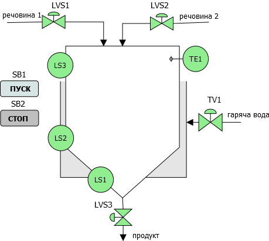

[Лабораторні](README.md)

# ЛАБОРАТОРНА РОБОТА № 1. Програмування IoT пристроїв з використанням JS 

Увага! Усі наведені в лабораторній роботі приклади передбачають, що здобувач буде розбиратися з їх функціонуванням.

## Частина 1. Знайомство з makecode.microbit

https://makecode.microbit.org/

Середовище Microsoft MakeCode — це безкоштовна онлайн-платформа для навчання коду, на якій кожен може створювати ігри, кодувати пристрої та модифікувати Minecraft. Microsoft MakeCode базується на проекті з відкритим кодом ([PXT](https://github.com/microsoft/pxt)) 

### 1. Реєстрація в microbit.org та створення першого проекту

- [ ] Зайдіть на сайт https://makecode.microbit.org/

- [ ] Натисніть кнопку "Увійти" і зареєструйтеся в системі
- [ ] Натисніть "Новий проект" і створіть проект з іменем `proect_вашепрізвище` де замість `вашепрізвище` вкажіть ваш прізвище латиною.
- [ ] Після створення проекту перший раз Вам запропонують помічник який познайомить Вас з основними інструментами середовища розроблення 
- [ ] Перейдіть на закладку `JavaScript`, надалі передбачається розробляти скрипти саме на цій мові
- [ ]  Подивіться на структуру коду, за замовченням та є одна функція, вірніше метод `forever` об'єкту `basic` який викликається циклічно 


рис.1.

Ліворуч від коду є панель з блоками, в яких можна вибрати конкретний метод і перетягнути в програму.

- [ ] Виберіть блок `Основні -> Пказати рядок` і перетягніть в свою програму.   


рис.2

Повинна вийти така програма

```js
basic.forever(function () {
    basic.showString("Hello!")
})
```

- [ ] Натисніть на `Запустити симулятор` і подивіться на результат


рис.3

### 2. Використання імітатора програми та налагоджувальних засобів

У онлайн середовище розроблення вбудований симулятор контролер. Тому логіку виконання програм можна відлагоджувати на цьому емуляторі.

- [ ] Запишіть наступний код

```typescript
let count = 0;
basic.forever(function () {
    count += 1;
    console.log (count)
})
```

- [ ] Натисніть на `Запустити симулятор`

- [ ] Відкрийте дані для симулятора


рис.4

Ви побачите що потік даних відображаються в текстовому вигляді і на діаграмі. Потік зумовено постійним викликом методу `forever`, який забезпечує планувальником `micro:bit`, про це можна почитати детальніше [за посиланням](../add/microbit/README.md). Для того, щоб інші події могли бути оброблені, необхідно ставити паузи.  


рис.5.

- [ ] Змініть код та перевірте його виконання

```js
let count = 0;
basic.forever(function () {
    count += 1;
    console.log (count);
    basic.pause (500) //ставимо паузу до наступного виклику 500 мс 
})
```

Як бачите, періодичність виклику змінилася. 

Щодо `console.log`, то в даному випадку метод дає можливість виводити дані на консоль з симулятора контролеру. Однак при підключенні MakeCode до реального обладнання, для отримання даних з плати, дані можна з неї можна відправляти (отримувати на ПК) через методи обєкту послідовного порта  [serial](https://github.com/microsoft/pxt-microbit/blob/master/reference/serial). 

- [ ] Змініть програму на наступну та перевірте її роботу

```js
let count = 0;
basic.forever(function () {
    count += 1;
    serial.writeLine(count.toString());// аналогічно console.log (count);
    basic.pause (500) //ставимо паузу до наступного виклику 500 мс 
})
```

Усі дані, записані з плати функціями [serial](https://github.com/microsoft/pxt-microbit/blob/master/reference/serial), що передаються через USB в ПК в MakeCode записуються редактором MakeCode. Те саме відбувається, коли запускається код в симуляторі. Виведення даних в консолі та на діаграмі залежить від формату запису в послідовний порт. Проексперементуйте кілька варіантів, більш повний опис доступний [за посиланням](https://makecode.microbit.org/device/data-analysis/writing)   

- [ ] Напишіть наступний фрагмент коду, замінивши попередній:

```js
let count = 0;
let arr = [];
basic.forever(function () {
    count += 1;
    arr = [count, count + 10.5, count + 21];
    serial.writeNumbers(arr); // виведення масиву
    basic.pause(500) //ставимо паузу до наступного виклику 500 мс 
})
```


рис.6.

- [ ] Напишіть наступний фрагмент коду, замінивши попередній:

```js
let count = 0;
let arr = [];
basic.forever(function () {
    count += 1;
    arr = [count, count + 10.5, count + 21];
    serial.writeValue("count", count);
    serial.writeValue("arr[0]", arr[0]);
    basic.pause(500) //ставимо паузу до наступного виклику 500 мс 
})
```


рис.7

- [ ] Напишіть наступний фрагмент коду, замінивши попередній:

```js
let count = 0;
basic.forever(function () {
    count += 1;
    serial.writeValue("count.base", count);
    serial.writeValue("count.bias10", count+10);
    serial.writeValue("count.bias20", count+20);
    basic.pause(500) //ставимо паузу до наступного виклику 500 мс 
})
```


рис.8.

### 3. Робота з входами/виходами micro:bit та масивами

У цьому пункті необхідно потренуватися з блоками з розділів `Вхідні дані` (`inputs`) та `піни` (`pins`). 

- [ ] Познайомтеся з описом апаратного забезпечення micro:bit за [цим посиланням](../add/microbit/device.md)

Є кілька варіантів роботи з входами: 

- встановити обробник входів з передачою функції обробки
- опитувати вхід за необхідності

- [ ] Напишіть і перевірте роботу наступного фрагменту програми. Для зміни значення піна в симуляторі, клікніть у верхній його частині щоб перевести в 1, та в нижній, щоб перевести в 0 відповідно.

```js
input.onButtonPressed(Button.A, function () {
    // отримати значення піна P1
    let p1 = pins.digitalReadPin(DigitalPin.P1);
    p1 = p1 == 0 ? 1 : 0; // тернарий вираз
    // записати значення піна P1
    pins.digitalWritePin(DigitalPin.P1, p1)
})
```

- [ ] Напишіть і перевірте роботу наступного фрагменту програми

```js
basic.forever(function () {
	let temp = input.temperature();
    serial.writeValue("temperature", temp);
    basic.pause(500);
})
```


рис.9.

- [ ] Напишіть і перевірте роботу наступного фрагменту програми. Для зміни значення піна в симуляторі натисніть на 4-му піні і мишою змінюйте його значення клікаючи по рівню або скористайтеся кнопками вверх та вниз відповідно.

```js
basic.forever(function () {
	let p4ai = pins.analogReadPin(AnalogPin.P4)
    serial.writeValue("p4ai", p4ai);
    basic.pause(500);
})
```


рис.10.

- [ ] Напишіть і перевірте роботу наступного фрагменту програми, який реалізує П-закон регулювання. Для зміни значення завдання (`sp`) використовуйте кнопки більше та менше.

```js
let sp = 500; // задане значення
basic.forever(function () {
    let pv = pins.analogReadPin(AnalogPin.P4);// дійсне значення
    let kp = 2; // коефіцієнт пропорційності
    let out = (sp - pv) * kp + 500; 
    pins.analogWritePin(AnalogPin.P0, out);
    serial.writeValue("loop.pv", pv);
    serial.writeValue("loop.sp", sp);
    serial.writeValue("loop.out", out);
    // збільшення/зменшення завдання по кнопкам 
    if (input.buttonIsPressed(Button.A) === true) {
        sp += 5;
    }
    if (input.buttonIsPressed(Button.B) === true ) {
        sp -= 5;
    }
    basic.pause(500);
})
```

- [ ] Напишіть і перевірте роботу наступного фрагменту програми, який реалізує П-закон регулювання та керує серводвигуном. Для зміни значення завдання (`sp`) використовуйте кнопки більше та менше

```js
let sp = 500; // задане значення
basic.forever(function () {
    let pv =  input.temperature();// дійсне значення
    let kp = 2; // коейіцієнт пропорційності
    let out = (sp - pv) * kp + 500; 
    pins.analogWritePin(AnalogPin.P0, out);
    serial.writeValue("loop.pv", pv);
    serial.writeValue("loop.sp", sp);
    serial.writeValue("loop.out", out);
    // збільшення/зменшення завдання по кнопкам 
    if (input.buttonIsPressed(Button.A) === true) {
        sp += 5;
    }
    if (input.buttonIsPressed(Button.B) === true ) {
        sp -= 5;
    }
    // масштабування 0-1023 => 0-180
    out = Math.map(out, 0, 1023, 0, 180)
    pins.servoWritePin(AnalogPin.P2, out);
    basic.pause(500);
})
```

### 4. Керуючі елементи

- [ ] Напишіть і перевірте роботу наступного фрагменту програми. 

```js
basic.forever(function () {
    let time = control.millis(); //час в мс з запуску програми
    basic.pause (1000);
    serial.writeValue("time", time)
})
input.onButtonPressed(Button.A, function() {
    control.reset() // перезапустити програму 
})
```

- [ ] Напишіть і перевірте роботу наступного фрагменту програми.

```js
basic.forever(function () {
    basic.pause (100);
})
input.onButtonPressed(Button.A, function() {
    serial.writeLine(`Запуск таймеру з ${control.millis()}`);
    let timerid1 = control.setInterval(
    function () {
        serial.writeLine(`Спрацював таймер в ${control.millis()}`)
    }, // функція що викликається при спрацюванні таймеру 
    1000, // час в мс, коли таймер спрацює
    control.IntervalMode.Timeout // режим таймеру
    )
})
```

- [ ] Напишіть і перевірте роботу наступного фрагменту програми. 

```js
let timerid1 = 0, timerid2 = 0;
basic.forever(function () {
    basic.pause (100);
})
input.onButtonPressed(Button.A, function() {
    if (timerid1>0) {
        control.clearInterval(timerid1, control.IntervalMode.Interval);
        timerid1 = 0;
    } else {
        settmier1()
    }
})
input.onButtonPressed(Button.B, function () {
    if (timerid2 > 0) {
        control.clearInterval(timerid2, control.IntervalMode.Interval);
        timerid2 = 0;
    } else {
        settmier2()
    }
})
// інтервальні таймери
function settmier1 () {
    timerid1 = control.setInterval(function () {
        serial.writeValue("timer1000 time", control.millis())
    }, 
    1000, // періодичність виклику 
    control.IntervalMode.Interval //режим інтервалу
    )
}
function settmier2() {
    timerid2 = control.setInterval(function () {
        serial.writeValue("timer2000 time", control.millis())
    }, 2000, control.IntervalMode.Interval)
}
```


### 5. Робота з LED

- [ ] Напишіть і перевірте роботу наступного фрагменту програми. 

```js
let direction = 0;
basic.forever(function () {
    direction++;
    if (direction > 7) direction = 0;
    basic.showArrow(direction)
    basic.pause(250);
})
```

- [ ] Напишіть і перевірте роботу наступного фрагменту програми. 

```js
let icons = 0;
basic.forever(function () {
    icons++;
    if (icons > 40) icons = 0;
    basic.showIcon(icons)
    basic.pause(250);
})
```

- [ ] Напишіть і перевірте роботу наступного фрагменту програми. 

```js
basic.showLeds(`
    # . # . #
    . . . . .
    # . # . #
    . . . . .
    # . # . #
    `);
```

- [ ] Напишіть і перевірте роботу наступного фрагменту програми. 

```js
let val = 0;
basic.forever(function () {
    // DigitalPin.P0 - 100
    // DigitalPin.P20 - 120
    val++;
    if (val > 0b11111111111111111111) val = 0;
    for (let i = 0; i<20; i++) {
        let pinnmbr = 100 + i;
        // стан біта по масці
        let mask = 1 << i;
        let bitval = (val & mask) !== 0;
        let y = i/5; 
        let x = i % 5;
        if (bitval) {led.plot(x, y)} else {led.unplot(x, y)}
    }
})
```

- [ ] Напишіть і перевірте роботу наступного фрагменту програми. 

```js
let rad = 0.0;
basic.forever(function () {
    let val = (Math.sin (rad) + 1.0) * 512;
    led.plotBarGraph(val, 1023, true);
    rad = rad + Math.PI / 10.0;
    if (rad>=2 * Math.PI) rad = 0
    basic.pause (200);
})
```

- [ ] Напишіть і перевірте роботу наступного фрагменту програми. 

```js
let rads = [0.0, Math.PI / 4, Math.PI / 2, 3/4 * Math.PI, Math.PI/2];
let vals = [0,0,0,0,0];
basic.forever(function () {
    for (let i=0; i<5; i++){
        vals[i] = Math.round((Math.sin(rads[i]) + 1.0) * 2);
        rads[i] += Math.PI / 10.0;
        if (rads[i] >= 2 * Math.PI) rads[i] = 0.0;
        plotval(i, vals[i])
    }
    serial.writeNumbers(vals)
    basic.pause (200);
})

function plotval (x = 0, val = 0) {
    for (let y=0; y<5; y++) {
        if (y < val) {
            led.plot(x, 4 - y)
        } else {
            led.unplot(x, 4 - y)
        }       
    }    
}
```

### 6. Алгоритми імітації сигналів

У даному пункті наводяться приклади імітації роботи деяких об'єктів керування для спрощення налагодження.

- [ ] Напишіть і перевірте роботу наступного фрагменту програми. У ньому частина програми імітує роботу аналогового датчика рівня та сигналізаторів верхнього і нижнього рівня в ємності що має запірні (on/off) клапани набору і зливу.  

```js
// відображення IO
let ioInfo = {
    lvlPin: AnalogPin.P0,
    vlvInPin: DigitalPin.P13,
    vlvOutPin: DigitalPin.P14,
    lvlHiPin: DigitalPin.P15,
    lvlLoPin: DigitalPin.P15
}
basic.forever(function () {
    let level = pins.analogReadPin(ioInfo.lvlPin);
    led.plotBarGraph(level, 1023, true)
    basic.pause (200);
    simulate ();
})
input.onButtonPressed(Button.A, function() {
    let val = pins.digitalReadPin(ioInfo.vlvInPin) === 0 ? 1 : 0 ;
    pins.digitalWritePin(ioInfo.vlvInPin, val)
})
input.onButtonPressed(Button.B, function () {
    let val = pins.digitalReadPin(ioInfo.vlvOutPin) === 0 ? 1 : 0;
    pins.digitalWritePin(ioInfo.vlvOutPin, val)
})

// ---------- логіка імітації 
function simulate (){
    let level = pins.analogReadPin(ioInfo.lvlPin);
    let vlvOut = pins.digitalReadPin(ioInfo.vlvOutPin);
    let vlvIn = pins.digitalReadPin(ioInfo.vlvInPin);
    if (vlvIn) {
        level +=10
    }
    if (vlvOut) {
        level -= 10
    }
    if (level > 1023) level = 1023;
    if (level < 0) level = 0;
    let lvlLo =  level> 10 ? 1 : 0;
    let lvlHi = level > 1020 ? 1 : 0;
    pins.analogWritePin(ioInfo.lvlPin, level);
    pins.digitalWritePin(ioInfo.lvlLoPin, lvlLo);
    pins.digitalWritePin(ioInfo.lvlHiPin, lvlHi);
}
```

- [ ] Напишіть і перевірте роботу наступного фрагменту програми. У ньому частина програми імітує роботу аналогового датчика рівня в ємності що має один регулюючий клапан набору (0-1023) і постійний відбір.  

```js
// відображення IO
let ioInfo = {
    lvlPin: AnalogPin.P0,
    vlvInPin: AnalogPin.P1,
}
basic.forever(function () {
    let level = pins.analogReadPin(ioInfo.lvlPin);
    led.plotBarGraph(level, 1023, true)
    basic.pause (200);
    simulate ();
})
input.onButtonPressed(Button.B, function() {
    let val = pins.analogReadPin(ioInfo.vlvInPin) + 10;
    val = val > 1023 ? 1023 : val;
    pins.analogWritePin  (ioInfo.vlvInPin, val)
})
input.onButtonPressed(Button.A, function () {
    let val = pins.analogReadPin(ioInfo.vlvInPin) - 10;
    val = val<0 ? 0 : val;
    pins.analogWritePin(ioInfo.vlvInPin, val)
})

// ---------- логіка імітації
let initsml = true; 
function simulate (){
    let level = pins.analogReadPin(ioInfo.lvlPin);
    let vlvIn = pins.analogReadPin(ioInfo.vlvInPin);
    if (initsml) {
        level += 500;
    } else {
        level += vlvIn / 10 - Math.random() * 25;
    }
    if (level > 1023) level = 1023;
    if (level < 0) level = 0;
    pins.analogWritePin(ioInfo.lvlPin, level);
    initsml = false;
}
```

- [ ] Напишіть і перевірте роботу наступного фрагменту програми. У ньому частина програми імітує роботу аналогового датчика температури в підігрівачі, що має один регулюючий клапан подачі теплоагента (0-1023) і постійний відбір теплоти.  

```js
// відображення IO
let ioInfo = {
    lvlPin: AnalogPin.P0,
    vlvInPin: AnalogPin.P1,
}
basic.forever(function () {
    let level = pins.analogReadPin(ioInfo.lvlPin);
    led.plotBarGraph(level, 1023, true)
    basic.pause (200);
    simulate ();
})
input.onButtonPressed(Button.B, function() {
    let val = pins.analogReadPin(ioInfo.vlvInPin) + 10;
    val = val > 1023 ? 1023 : val;
    pins.analogWritePin  (ioInfo.vlvInPin, val)
})
input.onButtonPressed(Button.A, function () {
    let val = pins.analogReadPin(ioInfo.vlvInPin) - 10;
    val = val<0 ? 0 : val;
    pins.analogWritePin(ioInfo.vlvInPin, val)
})

// ---------- логіка імітації
let smltemper = 0.0;
function simulate (){
    let vlv = pins.analogReadPin(ioInfo.vlvInPin) / 10.23; // 0 - 100 %
    smltemper = smltemper * 0.9 + vlv * 0.1; // 0 - 100 %
    let temper = (smltemper - 20) * 10.23 + 200 ;
    temper = Math.constrain(temper, 0, 1023)
    pins.analogWritePin(ioInfo.lvlPin, temper);
}
```

### 7. Алгоритми керування

У цьому пункті необхідно реалізувати і перевірити кілька типових законів регулювання. 

Почнемо з 2-х позиційного закону, в якому необхідно дотримувати значення регульованої величини `PV` в околі певної заданої точки `SP` з використанням дискретного виконавчого механізму типу вкл/відкл. Спочатку задане значення проходить обмеження по максимуму `pv_sup` та по мінімуму  `pv_inf`, потім рахується розузгодження `dev = PV - SP`  (рис.11). Якщо розузгодження менше нижнього порогового значення (по модулю більше) `dev_ll` , вихід регулятору включається, коли розузгодження стає більше іншого порогового значення `dev_hh` - вихід регулятору відключається.      


рис.11. Функціональна схема 2-х позиційного регулятора


рис.12.

- [ ] Напишіть і перевірте роботу наступного фрагменту програми, який реалізовує двох-позиційний закон регулювання. Змінюючи завдання перевірте як працює регулятор.

```js
// відображення IO
let ioInfo = {tmprtPin: AnalogPin.P0, vlvInPin: DigitalPin.P1}
let sp = 500;
let out = 0;
basic.forever(function () {
    let pv = pins.analogReadPin(ioInfo.tmprtPin);
    led.plotBarGraph(pv, 1023);
    serial.writeValue ('loop.sp', sp);
    serial.writeValue('loop.pv', pv);
    out = step2ctrl (sp, pv, out, -50, 50);
    serial.writeValue('loop.out', out*100);
    pins.digitalWritePin(ioInfo.vlvInPin, out)
    simulate();
    basic.pause(200);
})
input.onButtonPressed(Button.B, function () {
    sp = sp + 50;
    sp = Math.constrain (sp, 0, 1023);
})
input.onButtonPressed(Button.A, function () {
    sp = sp - 50;
    sp = Math.constrain(sp, 0, 1023);
})

function step2ctrl(sp = 0, pv = 0, out = 0, dev_ll=-50, dev_hh = 50 ){
    let pv_sup = 1023, pv_inf = 0;
    pv = Math.constrain(pv, pv_inf, pv_sup);
    let dev = pv - sp;
    if (out === 0 && dev < dev_ll) out = 1;
    if (out === 1 && dev > dev_hh) out = 0;
    return out 
}
// ---------- логіка імітації
let smltemper = 0.0;
function simulate() {
    let vlv = pins.digitalReadPin(ioInfo.vlvInPin) * 100; // 0 - 100 %
    smltemper = smltemper * 0.95 + vlv * 0.05; // 0 - 100 %
    let temper = (smltemper - 20) * 10.23 + 200;
    temper = Math.constrain(temper, 0, 1023);
    pins.analogWritePin(ioInfo.tmprtPin, temper);
}
```

- [ ] Напишіть і перевірте роботу наступного фрагменту програми, який реалізовує П-закон регулювання. Змінюючи завдання перевірте як працює регулятор.

```js
// відображення IO
let ioInfo = {tmprtPin: AnalogPin.P0, vlvInPin: AnalogPin.P1}
let sp = 500;
let out = 0;
basic.forever(function () {
    let pv = pins.analogReadPin(ioInfo.tmprtPin);
    led.plotBarGraph(pv, 1023);
    serial.writeValue ('loop.sp', sp);
    serial.writeValue('loop.pv', pv);
    out = p_ctrl (sp, pv, out);
    serial.writeValue('loop.out', out);
    pins.analogWritePin(ioInfo.vlvInPin, out)
    simulate();
    basic.pause(200);
})
input.onButtonPressed(Button.B, function () {
    sp = sp + 50;
    sp = Math.constrain (sp, 0, 1023);
})
input.onButtonPressed(Button.A, function () {
    sp = sp - 50;
    sp = Math.constrain(sp, 0, 1023);
})

function p_ctrl(sp = 0, pv = 0, out = 0){
    pv = Math.constrain(pv, 0, 1023);
    let dev = sp - pv;
    let bias = 500;
    let kp = 1.0;
    out = kp * dev + bias;
    return out 
}
// ---------- логіка імітації
let smltemper = 0.0;
function simulate() {
    let vlv = pins.analogReadPin(ioInfo.vlvInPin) / 10.23; // 0 - 100 %
    smltemper = smltemper * 0.95 + vlv * 0.05; // 0 - 100 %
    let temper = (smltemper - 20) * 10.23 + 200;
    temper = Math.constrain(temper, 0, 1023);
    pins.analogWritePin(ioInfo.tmprtPin, temper);
}
```

- [ ] Напишіть і перевірте роботу наступного фрагменту програми, який реалізовує ПІ-закон регулювання. Змінюючи завдання перевірте як працює регулятор.

```js
// відображення IO
let ioInfo = {tmprtPin: AnalogPin.P0, vlvInPin: AnalogPin.P1}
let sp = 500;
let out = 0;
basic.forever(function () {
    let pv = pins.analogReadPin(ioInfo.tmprtPin);
    led.plotBarGraph(pv, 1023);
    serial.writeValue ('loop.sp', sp);
    serial.writeValue('loop.pv', pv);
    out = pi_ctrl (sp, pv, out);
    //serial.writeValue('loop.out', out);
    pins.analogWritePin(ioInfo.vlvInPin, out)
    simulate();
    basic.pause(200);
})
input.onButtonPressed(Button.B, function () {
    sp = sp + 50;
    sp = Math.constrain (sp, 0, 1023);
})
input.onButtonPressed(Button.A, function () {
    sp = sp - 50;
    sp = Math.constrain(sp, 0, 1023);
})

let i = 500; // інтегральна складова
const dt = 0.2; // перідинічть виклику в с 
function pi_ctrl(sp = 0, pv = 0, out = 0){
    pv = Math.constrain(pv, 0, 1023);
    let dev = sp - pv;
    let kp = 2.5; // коефіцієнт пропорційності
    let ti = 5; // час інтегрування в с
    i += dev * kp * dt/ti;
    out = kp * dev + i;
    out = Math.constrain(out, 0, 1023);
    return out 
}
// ---------- логіка імітації
let smltemper = 0.0;
function simulate() {
    let vlv = pins.analogReadPin(ioInfo.vlvInPin) / 10.23; // 0 - 100 %
    smltemper = smltemper * 0.90 + vlv * 0.1; // 0 - 100 %
    let temper = (smltemper - 20) * 10.23 + 200;
    temper = Math.constrain(temper, 0, 1023);
    pins.analogWritePin(ioInfo.tmprtPin, temper);
}
```


## Частина 2. Приклад керування установкою

### 1. Опис та формалізація завдання

- [ ] Ознайомтеся з постановкою завдання для створення програми користувача. Схема технологічної установки, для якої необхідно розробити програму користувача показана на рис.13



рис.13. Спрощена апаратурно-технічна схема установки 

Після натискання кнопки "ПУСК", якщо ємність не порожня, повинен відкритися клапан `LVS3`, і присутня в ємності рідина повинна вивантажитися з неї.  Якщо (коли) ємність буде порожня необхідно закрити клапан `LVS3` і відкрити клапан `LVS1` і почати її наповнювати до спрацювання середнього рівня. Після цього необхідно закрити клапан `LVS1` і відкрити `LVS2` для заповнення ємності до верхнього рівня. Потім клапан `LVS2` треба закрити і відкрити клапан `TV1` повністю. Після досягнення температури 50°С клапан треба залишити відкритим на 50%. Після досягнення значення 55°С клапан `TV1` треба закрити повністю і вивантажити рідину з апарату. Якщо не натиснута кнопка "СТОП" - цикл повинен повторюватися.

Після кожного кроку повинно виводитися повідомлення зі станом програми в послідовний порт.  

### 2. Аналіз завдання          

Наведене вище завдання є типовим початковим, і дає можливість поверхово оцінити необхідний алгоритм та підібрати компоненти для контролера, функції якого бере на себе IoT Device. Але воно має ряд невизначеностей, які необхідно уточнити. 

- [ ] Проаналізуйте деякі з невизначеностей завдання: 

1. Що значить закрити або відкрити клапан, яке для клапанів є нормальним положенням? Якщо клапани нормально-закриті, то відкриття для IoT Device буде значити подачу логічної одиниці, у іншому випадку - навпаки, нуля. 
2. Як працюють сигналізатори рівня? Якщо ємність порожня, то сигналізатор нижнього рівня буде замкнутим або розімкнутим? 
3. У якому стані має знаходитися клапан гарячої води на кожному із кроків?
4. Як повинен вести себе  алгоритм в нештатних ситуаціях?
5. Що повинен робити контролер, коли він включається (подаєтья на нього живлення) або запускається (включається в RUN)?

Перед розробкою алгоритму та вибору складових контролера роблять уточнення завдання. Для початку визначаються з засобами вводу/виводу, які підключаються до контролера для вирішення завдання. Потім формалізують завдання через набір задач та функцій, що більш піддається формальній перевірці на виконання. 

### 3. Самостійне визначення необхідних датчиків та виконавчих механізмів (ВМ)          

При аналізі завдання, ще перед підбором датчиків та ВМ визначаються з кількістю та типом сигналів, які будуть підключатися до контролера.  

- [ ] Визначте самостійно скільки потрібно дискретних входів та виходів, аналогових входів та виходів. Для цього для кожного передбачуваного датчика та виконавчого механізму з рис.13 вкажіть необхідний тип сигналу.

### 4. Перевірка визначення необхідних датчиків та виконавчих механізмів 

- [ ] У таблиці 1.1 показаний перелік необхідних типів сигналів, та необхідне уточнення після вибору датчика.  Перевірте, чи співпадають значення з цієї таблиці зі значеннями, що вийшли у Вас.   

Таблиця 1.1. Типи сигналів

| Позначення параметру | Тип сигналу для контролеру | Примітка                                                     |
| -------------------- | -------------------------- | ------------------------------------------------------------ |
| Кнопка SB1 "ПУСК"    | кнопка A                   | вмикається людиною, без фіксації                             |
| Кнопка SB2 "СТОП"    | кнопка B                   | вмикається людиною, без фіксації                             |
| Сигналізатор LS1     | DI                         | необхідно дізнатися про значення "ВКЛ" та "ВІДКЛ"            |
| Сигналізатор LS2     | DI                         | необхідно дізнатися про значення "ВКЛ" та "ВІДКЛ"            |
| Сигналізатор LS3     | DI                         | необхідно дізнатися про значення "ВКЛ" та "ВІДКЛ"            |
| Температура TE1      | AI                         | необхідно дізнатися про діапазон вимірювання та сигналу з датчика |
| Клапан LVS1          | DO                         | необхідно дізнатися про нормальний стан регулюючого органу (РО) |
| Клапан LVS2          | DO                         | необхідно дізнатися про нормальний стан РО                   |
| Клапан LVS3          | DO                         | необхідно дізнатися про нормальний стан РО                   |
| Клапан TV1           | AO                         | необхідно дізнатися про нормальний стан РО                   |

де DI - дискретний вхід, DO - дискретний вихід, AI - аналоговий вхід, AO - аналоговий вихід  

### 5. Визначення входів/виходів контролеру 

Вибір датчиків та виконавчих механізмів виходить за рамки лабораторної роботи і даної дисципліни. Тому тут буде вказано діапазони сигналів, які були вибрані навмання. Також для них вибрані входи та виходи micro:bit відповідно до можливостей що наведені за [цим посиланням](../add/microbit/device.md) 

- [ ] Подивіться перелік змінних, які передбачаються для підключених вимірювальних перетворювачів та виконавчих механізмів (таб.2.2).

Таблиця 2.2.Перелік входів/виходів та вимоги до них  

| Позначення параметру | Діапазон  зміни    | Вхід/вихід           | Примітка                                                     |
| -------------------- | ------------------ | -------------------- | ------------------------------------------------------------ |
| Кнопка SB1  "ПУСК"   | вкл/відкл          | `Кнопка A` або  `P5` | вмикається людиною, без фіксації                             |
| Кнопка SB2 "СТОП"    | вкл/відкл          | `Кнопка B` або `P11` | вмикається людиною, без фіксації                             |
| Сигналізатор LS1     | вкл/відкл          | `P13`                | "ВКЛ" коли присутня рідина на даному рівні, коли ємність порожня буде в стані "ВІДКЛ" |
| Сигналізатор LS2     | вкл/відкл          | `P14`                | "ВКЛ" коли присутня рідина на даному рівні, буде "ВКЛ" коли в ємності рідини більше за 50% |
| Сигналізатор LS3     | вкл/відкл          | `P15`                | "ВКЛ" коли присутня рідина на даному рівні, буде "ВКЛ" коли в ємності рідини більше за 95% |
| Температура TE1      | 0 - 100 °С         | `P0`                 | лінійна шкала                                                |
| Клапан LVS1          | Відкритий/закритий | `P8`                 |                                                              |
| Клапан LVS2          | Відкритий/закритий | `P9`                 |                                                              |
| Клапан LVS3          | Відкритий/закритий | `P16`                |                                                              |
| Клапан TV1           | 0 - 100 %          | `P1`                 | 0% - повністю закритий, лінійна шкала                        |

- [ ] Проаналізуйте рис.14, який отриманий з рис.13 з підписаними змінними:


рис.14. Схема установки з вказівкою входів/виходів

Відповідно до таблиці 2.2 необхідно більше формалізувати завдання, яке зручно буде перетворювати на алгоритм та робити перевірочні тести. Для цього спочатку виділяють задачі та функції (роблять декомпозицію). **Функції** постійно формують виходи за станом входів.  **Задачі** - це функції, які описуються певною послідовністю кроків. Задачі мають початок і кінець, а їх виконання описується послідовністю умов та дій. 

Для даного завдання можна виділити тільки одну задачу, яку можна назвати  "Приготування продукту за означеним алгоритмом". Якби для даної установки необхідно було ще розробити програму автоматичної мийки, яка описується своїм алгоритмом, варто було б виділити для нього окрему задачу "Мийка установки". Якби установка мала регулятор температури, який працював би умовно незалежно, можна б було виділити окрему функцію "Регулювання температури", для якої давався окремий алгоритм.  Для кожної задачі та функції можна приводити описи алгоритмів їх роботи. Для даної задачі є принаймні два способи формалізації, через послідовнісне виконання або через залежність виходів через входи.  

### 6. Формалізація задачі через послідовнісне виконання    

- [ ] Уважно прочитайте та осмисліть наведений нижче текст.

Задача може формалізуватися алгоритмом, який має початок і завершення і складається з певних кроків. Це називається послідовнісним (sequentional) алгоритмом. Опишемо задачу через кроки. 

**0. Ініціалізація (Програма в контролері запустилася)**.

Усі виходи виставити в стан ВІДКЛ (для дискретних) або 0 (для аналогових). Перейти на крок "Простій, очікування пуску задачі".

**1. Простій, очікування пуску задачі.**

Усі виходи виставити в стан ВІДКЛ (для дискретних) або 0 (для аналогових). При спрацюванні кнопки "ПУСК" в залежності від стану  `LS1` :

- при `LS1=0` перейти на крок "Наповнення речовиною 1"
- при `LS1=1` перейти на крок "Вивантаження продукту"

**2. Наповнення речовиною 1.**

`LVS1=1`, усі інші 0. При спрацюванні `LS2` (`LS2=1`) перейти на крок "Наповнення речовиною 2".

**3. Наповнення речовиною 2.**

`LVS2=1`, усі інші 0. При спрацюванні `LS3` (`LS3=1`) перейти на крок "Нагрівання".

**4. Нагрівання 1.**

`TV1=100% (1023)` усі інші 0. При досягненні заданої температури 50°С (`TE1>=516`) перейти до кроку "Нагрівання 2" 

**5. Нагрівання 2.**  

`TV1=50% (516)` усі інші 0. При досягненні заданої температури 55°С (`TE1>=567`) перейти до кроку "Вивантаження продукту" 

**6. Вивантаження продукту.** 

`LVS3=1`, усі інші 0. При досягненні нижнього рівня (`LS1=0`), в залежності від стану кнопки "СТОП":

- при `SB2=0` перейти до кроку "Наповнення речовиною 1"
- при `SB2=1` перейти до кроку "Простій"    

Наведений вище опис задачі, що формалізований через кроки вже по суті є певним представленням алгоритму і дає можливість створити програму користувача і методику випробувань .  

### 7. Розробка методики перевірки    

Методика перевірки передбачає опис процедур, які необхідно зробити, щоб перевірити чи відповідає виконання програми заданим в завданні умовам. Перший варіант методики перевірки розробляють ще до написання програми користувача. Методика дає можливість розробнику не тільки перевірити правильність виконання програми користувача, але і зрозуміти усі тонкощі алгоритму.

Враховуючи що у даному випадку система у кожен момент часу перебуває у певному стані, поведінка програми залежить не тільки від входів але і від теперішнього стану. Тому перевірка правильності виконання задачі зводиться до перевірки поведінки виходів контролеру при зміні стану та входів контролеру. Це зручно оформити у вигляді таблиці, яка має форму як в таб.2.3. При перевірці послідовно змінюють значення вхідних змінних (`SB1`, `SB2`, `LS1`, `LS2`, `LS3`, `TE1`) і дивляться на те, як змінюються вихідні змінні.  

- [ ] Проаналізуйте зміст таблиці 2.3.

Таблиця 2.3. Табличний вигляд методики перевірки роботи задачі приготування продукту. 

| №    | стан/зміна стану  системи         | SB1  | SB2  | LS1  | LS2  | LS3  | TE1   | LVS1 | LVS2 | LVS3 | TV1  | Примітка                    |
| ---- | --------------------------------- | ---- | ---- | ---- | ---- | ---- | ----- | ---- | ---- | ---- | ---- | --------------------------- |
| 1    | початковий  (включення контролер) | -    | -    | -    | -    | -    | -     | 0    | 0    | 0    | 0    |                             |
| 2    | Предпуск                          | 0    | -    | -    | -    | -    | -     | 0    | 0    | 0    | 0    |                             |
| 3    | Пуск порожнім                     | 1    | 0    | 0    | 0    | 0    | -     | 1    | 0    | 0    | 0    |                             |
| 4    | Пуск не порожнім                  | 1    | 0    | 1    | 0    | 0    | -     | 0    | 0    | 1    | 0    | Продовжити перевірку з п.14 |
| 5    | Наповн. нижче рівня LS2           | 0    | 0    | 1    | 0    | 0    | -     | 1    | 0    | 0    | 0    |                             |
| 6    | рівень LS2                        |      |      | 1    | 1    | 0    | -     | 0    | 1    | 0    | 0    |                             |
| 7    | Наповн. нижче рівня LS3           | -    | -    | 1    | 1    | 0    | -     | 0    | 1    | 0    | 0    |                             |
| 8    | рівень LS3                        | -    | -    | 1    | 1    | 1    | -     | 0    | 0    | 0    | 100% |                             |
| 9    | Нагрівання 1                      | -    | -    | -    | -    | -    | <50°С | 0    | 0    | 0    | 100% |                             |
| 10   | температура 50°С                  | -    | -    | -    | -    | -    | 51°С  | 0    | 0    | 0    | 50%  |                             |
| 11   | Нагрівання 2                      | -    | -    | -    | -    | -    | <55°С | 0    | 0    | 0    | 50%  |                             |
| 12   | температура 55°С                  | -    | -    | -    | -    | -    | 56°С  | 0    | 0    | 0    | 0    |                             |
| 13   | Вивантаження до LS2               | -    | -    | 1    | 1    | 0    | -     | 0    | 0    | 1    | 0    |                             |
| 14   | Вивантаження до LS1               | -    | -    | 1    | 0    | 0    | -     | 0    | 0    | 1    | 0    |                             |
| 15   | Ємність порожня при "СТОП"        | 0    | 1    | 0    | 0    | 0    | -     | 0    | 0    | 0    | 0    | продовжити перевірку з п.2  |
| 16   | Ємність порожня без "СТОП"        | 0    | 0    | 0    | 0    | 0    | -     | 1    | 0    | 0    | 0    | продовжити перевірку з п.5  |

  `-` - вказує незалежність дій від значення вхідних сигналів, бажано перевіряти що стан системи не міняється при зміні цих вхідних сигналів 

### 8. Розробка програми користувача.    

Програма для даної задачі розроблятиметься з використанням послідовнісного стано-орієнтованого підходу. Стан оцінюється змінною `state` яка має різне значення для кожного зі станів (таб.2.4).  У Type Script зручно використовувати для цього тип `enum`

Таблиця 2.4. Значення змінної стану.

| Стан                             | Значення | Символьне значення | Примітка |
| -------------------------------- | -------- | ------------------ | -------- |
| Простій, очікування пуску задачі | 0        | idle               |          |
| Наповнення речовиною 1           | 1        | load1              |          |
| Наповнення речовиною 2           | 2        | load2              |          |
| Нагрівання 1                     | 3        | hea1               |          |
| Нагрівання 2                     | 4        | hea2               |          |
| Вивантаження продукту            | 5        | dwnld              |          |

- [ ] Створіть програму користувача, наведену нижче

```js
// відображення IO
let ioInfo = {ls1: DigitalPin.P13, ls2: DigitalPin.P14, ls3: DigitalPin.P15,
    lvs1: DigitalPin.P8, lvs2: DigitalPin.P9, lvs3: DigitalPin.P16,
    te1: AnalogPin.P0, tv1: AnalogPin.P1,
    sb1: DigitalPin.P5, sb2: DigitalPin.P11
    };
enum states {init, idle, load1, load2, hea1, hea2, dwnld};
let state = states.idle;
serial.writeLine ('Program started');
basic.forever(function () {
    let sb1Strt = (pins.digitalReadPin(ioInfo.sb1) === 1) || input.buttonIsPressed(Button.A);
    let sb2Stop = (pins.digitalReadPin(ioInfo.sb1) === 1) || input.buttonIsPressed(Button.B);
    let ls1Lo = pins.digitalReadPin(ioInfo.ls1);
    let ls2Mdl = pins.digitalReadPin(ioInfo.ls2);
    let ls3Hi = pins.digitalReadPin(ioInfo.ls3);
    let te1 = pins.analogReadPin(ioInfo.te1);
    switch (state) {
        case states.idle:
            pins.digitalWritePin(ioInfo.lvs1, 0);
            pins.digitalWritePin(ioInfo.lvs2, 0);
            pins.digitalWritePin(ioInfo.lvs3, 0);
            pins.analogWritePin(ioInfo.tv1, 0);            
            if (sb1Strt) {
                if (ls1Lo === 1) {
                    state = states.dwnld;
                    serial.writeLine('Downloading')
                } else {
                    state = states.load1;
                    serial.writeLine('Loading 1')
                }
            }
            break
        case states.load1:
            pins.digitalWritePin(ioInfo.lvs1, 1);
            if (ls2Mdl === 1) {
                state = states.load2;
                serial.writeLine('Loading 2')
            }
            break
        case states.load2:
            pins.digitalWritePin(ioInfo.lvs1, 0);
            pins.digitalWritePin(ioInfo.lvs2, 1);
            if (ls3Hi === 1) {
                state = states.hea1;
                serial.writeLine('Heating1')
            }
            break
        case states.hea1:
            pins.digitalWritePin(ioInfo.lvs2, 0);
            pins.analogWritePin(ioInfo.tv1, 1023);
            if (te1>516) {
                state = states.hea2;
                serial.writeLine('Heating2')
            }
            break
        case states.hea2:
            pins.analogWritePin(ioInfo.tv1, 516);
            if (te1 > 567) {
                state = states.dwnld;
                serial.writeLine('Downloading')
            }
            break
        case states.dwnld:
            pins.analogWritePin(ioInfo.tv1, 0);
            pins.digitalWritePin(ioInfo.lvs3, 1);
            if (ls1Lo === 0) {
                if (sb2Stop) {
                    state = states.idle;
                    serial.writeLine('Program stopped')
                } else {
                    state = states.load1;
                    serial.writeLine('Next cicle')
                }
            }
            break
        default :
            state = states.idle;
    } 
    basic.pause(200);
})
```

Наведена програма не передбачає блокування можливості зміни виходів а також кроків із-зовні. Так, наприклад, можна змінити стан ВМ подачі гарячої води на кроках наповнення. Для того,щоб це унеможливити, можна добавити додаткові дії. 

### 9. Перевірка роботи програми користувача ручним способом    

- [ ] Запустіть програму на виконання.

- [ ] Перевірте роботу програми згідно методики перевірки, яка наведена в таблиці 2.3

### 10. Перевірка роботи програми користувача з використанням імітатору (не обов'язкове завдання)    

- [ ] Можете (не обов'язково) зробити імітаційну програму для даної установки та перевірити роботу програми на імітаторі.

## Частина 3. Індивідуальне завдання

- [ ] За Вашим варіантом отримайте індивідуальне завдання.
- [ ] Відповідно до прикладу з Частини 2 цієї лабораторної роботи зробіть наступне:
- визначитися з входами/виходами контролеру micro:bit або аналогічного
- розробити методику перевірки через табличне представлення
- розробити програму та забезпечити її правильність роботи відповідно до методики перевірки

- за бажанням розробити імітатор установки та зробити перевірку на ньому

- [ ] Розроблену програму та таблицю перевірки відправте у звіті. 

## Частина 4. Знайомство з Espruino (необов'язкове завдання)

За бажанням можете зробити аналогічні діяльності для [Espruino](https://www.espruino.com/ide/)  

