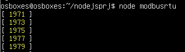

[Лабораторні](README.md)

# ЛАБОРАТОРНА РОБОТА № 2. Програмування IoT шлюзів з використанням Node.js

Увага! Усі наведені в лабораторній роботі приклади передбачають, що здобувач буде розбиратися з їх функціонуванням.

## Частина 1. Підготовка IoT Gateway

### 1. Створення віртуальної машини

- [ ] Встановіть віртуальну машину, як це описано [за посиланням](https://asu-in-ua.github.io/atpv/vm/vbox/lablinuxdesktop.html)
- [ ] Налаштуйте мережний адаптер віртуальної машини, щоб він був підключений до мережної карти, через яку Ви з'єднуєтеся з Інтернет. Даний спосіб дасть Вам можливість використовувати комунікацію ВМ як для Інтернет так і для зв'язку з хостовою ОС. 

**Увага, передбачається що в мережі є DHCP-сервер, який автоматично видає IP адреси!**  


- [ ] Запустіть віртуальну машину. Залогуйтеся в консолі і наберіть `ping 8.8.8.8` щоб впевнитися що є зв'язок з Інтернетом. Вихід з роботи команди ping через `Ctrl + C`.
- [ ]  Отримайте інформацію про отриману IP-адресу адаптером віртуальної машини. 

```
hostname -I
```

- [ ] Встановіть Uncomplicated Firewal

```
sudo apt install ufw
```

### 2. Встановлення необхідних утиліт для роботи з віддаленою машиною

- [ ] Завантажте утиліту Putty для своєї версії ОС за посиланням <https://www.chiark.greenend.org.uk/~sgtatham/putty/latest.html> . Ця утиліта дає можливість підключатися до різноманітних пристроїв в режимі терміналу.
- [ ] Запустіть `Putty`. У полі `Host Name`  впишіть IP адресу віртуальної машини з Debian, яку Ви отримали у попередньому пункті. У полі `Saved Session` впишіть назву підключення, наприклад `Debian`, через яке Ви зможете підключатися пізніше, зробивши вибір, і натисніть `Save`. Після цього натисніть `Open` щоб відкрити сессію.   


- [ ] Перший раз при підключенні, Putty зробить попередження, натисніть `Accept` щоб погодитися.


- [ ] Відкриється вікно терміналу, аналогічне тому, яке показується при роботі з віртуальною машиною. 


Надалі усі дії з віртуальною машиною можна робити як через вікно машини так і через термінал Putty. Термінал працює з використанням захищеного протоколу `ssh`. При підключенні до реального пристрою з Linux, Putty дає можливість працювати в командному режимі. 

- [ ] Звантажте та встановіть WinSCP <https://sourceforge.net/projects/winscp/> . Цей застосунок дає можливість підключатися до файлової системи ОС Linux через SSH та інші способи комунікації
- [ ] Запустіть WinSCP на виконання. У полі `Вузол`  впишіть IP адресу віртуальної машини з Debian, яку Ви отримали у попередньому пункті. У полях `логін`  і `пароль` впишіть відповідно ім'я користувача і пароль (за замовченням `osboxes` та `osboxes.org` відповідно), а збережіть налаштування за допомогою кнопки `зберегти`, щоб потім Ви змогли підключатися пізніше, зробивши вибір відповідного збереженого вузла. Після цього натисніть `Логін` щоб відкрити сесію.   


- [ ] Перший раз при підключенні як і випадку з Putty, вийде попередження, натисніть `Accept` щоб погодитися. Відкриється навігатор, в якому перейдіть на верхній рівень в кореневу директорію.


- [ ] Встановіть текстовий редактор Notepad++ <https://notepad-plus-plus.org/> . Це текстовий редактор з корисними додатковими можливостями у тому числі з підсвіткою синтаксису в різноманітних мовах програмування. 

### 3. Встановлення Node.js на віртуальну машину

- [ ] Запустіть віртуальну машину.
- [ ] Залогуйтеся в системі, після чого введіть

```
sudo apt update
```

повторно введіть пароль адмінітсратора, для продовження операції. Ця дія приведе до оновлення інформації з репозиторіїв пакетів.

- [ ] Запустіть інсталятор `nodejs`

```
sudo apt install nodejs
```

натисніть `y`  на пропозицію встановлення

- [ ] Перевірте версію встановленого `nodejs`

```
node -v
```

- [ ] Встановіть пакунок `npm`

```
sudo apt install npm
```

- [ ] Перевірте версію встановленого npm

```
npm -v
```

## Частина 2. Створення проекту Node.js 

### 1. Створення папки проекту та ініціалізація 

- [ ] У консолі віртуальної машини введіть команду для створення папки для проекту `nodejsprj`

```
mkdir nodejsprj
```

- [ ] Перейдіть в створену папку

```
cd nodejsprj
```

- [ ] Зробіть ініціювання проекту node.js з вказівкою усіх налаштувань за замовченням (опція `-y`)

```
npm init -y
```

Після цього з'явиться повідомлення в яке виводиться зміст файлу `package.json` з налаштуванням проекту.


- [ ] Запустіть WinSCP, підключіться до віртуальної машини
- [ ] У WinSCP перейдіть в новостворену папку `nodejsprj` . Ви повинні побачити там `package.json`

### 2. Створення та перевірка простої програми 

- [ ] Налаштуйте щоб усі файли за замовченням відкривалися в текстовому редакторі `Notepad++`, для цього зайдіть в `Опції->Налаштування` і в розділі `Редактори` вкажіть цю програму. Також виставте опцію `Примусова текстова передача файлів для зовнішнього редактора`, після чого натисніть `Ok`


- [ ] У папці `nodejsprj` створіть файл `index.js` 


Відкриється редактор `Notepad++` . 

- [ ] Запишіть фрагмент програми і збережіть її.

```js
console.log ('Hello world!')
```

- [ ] У консолі Debian ВМ наберіть команду `node index`, має вивести повідомлення 'Hello world!'

### 3. Встановлення пакунку nodemon 

Пакунок `nodemon` дає можливість змінювати програму в середовищі виконання  без зупинки та повторного запуску. Цей пакунок відноситься до середовищ розроблення.   

- [ ] У терміналі Debian в папці проекту наберіть `npm install nodemon -D` та натисніть Enter. 

Команда `install` встановлює потрібний пакунок, а опція  `-D` вказує на те, що цей пакунок потрібен тільки в середовищі розроблення для налагодження застосунку. 

У результаті виконання команди менеджер npm завантажує необхідний пакунок з репозиторію, розпаковує його у вашу папку і встановлює залежності в:

- файл package.json
- новостворений файл package-lock.json
- [ ] Використовуючи WinSCP подивіться на зміст папки проекту (кнопка `Refresh` оновлює зміст): там повинна з'явитися папка `node_modules` та міститися два файли json.
- [ ] Подивіться на зміст файлу  `package.json`: там повинен з'явитися розділ `devDependencies` у якому є назва встановленого пакунку. Тепер він використовується в проекті для середовища розроблення.
- [ ] Подивіться на зміст файлу  `package-lock.json`: він сформований автоматично для роботи системи, з відомостями про встановлені пакунки та їх залежності.

### 4. Використання nodemon

Для внесення змінних у виконавчу програму приходиться її зупиняти і запускати заново. Пакунок `nodemon` , який був встановлений дає можливість вносити зміни без перезапуску. Цей пакунок запускає застосунок та слідкує за зміною JS файлів. Як тільки файл змінюється - `nodemon` автоматично перезапускає проект.

Для можливості запуску в режимі налагодження (з `nodemon`) та виконання, можна використати функціональність скриптів пакунку npm. Для цього у файлі `package.json` можна записати скрипти, які будуть запускатися при виклику команди `npm run <назва скрипта>`. Також скрипти використовуються при розгортанні застосунку на кінцевому місці розташування. Так, після розгортання застосунку може використовуватися скрипт `start`, а при запуску на комп'ютері розробника - `dev`.

- [ ] Використовуючи WinSCP відкрийте файл  `package.json` змініть властивість `scripts` як це показано нижче 

```json
  "scripts": {
    "start": "node index.js",
    "dev": "nodemon index.js"
  }
```

Перший скрипт викликає звичайну команду запуску файлу `js` середовищем node.  Другий скрипт запускає модуль `nodemon`, який у свою чергу запускає `index.js` в особливому режимі. Тепер для запуску необхідного скрипта треба викликати команду `npm run <назва скрипта>`.

- [ ] Запустіть програму з використанням пакунку `nodemon`, набравши в консолі debian наступну команду

```bash
npm run dev
```

- [ ] Змініть програму в  `index.js` змінивши напис, що виводиться, у консоль виведеться нове повідомлення.
- [ ] Введіть `CTRL+C` для завершення програми.  

## Частина 3. Взаємодія через COM-порт

### 1. Встановлення com0com

- [ ] Завантажте утиліту com0com <https://sourceforge.net/projects/com0com/>. Ця утиліта дає можливість встановлювати віртуальні COM-порти, з'єднані між собою віртуальним зв'язком. 
- [ ] Запустіть інсталятор com0com погодьтеся на всі пропозиції
- [ ] Запустіть програму `setup` в розділі com0com для налаштування портів. Передбачається що налаштування будуть за замовченням, а саме використання спарених портів COM4 та COM3. Закрийте вікно налаштувань.


- [ ] Проконтролюйте, що порти з'явилися в диспетчері пристроїв комп'ютера. 


### 2. Встановлення та налаштування утиліти роботи з COM-портом та TCP/UDP

- [ ] Завантажте та встановіть утиліту для роботи з COM-портами (програму термінал)  а також з TCP/UDP. Надалі використовується безкоштовна утиліта Hercules, яку можна завантажити за посиланням <https://www.hw-group.com/software/hercules-setup-utility> Вона не потребує інсталяції.
- [ ] Запустіть 2 екземпляри Hercules. При першому запуску застосунку треба дозволити доступ до апаратного забезпечення та підтвердити умови використання.
- [ ] Переключіть закладку на Serial. Налаштуйте вікно відображення в режим 16-кового відображення, спочатку `Special Chars -> Hexadecimal` а потім `HEX Enable`. Один екземпляр налаштуйте на порт `COM3`, а інший на `COM4`. Після цього натисніть `Open`
- [ ] У вікні `Send` одного з екземплярів напишіть кілька байтів у 16-ковому форматі, наприклад `01 02 03` і натисніть  кнопку `Send`. Враховуючи що порти спарені, дане посилання надішлеться на вхід іншого порту.   


- [ ] За допомогою утиліти Hercules перевірте роботу TCP


### 3. Налаштування віртуальної машини на роботу з послідовним портом

- [ ] При вимкненій віртуальній машині налаштуйте щоб віртуальний COM-порт комп'ютера `COM3` був прокинутий на 1-й COM-порт віртуальної машини 


Для Debian 1-й COM-порт має назву пристрою `/dev/ttyS0`.

- [ ] Запустіть віртуальну машину. Після логування змініть налаштування порта  `/dev/ttyS0` щоб був доступ для читання та запису.

```
sudo chmod o+rw /dev/ttyS0
```

- [ ] Введіть повторно пароль адміністратора.
- [ ] Перевірте, що права надалися

```
ls -l /dev/ttyS0
```

Якщо права надалися, Ви отримаєте відповідь `-crw-rw-rw-`


- [ ] Запустіть на хостовій машині утиліту для роботи з COM-портом. Підключіться до COM4. Враховуючи, що він віртуально з'єднаний з `COM3`, ви отримаєте зв'язок з  `/dev/ttyS0` на ВМ.

- [ ] На ВМ запустіть команду виведення тексту у вказаний пристрій

```
echo '123' > /dev/ttyS0
```

- [ ] У вікні виведення утиліти на хостовій машині Ви повинні побачити результат 


- [ ] Запустіть команду вводу з вказаного пристрою:

```
cat -v < /dev/ttyS0
```

- [ ] У утиліті відправте команду 

```
456$0d$0a
```

Останні символи відправляються в 16-ковому форматі для сигналізування завершення передачі.


- [ ] Вийдіть з режиму приймання повідомлень за допомогою комбінації `ctrl+C` 

Зміни прав доступу (`chmod`) не зберігаються після перезавантаження системи. Щоб зробити ці зміни на постійній основі, можна використовувати `udev` - правила для присвоєння дозволів пристрою (`ttyS0` у нашому випадку) при завантаженні системи. Для збереження змін налаштувань доступу до порту, необхідно зробити наступні команди.

- [ ] Створіть файл правил `ttyS0.rules` (назва може бути будь-якою) у каталозі `/etc/udev/rules.d/`:

```
sudo nano /etc/udev/rules.d/ttyS0.rules
```

- [ ] Вставте наступний рядок в цей файл:

```
KERNEL=="ttyS0", MODE="0666"
```

- [ ] Збережіть файл `CTRL+X` після чого `Y`

Це правило надасть повний доступ (`rw-rw-rw-` або `0666`) до пристрою `ttyS0` всім користувачам при кожному завантаженні системи.

- [ ] Після збереження файлу `ttyS0.rules`, перезавантажте систему:

```
sudo reboot
```

- [ ] Після цього, перевірте, чи залишилися зміни прав доступу до `/dev/ttyS0` після перезавантаження.

```
ls -l /dev/ttyS0
```

### 4. Створення проекту node.js для прослуховування COM-порта

- [ ] У консолі Debian встановіть пакунок `serialport` (деталі про пакунок [за посиланням](https://serialport.io/docs/10.x.x/api-serialport)). Для цього у папці проекту запустіть команду

```
npm install serialport@10.5.0
```

- [ ] Використовуючи WinSCP створіть в папці проекту файл `serial.js`. Запишіть туди наступний фрагмент коду і збережіть його.

```js
const {SerialPort, ReadlineParser } = require('serialport');
const port = new SerialPort({
	path: '/dev/ttyS0',
    baudRate: 9600
});
// створення парсера, що орієнтується на розмежувач \n (0A) 
const parser = new ReadlineParser();
// парсер ставить в поток після отримання даних портом
port.pipe(parser);
// коли отримали рядок запускається функція зворотного виклику
parser.on('data', (data)=> {
	console.log(data);
	port.write ('I recive ' + data + ' ');
});
// відправка даних на порт напочатку
port.write(' Hello! \n');
```

- [ ] У консолі Debian запустіть перейдіть в папку проекту, якщо зараз не в ній і запуістіть команду `node serial`. 
- [ ] Запустіть утиліту Hercules , підключіться до `COM4` відправте якесь текстове повідомлення, яке завершується на символ кінця рядку, наприклад

```
Hello gateway $0A
```

Ви повинні отримати в консолі Debian відповідний текст, натомість в Hercules має прийти відповідь.

- [ ] У консолі Debian натисніть `Ctrl+c` для завершення роботи скрипта.
- [ ] Закрийте Hercules 

## Частина 4. Робота з Modbus RTU та TCP/IP

### 1. Встановлення та налаштування Modrsism2  

- [ ] Завантажте `Modrssim2`  перейшовши за [цим посиланням](https://sourceforge.net/projects/modrssim2/) , натиснувши `download`. Це імітатор Modbus Server, який буде слугувати джерелом даних. 
- [ ] Створіть папку на диску, перемістіть туди файл, та завантажте в неї файл `mfc100.dll` який знаходиться за [цим посиланням](https://drive.google.com/file/d/1l7gpSOrhGIJb0aswPrErFtmPPG2JKAo0/view?usp=drive_link). Ця бібліотека потрібна для роботи `Modrssim2`.
- [ ] Завантажте та встановіть Microsoft Visual C++ Redistributable for Visual Studio 2010 http://go.microsoft.com/fwlink/?LinkID=177916&clcid=0x489 
- [ ] Перейдіть за посиланням <https://github.com/pupenasan/scriptlanginiot/blob/main/lab/lab2.vbs> та натисніть кнопку `Dwnload raw file` для завантаження файлу імітатора об'єкту. Перемістіть файл в ту ж папку, що і Modrsism2.


- [ ] Запустіть Modrssim2. У списку `prot` виберіть `Modbus TCP/IP`


- [ ] Зайдіть в налаштування `Simulation`


- [ ] Виберіть `training plc simulation` та вкажіть розміщення файлу `lab2.vbs`. 


- [ ] Перейдіть у `Holding Regs` і проконтролюйте що значення регістру `400012` збільшується


### 2. Перевірка роботи імітаційної установки  

У цій лабораторній роботі у якості імітаційної установки використовується той самий об'єкт що і попередінй лабораторній роботі. Передбачається, що з установкою зв'язаний пристрій вводу/виводу, що має інтерфейси Modbus RTU та Modbus TCP/IP. Нижче наведений перелік об'єктів Modbus для даної установки 


- [ ] Ознайомтеся з даними входів/виходів Modbus, що наведені в таблиці нижче

| Позначення параметру | Діапазон  зміни    | Вхід/вихід Modbus | Область, зміщення | Примітка                                                     |
| -------------------- | ------------------ | ----------------- | ----------------- | ------------------------------------------------------------ |
| Кнопка SB1  "ПУСК"   | вкл/відкл          | 100001            | di, 0             | вмикається людиною, без фіксації                             |
| Кнопка SB2 "СТОП"    | вкл/відкл          | 100002            | di, 1             | вмикається людиною, без фіксації                             |
| Сигналізатор LS1     | вкл/відкл          | 100003            | di, 2             | "ВКЛ" коли присутня рідина на даному рівні, коли ємність порожня буде в стані "ВІДКЛ" |
| Сигналізатор LS2     | вкл/відкл          | 100004            | di, 3             | "ВКЛ" коли присутня рідина на даному рівні, буде "ВКЛ" коли в ємності рідини більше за 50% |
| Сигналізатор LS3     | вкл/відкл          | 100005            | di, 4             | "ВКЛ" коли присутня рідина на даному рівні, буде "ВКЛ" коли в ємності рідини більше за 95% |
| Температура TE1      | 0 - 10000          | 300001            | ai, 0             | лінійна шкала в 0.01 °С                                      |
| Клапан LVS1          | Відкритий/закритий | 000001            | coils, 0          |                                                              |
| Клапан LVS2          | Відкритий/закритий | 000002            | coils, 1          |                                                              |
| Клапан LVS3          | Відкритий/закритий | 000003            | coils, 2          |                                                              |
| Клапан TV1           | 0 - 10000          | 400001            | a0, 0             | лінійна шкала в 0.01 %, 0 - повністю закритий, лінійна шкала |

- [ ] Використовуючи `Modrssim2` покеруйте установкою. Для цього переходьте у відповідні області пам'яті та змінюйте значення виходів, аналізуючи значення входів. 


### 3. Перевірка коду для зчитування регістрів по Modbus RTU

https://www.npmjs.com/package/modbus-serial/v/7.8.1

- [ ] У Modrssim2 у списку `prot` виберіть `Modbus RS-232` та в налаштуваннях порта `COM4`


- [ ] У консолі Debian встановіть пакунок `serialport`. Для цього у папці проекту (`nodejsprj`) запустіть команду

```
npm i modbus-serial@7.8.1
```

- [ ] Використовуючи WinSCP створіть в папці проекту файл `modbusrtu.js`. За допомогою Notepad++ запишіть туди наступний фрагмент коду і збережіть його.

```js
// створення modbus client
let ModbusRTU = require("modbus-serial");
var client = new ModbusRTU();

// відкриття підключення до serial port, 
// після підключення запустити task
client.connectRTUBuffered("/dev/ttyS0", { baudRate: 9600 }, task);
function task() {
    //slave 1
	client.setID(1);
	// інтервал 1000 мс
	setInterval(function() {
		// читати Holding Registers з 11 1 шт
		client.readHoldingRegisters(11, 1, 
			function(err, data) {
				console.log(data.data);
			});
	}, 1000)
}
```

- [ ] У консолі Debian запустіть команду `node modbusrtu`. З періодичністю 1 секунда має виводитися значення лічильника



- [ ] Натисніть  `CTRL+C` щоб завершити програму.

### 4. Перевірка коду для зчитування регістрів по Modbus TCP/IP

- [ ] У Modrssim2 у списку `prot` виберіть `Modbus TCP/IP` 
- [ ] Визначте IP адресу хоста на тій же мережі, до якої підключена віртуальна мережа, для цього можна скористатися командою `ipconfig` 
- [ ] У консолі Debian запустіть команду `ping` для перевірки підключення, наприклад

```
ping 192.168.2.103
```

Політики брандмауерів хостової ОС можуть блокувати icmp ехо-запити, тому якщо ping не проходить, це не значить що з'єднання немає.

- [ ] Використовуючи WinSCP створіть в папці проекту файл `modbustcp.js`. Запишіть туди наступний фрагмент коду і збережіть його.

```js
// створення modbus client
let ModbusRTU = require("modbus-serial");
var client = new ModbusRTU();

// відкриття підключення до tcp, 
// після підключення запустити task, вкажіть нижче адресу хостової машини
client.connectTCP("192.168.2.103", { port: 502 }, task);

function task() {
    //slave 1
	client.setID(1);
	// інтервал 1000 мс
	setInterval(function() {
		// читати Holding Registers з 11 1 шт
		client.readHoldingRegisters(11, 1, 
			function(err, data) {
				console.log(data.data);
			});
	}, 1000)
}
```

- [ ] У консолі Debian запустіть команду `node modbustcp`. З періодичністю 1 секунда має виводитися значення лічильника

- [ ] Натисніть  `CTRL+C` щоб завершити виведення.

- [ ] Якщо немає підключення до Modbus TCP сервера на хостовій ОС, переконайтеся що у брандмауері хостової ОС відкритий 502-й порт. Для цього зайдіть в налаштування брандмауера і подивіться чи не заблоковані порти 502. Якщо заблоковані треба в Inbound Rules додати правило на дозвіл використання порта 502. 


### 5. Розробка програми користувача

- [ ] Використовуючи WinSCP створіть в папці проекту файл `modbusapp.js`. Запишіть туди наступний фрагмент коду і збережіть його.

```js
let states = {init:0, idle:1, load1:2, load2:3, hea1:4, hea2:5, dwnld:6};
let state = states.idle;
let io = {msg: '', tstep: 0,
	sb1Strt:false, sb2Stop:false, ls1Lo:false, ls2Mdl:false, ls3Hi:false,
	lvs1:false, lvs2:false, lvs3:false, 
	te1:0.0, tv1:0.0}
let ModbusRTU = require("modbus-serial");
let client = new ModbusRTU();
client.connectTCP("192.168.2.103", { port: 502 }, task);
function task() {
	client.setID(1);
	setInterval(function() {
		client.readInputRegisters(0, 1, 
			function(err, data) {
				io.te1 = data.data[0] * 0.01;
				logic ();
			});
	}, 500);
	setInterval(function() {
		client.readDiscreteInputs(0, 5, 
			function(err, data) {
				let bools = data.data
				io.sb1Strt = bools[0]; io.sb2Stop = bools[1]; 
				io.ls1Lo = bools[2]; io.ls2Mdl = bools[3]; io.ls3Hi = bools[4]; 
			});
	}, 500);
	setInterval(function() {io.tstep ++; console.log(io)}, 1000)
}

function logic () {
    switch (state) {
        case states.idle:
            io.lvs1 = false; io.lvs2 = false; io.lvs3 = false;
            io.tv1 = 0.0; io.msg = 'idle';            
            if (io.sb1Strt === true) {
                if (io.ls1Lo === true) {
                    state = states.dwnld;
                    io.msg = 'Downloading';io.tstep = 0;
                } else {
                    state = states.load1;
                    io.msg = 'Loading 1';io.tstep = 0;
                }
            }
            break
        case states.load1:
            io.lvs3 = false; io.lvs1 = true;
            if (io.ls2Mdl === true) {
                state = states.load2;
                io.msg = 'Loading 2';io.tstep = 0;
            }
            break
        case states.load2:
            io.lvs1 = false; io.lvs2 = true;
            if (io.ls3Hi === true) {
                state = states.hea1;
                io.msg = 'Heating1';io.tstep = 0;
            }
            break
        case states.hea1:
            io.lvs2 = false; io.tv1 = 100.0;
            if (io.te1>50.0) {
                state = states.hea2;
                io.msg = 'Heating2';io.tstep = 0;
            }
            break
        case states.hea2:
            io.tv1 = 50.0;
            if (io.te1 > 55.0) {
                state = states.dwnld;
                io.msg = 'Downloading';io.tstep = 0;
            }
            break
        case states.dwnld:
            io.tv1 = 0.0; io.lvs3 = true;
            if (io.ls1Lo === false) {
                if (io.sb2Stop) {
                    state = states.idle;
                    io.msg = 'Program stopped';io.tstep = 0;
                } else {
                    state = states.load1;
                    io.msg = 'Next cycle: Loading1';io.tstep = 0;
                }
            }
            break
        default :
            state = states.idle;
    }
    client.writeCoils(0, [io.lvs1,io.lvs2,io.lvs3]);
    client.writeRegister(0, Math.round(io.tv1*100.0)) 	
}	
```

Цей код реалізує логіку керування установкою через Modbus TCP/IP.

- [ ] Запустіть код на виконання і перевірте його роботу, змінюючи в Modrssim2 значення входу з кнопки "Пуск" та "Стоп". Усі інші входи імітуються.

## Частина 5. Індивідуальне завдання

- [ ] За Вашим варіантом отримайте індивідуальне завдання.
- [ ] Відповідно до прикладу з Частини 4 цієї лабораторної роботи зробіть наступне:
- визначіться з входами/виходами Modbus
- забезпечте періодичне читання усіх входів (input bits та input registers) 
- забезпечте запис усіх виходів (coils та holding register) за певної логічної умови (наприклад значення змінної більше заданої) 
- [ ] Розроблену програму та копії екранів з даними зчитування відправте у звіті. 

