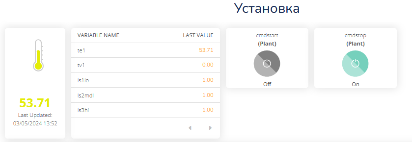

[Лабораторні](README.md)

# ЛАБОРАТОРНА РОБОТА № 3. Розробка застосунків з використанням IoT платформ

Увага! Усі наведені в лабораторній роботі приклади передбачають, що здобувач буде розбиратися з їх функціонуванням.

## Частина 1. Знайомство з MQTT

Одна із областей застосування MQTT – це обмін між пристроями та програмами, що підключені до Інтернет.  У даному лабораторному занятті використовується загальнодоступні брокери,  наприклад `test.mosquitto.org` або `mqtt.eclipse.org`. Слід звернути увагу, що їх використання є безкоштовним, але вони не гарантують безперебійну роботу сервісу, тому їх не слід використовувати для реальних рішень, що потребують надійних з’єднань та цілодобового використання. За необхідності використання надійних сервісів, слід користуватися іншими брокерами власними, або хмарними.

Також в роботі використовуються тестові клієнти:

- <http://www.hivemq.com/demos/websocket-client>
- <http://mqtt-explorer.com/>

### 1. Завантаження, встановлення та запуск MQTT Explorer

- [ ] Завантажте та встановіть [MQTT Explorer](http://mqtt-explorer.com/)
- [ ] Запустіть на виконання MQTT Explorer
- [ ] Виберіть наперед-сконфігуроване з'єднання `mqtt.eclipse.org`, подивіться на налаштування і натисніть `Connect`.
- [ ] Якщо з'єднання не працює, перевірте аналогічно наперед-сконфігуроване з'єднання `test.mosquitto.org` 


рис.3.1. Налаштування MQTT Explorer

Після з'єднання Ви побачите усі теми, які публікуються на брокері.   

- [ ] Введіть фільтр `$SYS` для відображення тільки системних повідомлень 


рис.3.2. Фільтрування системних повідомлень на брокері

- [ ] Зробіть огляд гілок та значень в `$SYS`
- [ ] Знайдіть і виберіть тему `clients/connected`, який показує кількість підключених клієнтів. У деталізації `History` Ви побачите перелік усіх повідомлень, які були отримані з початку сеансу а також їх значення у вигляді графіку.   


рис.3.3. Деталізація переліку повідомлень 

- [ ] Натисніть `Disconnect`. Зайдіть в налаштування `Advanced`. Подивіться налаштування: у списку тем вказано фільтр підписки на усі теми. На кожну тему підписка вказана з `QoS=0`
- [ ] Перевірте підключення до `test.mosquitto.org` 

### 2. Робота з HiveMQ Вебсокет-клієнтом

- [ ] У браузері зайдіть на <http://www.hivemq.com/demos/websocket-client>
- [ ] На сторінці Вебсокет-клієнта в полі Host введіть:
  - **mqtt.eclipse.org** 
  - в полі Port **80** (over WebSocket), 
- [ ] Якщо **mqtt.eclipse.org**  не працює, на сторінці Вебсокет-клієнта в полі Host введіть:
  - [ ] **test.mosquitto.org**
  - [ ] в полі Port **8081** (over WebSocket),
  - [ ] залиште виставленою опцію SSL 
- [ ] після чого натисніть кнопку Connect. Повинен з’явитися напис Connected.
- [ ] Натисніть `Add New Topic Subscription` і в полі `Topic` задайте  

```
$SYS/broker/clients/connected
```

- [ ] Тепер у полі Messages виводимуться повідомлення з даної теми

У випадку відсутності зв’язку з брокером зробіть перевірку на `test.mosquitto.org`. 

### 3. Публікація і підписка для власного повідомлення 

- [ ] На онлайновому клієнті HiveMQ створіть нову тему для публікації:

```
myname/device1/val
```

де `myname` - це якесь придумане ім'я, яке має бути унікальне в адресному просторі брокера

- [ ] Задайте QoS=1, виставіть опцію Retain
- [ ] В поле `Message`пишіть якесь числове значення 
- [ ] Зробіть публікацію
- [ ] Відкрийте MQTT Explorer, в Advanced налаштуйте фільтр на ваші публікації, які задаються полем `myname` 
- [ ] Знайдіть це повідомлення і передивіться його значення
- [ ] В HiveMQ ще кілька раз введіть різні значення і зробіть публікацію

**Надалі рекомендується використовуати MQTT Explorer для налагодження те перевірки публікацій та підписки.**

### 4. Відкриття сторінки з варіантом на тестовому сервері

- [ ] Перейдіть на <http://edu.asu.in.ua:1880/ui/#/0> (надалі, **тестовий сервер**) виберіть вкладку і групу елементів **з вашим варіантом**, який відповідає номеру в списку групи.

- повзунок для керування клапаном
- тренди температури, позиції клапану, та секундної пилоподібної кривої (0-100)  
- круговий індикатор температури 

 

рис.3.4. Вигляд сторінки з варіантом на тестовому сервері

### 5.  Перевірка підключення до тестового варіанту

- [ ] У MQTT Explorer відключіться від брокера
- [ ] Виберіть брокер `test.mosquitto.org`
- [ ] Зайдіть в налаштування `Advanced`, де:
  - [ ] видаліть усі теми
  - [ ] добавте нову тему для підписування `NUFT TI4/#`
  - [ ] вкажіть `QoS=0`
  - [ ] натисніть `ADD`
  - [ ] натисніть `Back` 
- [ ] Натисніть `Connect` для підключення до брокера
- [ ] На тестовому сервері (<http://edu.asu.in.ua:1880/ui/#/0>) змініть якісь значення повзунків

У MQTT Explorer  мають з'явитися відповідні записи 

### 6.  Зміна даних на тестовому сервері через MQTT 

- [ ] У MQTT Explorer на панелі `Publish` в полі `Topic` впишіть “NUFT TI4/Variant**X**/TT101”, де **X** – номер вашого варіанту. 
- [ ] `QoS` задайте рівним `0`, 
- [ ] Виберіть тип повідомлення `RAW`
- [ ] У полі `Message` введіть значення від `10.5`, натисніть `Publish`. 
- [ ] Перейдіть на тестовий сервер, подивіться як змінюється значення на круговому індикаторі. 
- [ ] Зробіть поступове введення `30`, `75`, `50`, з періодичністю 5 секунд, після кожного натискайте `Publish`. Подивіться як змінюється значення на тренді. 

### 7. Створення проекту node.js для роботи з MQTT

- [ ] Запустіть віртуальну машину з Debian, яку встановлювали на минулій лабораторній роботі

- [ ] Перейдіть в папку проекту

```
cd nodejsprj
```

- [ ] Встановіть модуль mqtt.js для роботи з MQTT, детальніше про роботу з модулем можна почитати за [цим посиланням](https://github.com/mqttjs/MQTT.js/tree/v4.3.7#publish)

```
npm i mqtt@4.3.7
```

- [ ] За допомогою WinSCP у папці проекту створіть новий файл `testmqtt.js` 
- [ ] Впишіть туди код програми, однак замість 1-го номеру варіанту вкажіть власний

```js
const mqtt = require('mqtt')
const client  = mqtt.connect('mqtt://test.mosquitto.org')

client.on('connect', function () {
  client.subscribe('NUFT TI4/Variant1/#', function (err) {
	console.log ("Subscribed")
  })
})

client.on('message', function (topic, message) {
  console.log(topic + ": " + message.toString())
})

client.on('error', function (error) {
  console.log(error)
})
```

- [ ] Запустіть програму на виконання

```
node testmqtt.js
```

- [ ] Спочатку повинні прийти останні збережені дані. Змініть значення клапану на тестовому сервері, щоб прийшли нові дані. 
- [ ] Зупиніть виконання програми, використовуючи комбінацію `CTRL+C`

- [ ] Змініть програму на наступний вигляд (не забувайте про варіант)

```js
const mqtt = require('mqtt')
const client  = mqtt.connect('mqtt://test.mosquitto.org')
let rad = 0;

client.on('connect', function () {
  client.subscribe('NUFT TI4/Variant1/#', function (err) {
	console.log ("Subscribed");
	setInterval(function() {
		rad = (rad>6.28) ? 0 : rad + 0.1;
		val = (Math.sin (rad)+1)/2*100; 
		client.publish('NUFT TI4/Variant1/TT101', val.toString());
	}, 2000)
  })
})

client.on('message', function (topic, message) {
  console.log(topic + ": " + message.toString())
})
```

- [ ] Запустіть програму на виконання, проконтролюйте що значення на тестовому сервері змінюється.

Про додаткві налаштування підписки можна почитати за [цим посиланням](https://github.com/mqttjs/MQTT.js/tree/v4.3.7?tab=readme-ov-file#subscribe)

## Частина 2. Робота з IoT платформою Ubidots

У даній частині лабораторної робити використовується платформа IoT Ubidots, яка надає тестові функції в певному обсязі на правах безкоштовної підписки. Ви можете використовувати інші платформи за бажанням.

### 1. Реєстрація на платформі Ubidots

Обмеження безкоштовної ліцензії описано [тут](https://help.ubidots.com/en/articles/639806-what-is-the-difference-between-ubidots-and-ubidots-stem)

- [ ] Зайдіть на сайт  <https://ubidots.com/manufacturing/>
- [ ] Натисніть `Sing up` або перейдіть [за посиланням](https://industrial.ubidots.com/accounts/signup_industrial/)
- [ ] Натисніть `Take Me To Ubidots Stem`
- [ ] Вкажіть реєстраційні дані та `Sign Up For Free`

### 2.Створення та налаштування нового пристрою

- [ ] Зайдіть у розділ `Devices`
- [ ] Натисніть `+`, щоб створити новий пристрій
- [ ] У списку типів пристроїв виберіть `Blank Devices`
- [ ] Дайте ім'я пристрою `Plant`, а мітку (Label) `plant`
- [ ] Натисніть по назві пристрою щоб зайти в його налаштування. Вкажіть розташування, яке відповідає поточному вашому за допомогою `set location`

### 3.Доступу до API через MQTT 

Ubidots пропонує широкий спектр технологій для надсилання даних до Ubidots з пристроїв, зокрема через:

- HTTP 

- MQTT 

- TCP/UDP 

Загальні концепції роботи описані [за цим посиланням](https://docs.ubidots.com/v1.6/reference/how-ubidots-works) , опис роботи з MQTT [за цим посиланням](https://docs.ubidots.com/v1.6/reference/mqtt).  

- [ ] З налаштувань Device скопіюйте в буфер пам'яті `token` для можливості підключення до брокера


рис.3.5. Налаштування Device

- [ ] Запустіть MQTT Explorer, налаштуйте нове підключення до брокера `industrial.api.ubidots.com` у полі `user name` вставте скопійований `Token`, а поле `Password` залиште без змін 


рис.3.6. Налаштування підключення до брокера

- [ ] Натисніть `Connect`.

### 4. Відправка тестового повідомлення через MQTT 

Для відправки даних по MQTT в якості `topic` треба вказати у форматі

```text
/v1.6/devices/{DEVICE_LABEL}
```

, де `{DEVICE_LABEL}` мітка пристрою що надається при створенні. У нашому випадку topic MQTT буде наступна: 

```
/v1.6/devices/plant
```

Повідомлення передається для кожного параметру у форматі JSON, наприклад 

```json
{
    "temperature":{
        "value": 23.5,
        "timestamp":1703001262000, 
        "context" : {
            "weather" : "sunny"
        }
    }
}    
```

де 

- `value` - числове значення параметру; 

- `timestamp` - відмітка часу Unix Epoch в мілсекундах, якщо не передається, то сервери встановлюють час отримання;
- `context` - довільний набір пар ключ-значення, який здебільшого використовується для зберігання координат широти та довготи пристроїв GPS, або інших значень в парі

- [ ] Використовуючи MQTT Explorer відправте наступне повідомлення на платформу

```json
{
    "te1": {
        "value":10, 
        "context": {"state": "work"}
    },
    "lvs1":1
}
```


рис.3.7. Відправка повідомлення до платформи

- [ ] Почекайте кілька секунд, перейдіть на сторінку пристрою Ubidots, оновіть її. Ви маєте побачити дані.


рис.3.8. Перегляд отриманих даних

- [ ] Змініть в повідомлені значення температури `te1` рівним 25, а `lvs1` нулю і знову відправте на платформу. 

- [ ] Перейдіть на платформу, відкрийте пристрій, оновіть сторінку, якщо вона була відкрита. Ви повинні побачити змінні у вигляді їх поточних значень

- [ ] Використовуйте кнопку "Toggle View" для зміни формату відображення

 

рис.3.9. Зміна формату відображення

### 5.Відправка з node.js 

- [ ] За допомогою WinSCP у папці проекту створіть новий файл `testmqtt2.js` 
- [ ] Впишіть туди код програми, модифікуючи його зі своїм маркером доступу

```js
const mqtt = require('mqtt');
const client  = mqtt.connect('mqtt://industrial.api.ubidots.com', 
                             {username:"тут_має_бути_ваш_токен"});
let rad = 0;

client.on('connect', function () {
	setInterval(function() {
		rad = (rad>6.28) ? 0 : rad + 0.1;
		sin = (Math.sin (rad)+1)/2*100; 
		let msg = {"rad": rad,"sin": sin};
		console.log (msg);
		client.publish('/v1.6/devices/plant', JSON.stringify(msg));
	}, 5000)
})
```

- [ ] Запустіть на виконання, перевірте що дані надходять на Ubidots

### 6. Налаштування Dashboard 

- [ ] В Ubidots перейдіть в `Data->Dashboards`
- [ ] Змініть ім'я Dashboard з назвою `Demo Dashboard` на `Моя установка` 
- [ ] Налаштуйте, щоб на Dashboard відображалися останні 10 хвилин інформації

- [ ] Привяжіть до існуючих віджетів Dashboard за замовченням змінні `sin` та `rad`.

- [ ] Видаліть усі віджети, окрім 4-х існуючих, як показано на рис.3.10. Це зумовлено обмеженням в безкоштовній ліцензії до 10 віджетів.  


рис.3.10. Зміна Dashboard: привязка змінних

- [ ] Самостійно додайте різні віджети на Dashboard з прив'язкою до різних змінних. Зверніть увагу, що деякі віджети вимагають однієї змінної, інші - кількох. Як мінімум додайте та налаштуйте наступні віджети
  - [ ] Tank
  - [ ] Temperature

### 7.Модифікація програми для зміни завдання

Для підписки на зміни в Ubidots використовується наступний синтаксис topic:

```
/v1.6/devices/{DEVICE_LABEL}/{VARIABLE_LABEL}
```

Для підписки на останню зміну змінної:

```
/v1.6/devices/<device_label>/<variable_label>/lv
```

Якщо необхідно підписатися під будь які змінні на пристрої `plant`, це матиме вигляд

```
/v1.6/devices/plant/#
```

- [ ] У  `testmqtt2.js`  додайте фрагмент програми з підпискою на зміну змінної `setpoint`. Програма матиме вигляд:

```js
const mqtt = require('mqtt');
const client  = mqtt.connect('mqtt://industrial.api.ubidots.com', 
                             {username:"тут_має_бути_ваш_токен"});
let rad = 0;

client.on('connect', function () {
	client.subscribe('/v1.6/devices/plant/setpoint/lv', function (err) {
        console.log ("Subscribed")
    })
	setInterval(function() {
		rad = (rad>6.28) ? 0 : rad + 0.1;
		sin = (Math.sin (rad)+1)/2*100; 
		let msg = {"rad": rad,"sin": sin};
		console.log (msg);
		client.publish('/v1.6/devices/plant', JSON.stringify(msg));
	}, 5000)
})

client.on('message', function (topic, message) {
  console.log(topic + ": " + message.toString())
})  
```

- [ ] Запустіть програму на виконання.

### 8. Додавання віджету для зміни завдання

- [ ] На Ubidots e розділі Devices добавте вручну нову змінну з назвою `setpoint`
- [ ] Додайте віджет `Manual Input` і налаштуйте його на зміну змінної `setpoint`
- [ ] Змініть за допомогою цього віджету завдання. Перевірте що значення надходить до програми на node.js і виводиться на консолі. 
- [ ] Проведіть таку саму операцію з віджетом `Slider`

### 9.Генерування події 

- [ ] На Ubidots перейдіть на сторінку налаштування подій `Data->Events`
- [ ] Натисніть `Create Event`
- [ ] Налаштуйте подію на надсилання поштового повідомлення, якщо `setpoint` перевищує 60


рис.3.11. Налаштування тригеру на відправку повідомлення 

- [ ] Встановіть завдання на 65 градусів, після перевищення 60 градусів має надіслати повідомлення на вказану пошту 

### 10. Реалізація задачі обміну даними між Modbus пристроєм та платформою

У даному пункті необхідно реалізувати обмін даними між імітатором Modbus-серверу та платформою. Для цього треба модифікувати модуль Node.js, що був зроблений на минулій лабораторній роботі для можливості підключення його до основного модуля     

- [ ] Запустіть Modrsism2. 
- [ ] Скопіюйте  `modbusapp.js` що був зроблений в минулій лабораторній роботі під іменем `modbusmodule.js`

```
cp modbusapp.js modbusmodule.js
```

- [ ] Запустіть `modbusmodule.js` і переконайтеся що він працює. Якщо виникають помилки, перевірте чи не змінилася IP адреса вашого хоста, і якщо це так, відкрийте код в Notepad++  та змініть її в програмі.
- [ ] Відкрийте код в Notepad++ і зробіть наступні зміни в програмі (підказки для зміни коду наведені нижче):
  - щоб виводилися повідомлення `Modbus task started` після підключення до Modbus Server
  - щоб не виводилися повідомлення при опитуваннях змінних
  - добавте в перелік `io` змінні запуску та зупинки з зовнішнього користувацького інтерфейсу: `cmdstart` та `cmdstop`
  - щоб реагувала на команди `cmdstart` та `cmdstop`
  - щоб з модуля експортувалися змінні `io`

```js
...
let io = {
...
	cmdstart:0, cmdstop:0 //<-- добавити
}
...
function task() {
    //slave 1
	client.setID(1);
	console.log ("Task started") //<-- добавити
    ...
	setInterval(function() {
		io.tstep ++;
		//console.log(io); <-- закоментувати
	}, 1000)
}
...
function logic () {
...
       case states.idle:
       ...
            if (io.sb1Strt === true || io.cmdstart>0) { //<-- змінити
       ... 
       case states.dwnld:
		...
                if (io.sb2Stop || io.cmdstop>0) {  //<-- змінити              
...
module.exports = io;//<--добавити в кінці файлу
```

- [ ] За допомогою WinSCP у папці проекту створіть новий файл `mqttapp.js` 
- [ ] Запишіть та збережіть наступний код (зверніть увагу на `token`)

```js
const mqtt = require('mqtt');
const modbusio =  require('./modbusmodule.js');
const client  = mqtt.connect('mqtt://industrial.api.ubidots.com', 
                             {username:"тут_має_бути_ваш_токен"});
let msg;
client.on('connect', function () {
	client.subscribe('/v1.6/devices/plant/cmdstart/lv', function (err) {
        console.log ("Subscribed to cmdstart")
    })
	client.subscribe('/v1.6/devices/plant/cmdstop/lv', function (err) {
        console.log ("Subscribed to cmdstop")
    })	
	setInterval(function() {
		msg = {
			te1: {value : modbusio.te1, context : {msg : modbusio.msg}},
			tv1: modbusio.tv1,
			tstep: modbusio.tstep,
			ls1lo: modbusio.ls1Lo ? 1:0, 
			ls2mdl: modbusio.ls2Mdl ? 1:0, 
			ls3Hi: modbusio.ls3Hi ? 1:0
			};
			if (!msg.cmdStart) {
				cmdstart = modbusio.cmdstart,
				cmdstop = modbusio.cmdstop
			}
		console.log (msg);
		client.publish('/v1.6/devices/plant', JSON.stringify(msg));
	}, 5000)
})

client.on('message', function (topic, message) {
  let varname = topic.split('/')[4];
  modbusio[varname] = message;
  console.log (varname + " " + message);
})
```

- [ ] Самостійно видаліть змінні `rad` та `sin` зі списку Ubidots, щоб загальна кількість змінних була не більше 8-ми (обмеження безкоштовної ліцензії 10).   
- [ ] Запустіть програму на виконання. Мають виводитися повідомлення подібні до наведених нижче: 


рис.3.12. Виведення повідомлень

### 11. Перевірка обміну з платформою

- [ ] На Ubidots, використовуючи віджети типу `Variables table` та `Switch` зебезпечте віддалене керування та контроль за установкою. Впевніться що кнопки працюють, а дані відображаються.



рис.3.13. Відображення даних та керування

## Частина 3. Індивідуальне завдання

- [ ] За Вашим варіантом, що Ви отримали на минулій лабораторній роботі а також на базі програми, що ви зробили в минулій лабораторній роботі, відповідно до прикладу з Частини 2 цієї лабораторної роботи зробіть наступне:
- зробіть копію вашої програми на node.js з лабораторної роботи 2 що реалізовує керування установкою 
- змініть її, щоб змінні `io` експортувалися з модуля 
- на node.js створіть модуль який забепзечує обмін даними по MQTT з платформою Ubidots:
  - усі значення входів з обєкту відправляє на платформу
  - усі значення команд та уставок приймає з платформи та скеровує на модуль керування
- у Ubidots реалізуйте користувацький інтерфейс для контролю та керування за установкою   
- використовуючи можливості Modrsim2 перевірте функціональність рішення
- [ ] Зверніть увагу на обмеження безкоштовної ліцензії (до 10 змінних на пристрій, 3 пристрої), описано [тут](https://help.ubidots.com/en/articles/639806-plans-billing-what-is-the-difference-between-ubidots-and-ubidots-stem?_gl=1*5f5fx8*_ga*OTk2MzQ4OTgwLjE3MDk1NTIyMjk.*_ga_VEME7QQ5EZ*MTcxMDE3MjE5MC44LjEuMTcxMDE3MjY4NS40LjAuMA..) 

- [ ] Розроблену програму та копії екранів з даними зчитування та користувацький інтерфейс відправте у звіті. 

- [ ] Перейдіть до налаштувань Dashboard і згенеруйте посилання для спільного доступу (кнопка `Share`)


рис.3.14. Надання спільного доступу до Dashboard

- [ ] Перевірте, що посилання відкривається в іншому браузері. Це посилання треба відправити викладачу для перевірки у звіті.


