[Лабораторні](README.md)

# ЛАБОРАТОРНА РОБОТА № 3. Розробка застосунків з використанням IoT платформ

Увага! Усі наведені в лабораторній роботі приклади передбачають, що здобувач буде розбиратися з їх функціонуванням.

## Частина 1. Знайомство з MQTT

Одна із областей застосування MQTT – це обмін між пристроями та програмами, що підключені до Інтернет.  У даному лабораторному занятті використовується загальнодоступні брокери,  наприклад `test.mosquitto.org` або `mqtt.eclipse.org`. Слід звернути увагу, що їх використання є безкоштовним, але вони не гарантують безперебійну роботу сервісу, тому їх не слід використовувати для реальних рішень, що потребують надійних з’єднань та цілодобового використання. За необхідності використання надійних сервісів, слід користуватися іншими брокерами власними, або хмарними.

Також в роботі використовуються тестові клієнти:

- <http://www.hivemq.com/demos/websocket-client>
- <http://mqtt-explorer.com/>

### 1. Завантаження, встановлення та запуск MQTT Explorer

- [ ] Завантажте та встановіть [MQTT Explorer](http://mqtt-explorer.com/)
- [ ] Запустіть на виконання MQTT Explorer
- [ ] Виберіть наперед-сконфігуроване з'єднання `mqtt.eclipse.org`, подивіться на налаштування і натисніть `Connect`.
- [ ] Якщо з'єднання не працює, перевірте аналогічно наперед-сконфігуроване з'єднання `test.mosquitto.org` 

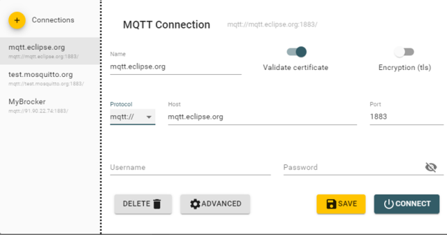

рис.3.1. Налаштування MQTT Explorer

Після з'єднання Ви побачите усі теми, які публікуються на брокері.   

- [ ] Введіть фільтр `$SYS` для відображення тільки системних повідомлень 

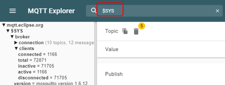

рис.3.2. Фільтрування системних повідомлень на брокері

- [ ] Зробіть огляд гілок та значень в `$SYS`
- [ ] Знайдіть і виберіть тему `clients/connected`, який показує кількість підключених клієнтів. У деталізації `History` Ви побачите перелік усіх повідомлень, які були отримані з початку сеансу а також їх значення у вигляді графіку.   

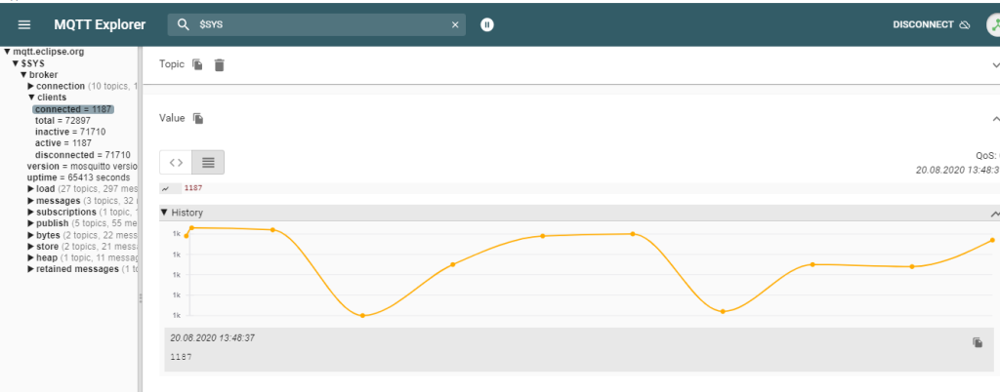

рис.3.3. Деталізація переліку повідомлень 

- [ ] Натисніть `Disconnect`. Зайдіть в налаштування `Advanced`. Подивіться налаштування: у списку тем вказано фільтр підписки на усі теми. На кожну тему підписка вказана з `QoS=0`
- [ ] Перевірте підключення до `test.mosquitto.org` 

### 2. Робота з HiveMQ Вебсокет-клієнтом

- [ ] У браузері зайдіть на <http://www.hivemq.com/demos/websocket-client>
- [ ] На сторінці Вебсокет-клієнта в полі Host введіть:
  - **mqtt.eclipse.org** 
  - в полі Port **80** (over WebSocket), 
- [ ] Якщо **mqtt.eclipse.org**  не працює, на сторінці Вебсокет-клієнта в полі Host введіть:
  - [ ] **test.mosquitto.org**
  - [ ] в полі Port **8081** (over WebSocket),
  - [ ] залиште виставленою опцію SSL 
- [ ] після чого натисніть кнопку Connect. Повинен з’явитися напис Connected.
- [ ] Натисніть `Add New Topic Subscription` і в полі `Topic` задайте  

```
$SYS/broker/clients/connected
```

- [ ] Тепер у полі Messages виводимуться повідомлення з даної теми

У випадку відсутності зв’язку з брокером зробіть перевірку на `test.mosquitto.org`. 

### 3. Публікація і підписка для власного повідомлення 

- [ ] На онлайновому клієнті HiveMQ створіть нову тему для публікації:

```
myname/device1/val
```

де `myname` - це якесь придумане ім'я, яке має бути унікальне в адресному просторі брокера

- [ ] Задайте QoS=1, виставіть опцію Retain
- [ ] В поле `Message`пишіть якесь числове значення 
- [ ] Зробіть публікацію
- [ ] Відкрийте MQTT Explorer, в Advanced налаштуйте фільтр на ваші публікації, які задаються полем `myname` 
- [ ] Знайдіть це повідомлення і передивіться його значення
- [ ] В HiveMQ ще кілька раз введіть різні значення і зробіть публікацію

**Надалі рекомендується використовуати MQTT Explorer для налагодження те перевірки публікацій та підписки.**

### 4. Відкриття сторінки з варіантом на тестовому сервері

- [ ] Перейдіть на <http://edu.asu.in.ua:1880/ui/#/0> (надалі, **тестовий сервер**) виберіть вкладку і групу елементів **з вашим варіантом**, який відповідає номеру в списку групи.

- повзунок для керування клапаном
- тренди температури, позиції клапану, та секундної пилоподібної кривої (0-100)  
- круговий індикатор температури 

 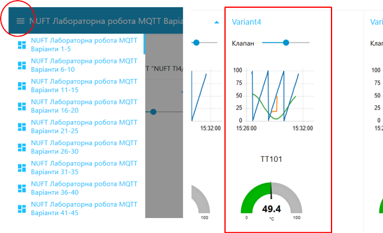

рис.3.4. Вигляд сторінки з варіантом на тестовому сервері

### 5.  Перевірка підключення до тестового варіанту

- [ ] У MQTT Explorer відключіться від брокера
- [ ] Виберіть брокер `test.mosquitto.org`
- [ ] Зайдіть в налаштування `Advanced`, де:
  - [ ] видаліть усі теми
  - [ ] добавте нову тему для підписування `NUFT TI4/#`
  - [ ] вкажіть `QoS=0`
  - [ ] натисніть `ADD`
  - [ ] натисніть `Back` 
- [ ] Натисніть `Connect` для підключення до брокера
- [ ] На тестовому сервері (<http://edu.asu.in.ua:1880/ui/#/0>) змініть якісь значення повзунків

У MQTT Explorer  мають з'явитися відповідні записи 

### 6.  Зміна даних на тестовому сервері через MQTT 

- [ ] У MQTT Explorer на панелі `Publish` в полі `Topic` впишіть “NUFT TI4/Variant**X**/TT101”, де **X** – номер вашого варіанту. 
- [ ] `QoS` задайте рівним `0`, 
- [ ] Виберіть тип повідомлення `RAW`
- [ ] У полі `Message` введіть значення від `10.5`, натисніть `Publish`. 
- [ ] Перейдіть на тестовий сервер, подивіться як змінюється значення на круговому індикаторі. 
- [ ] Зробіть поступове введення `30`, `75`, `50`, з періодичністю 5 секунд, після кожного натискайте `Publish`. Подивіться як змінюється значення на тренді. 

### 7. Створення проекту node.js для роботи з MQTT

- [ ] Запустіть віртуальну машину з Debian, яку встановлювали на минулій лабораторній роботі (за замовченням Username: `osboxes`, Password: `osboxes.org`)
- [ ] Перейдіть в папку проекту

```
cd nodejsprj
```

- [ ] Встановіть модуль mqtt.js для роботи з MQTT, детальніше про роботу з модулем можна почитати за [цим посиланням](https://github.com/mqttjs/MQTT.js/tree/v4.3.7#publish)

```
npm i mqtt@4.3.7
```

- [ ] За допомогою WinSCP у папці проекту створіть новий файл `testmqtt.js` 
- [ ] Впишіть туди код програми, однак замість 1-го номеру варіанту вкажіть власний

```js
const mqtt = require('mqtt')
const client  = mqtt.connect('mqtt://test.mosquitto.org')

client.on('connect', function () {
  client.subscribe('NUFT TI4/Variant1/#', function (err) {
	console.log ("Subscribed")
  })
})

client.on('message', function (topic, message) {
  console.log(topic + ": " + message.toString())
})

client.on('error', function (error) {
  console.log(error)
})
```

- [ ] Запустіть програму на виконання

```
node testmqtt.js
```

- [ ] Спочатку повинні прийти останні збережені дані. Змініть значення клапану на тестовому сервері, щоб прийшли нові дані. 
- [ ] Зупиніть виконання програми, використовуючи комбінацію `CTRL+C`

- [ ] Змініть програму на наступний вигляд (не забувайте про варіант),

```js
const mqtt = require('mqtt')
const client  = mqtt.connect('mqtt://test.mosquitto.org')
let rad = 0;

client.on('connect', function () {
  client.subscribe('NUFT TI4/Variant1/#', function (err) {
	console.log ("Subscribed");
	setInterval(function() {
		rad = (rad>6.28) ? 0 : rad + 0.1;
		val = (Math.sin (rad)+1)/2*100; 
		client.publish('NUFT TI4/Variant1/TT101', val.toString());
	}, 2000)
  })
})

client.on('message', function (topic, message) {
  console.log(topic + ": " + message.toString())
})
```

- [ ] Запустіть програму на виконання, проконтролюйте що значення на тестовому сервері змінюється.

Про додаткві налаштування підписки можна почитати за [цим посиланням](https://github.com/mqttjs/MQTT.js/tree/v4.3.7?tab=readme-ov-file#subscribe)

## Частина 2. Робота з IoT платформою Datacake

У даній частині лабораторної робити використовується платформа IoT Datacake, яка надає тестові функції в певному обсязі на правах безкоштовної підписки, а [саме](https://datacake.co/pricing).

- 5 підключених пристроїв з безкоштовним планом підключення
- збереження даних з глибиною 7 днів на один пристрій
- 500 записів на день (деталі [тут](https://docs.datacake.de/device/database/data-retention-and-datapoints#so-how-many-datapoints-do-i-need)) на один пристрій

### 1. Реєстрація на платформі Datacake

- [ ] Зайдіть на сайт https://datacake.co/. Натисніть Dashboard та створіть аккаунт:

- заповніть поля імені та прізвища, електронну пошту
- у поле Project Type виберіть `Hobby`
- Виставте опцію `I agree ...`

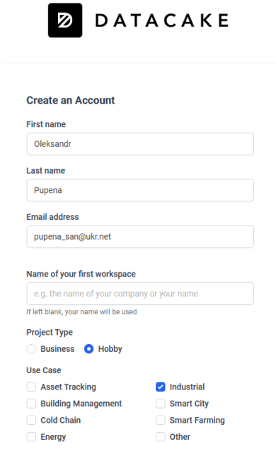


### 2.Створення та налаштування нового пристрою

- [ ] Зайдіть у розділ `Devices`. Натисніть `+ Add Device`  щоб створити новий пристрій/ Оберіть ”API” для створення пристрою з підтримкою MQTT

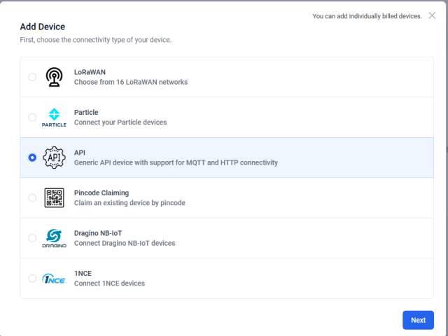

- [ ] Далі вам запропонують покроково заповняти налаштування нового пристрою:
  - STEP1: Введіть ім’я продукту `Testdevice`
  - STEP2: можна нічого не заповнювати
  - STEP3: Оберіть `free-plan` для свого пристрою.

Кожен пристрій на Datacake належить до продукту. Поведінка та зовнішній вигляд пристрою означуються цим продуктом, а саме:

-  Дизайн панелі приладів

-  Поля в базі даних

-  Декодер корисного навантаження (для API, MQTT)

-  Індивідуальні низхідні посилання

Кожен пристрій містить поля, через які надається доступ до даних пристрою. Необхідно означити їх.

- [ ] На вкладці `Configuration` розділ `Fields`, використовуючи кнопки `+ Add Field` добавте поля
  -  `rad` типу `float`
  - `sin` типу `float`

### 3.Доступу до пристрою через зовнішній MQTT брокер

Datacake пропонує широкий спектр технологій для надсилання та отримання даних з пристроїв, зокрема через:

- HTTP API 
- MQTT 
- LoRaWAN
- GraphQL API
- є готові інтеграції з хмарними сервісами, такими як Zapier, InfluxDB, AWS, Node-RED та інші

- [ ] Для підключення необхідно знати Serial Number Вашого пристрою. Скопіюйте його кудись в блокнот для подальшого використання  

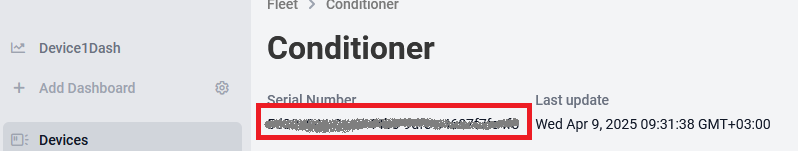

В Datacake є кілька варіантів інтеграції через MQTT, використовуючи внутрішній та зовнішній брокер. У цьому пункті ми розглянемо інтеграцію через зовнішній брокер, наприклад `test.mosquitto.org`. 

- [ ] Підключіть пристрій до MQTT брокера.
  - Перейдіть на сторінку пристрою на вкладку `Configuration`
  - Зайдіть в розділ MQTT Configuration і натисніть `+ Add new MQTT Server`
  - Заповніть параметри підключення для `test.mosquitto.org`, аналогічно як в першій частині
  - Протестувани з’єднання кнопкою `Test Connection`, у разі успіху натисніть`Add MQTT Server`

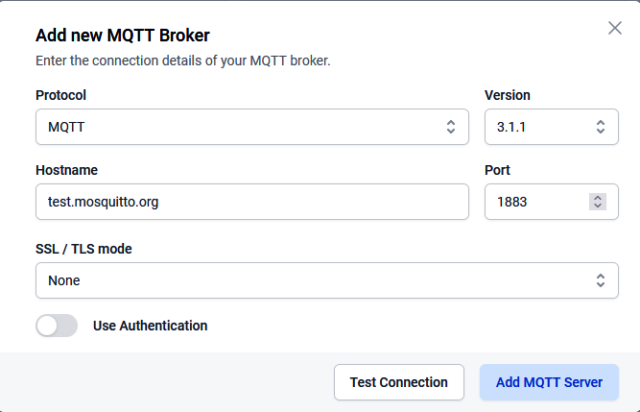 

Для доступу до даних Datacake використовує систему обробників `MQTT Uplink Decoders` та `Downlinks`. MQTT Uplink Decoder це JavaScript функція, що викликаються в момент оновлення інформації на MQTT сервері за певною темою. Downlink також є JavaScript функцією, але слугує для відправки інформації на сервер. 

**У всіх наступних пунктах, MQTT Topic повинен мати наступний формат:**

```
GROUP/MyfistnameMylastname/*
```

Де `GROUP` - назва групи, наприклад `АК1_1М`, `Myfistname` - ім'я латиницею, `Mylastname` - ім'я кирилицею.  

- [ ] Натисніть на `Add Uplink Decoder`.
- [ ] В поле `Subscribe to topics` впишіть MQTT topic на зміни якої буде реагувати цей обробник. У даному випадку це буде ф орматі:

```
GROUP/MyfistnameMylastname/testmqtt
```

Функція Decoder приймає 2 параметри MQTT `topic` і `payload`. Для вставки значені в поля результаті ми маємо повернути масив, що складається з об’єктів з полями `device`, `field`, `value`. 

`device` – серійний номер пристрою, про який писалося вище 

`field` – ідентифікатор поля куди буде записано значення 

`value` – значення, що буде записане.

- [ ] Напишіть наступну JS функцію змінивши `deviceID` на власний (зауважимо що підтримують не всі можливості JS):

```js
function Decoder(topic, payload) {
    var deviceID="1111111-0ea7-44b6-9dfe-99999999"; // 
    try {
        payload = JSON.parse (payload);
        //
        if (typeof payload !== "object") {
            console.log ("items not object");
            return
        }
        var result = [];
        for (var fieldname in payload) {
            result.push ({
                device: deviceID,
                field: fieldname,
                value: payload[fieldname]    
            })
        }
        return result
    } catch (err) {
        console.log (err.message)
    }   
}
```

- [ ] Відкрийте інструмент для тестування функції `Try Decode Function -> Show`  . В поле topic впишіть тестовий topic, у поле payload JSON у форматі: `{"rad":2.3,"sin":0.5}`. Очікуваний результат:

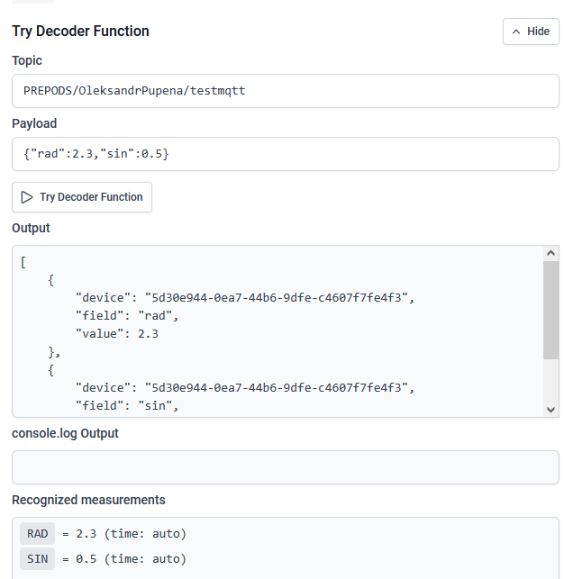 

- [ ] Натисніть `Update Uplink Decoder` щоб зміни вступили в силу.

- [ ] Натисніть `Save` для збереження налаштувань

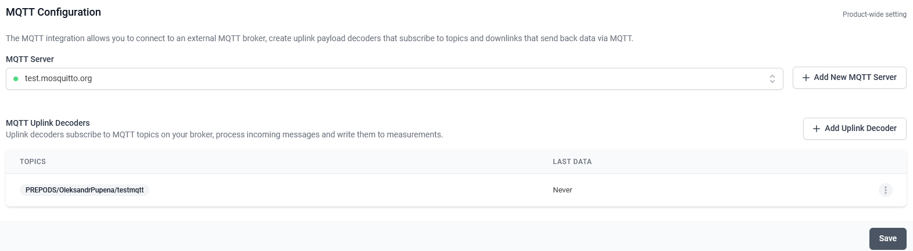

### 4. Відправка тестового повідомлення через MQTT

- [ ] Відкрийте MQTT Explorer. У налаштуваннях:
  - [ ] вкажіть брокер `test.mosquitto.org`
  - [ ] в `Topic` і `Payload` вкажіть  ті самі значення що при тестуванні повідомлення і опублікуйте його

- [ ] У налаштуваннях пристрою `TestDevice` закладці `Configuration` розділі `Fileds` повинні відображатися відправлені значення 

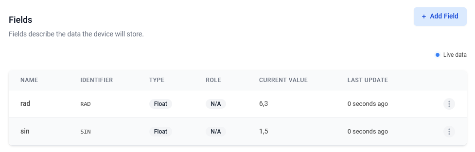 

- [ ] Подивіться на повідомлення у вікні `Debug`

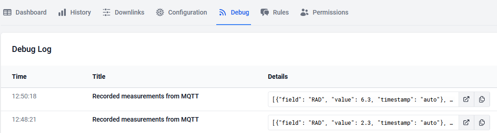

- [ ] Перейдіть на закладку `History`, виділіть внизу потрібні поля щоб показати їх на тренді. 

### 5.Відправка з node.js

- [ ] За допомогою WinSCP у папці проекту створіть новий файл `testmqtt2.js` 
- [ ] Впишіть туди код програми, модифікуючи його темою MQTT, яка була перевірена в минулій лабораторній роботі

```js
const mqtt = require('mqtt');
const client  = mqtt.connect('mqtt://test.mosquitto.org');
let rad = 0;
function simulation () {
	rad = (rad>6.28) ? 0 : rad + 0.314;
	sin = (Math.sin (rad)+1)/2*100; 
	let msg = {"rad": rad,"sin": sin};
	console.log (msg);
	client.publish('GROUP/MyfistnameMylastname/testmqtt', JSON.stringify(msg));//тут задається ваш Topic
}
client.on('connect', function () {
	setInterval(simulation , 60000)
});
simulation ();
```

- [ ] Запустіть на виконання, дочекайтеся. Зверніть увагу функція запускається раз/хвилину, тому друге значення буде згенеровано тільки через хвилину.
- [ ] За допомогою закладки пристрою Debug, перевірте що дані надходять на Datacake 

Слід зауважити, що `free-plan` забезпечує 500 записів на добу для одного пристрою, якщо перевищити цей ліміт то пристрій заблокується на 24 години або його доведеться перестворити.

### 6. Налаштування Dashboard

Dashboard слугує для візуального контролю за пристроєм та його станом, а також керування ним. 

- [ ] В Datacake перейдіть в налаштування `Device->Dashboards`
- [ ] Для переходу в режим редактора в правій частині активуйте опцію редагування:

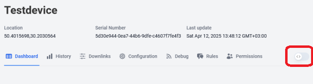 

Після активації на панелі з’явиться кнопки створення віджетів та посилання на  dashboard.

- [ ] Додайте віджет для відображення графіку змін значень `sin` та `rad`  (`Add Widget->Chart`) , у налаштуваннях віджета:
- у вкладці `Data`, добавте `sin` та `rad` , у налаштуваннях `Axis` вкажіть дві різні осі для різних змінних
- у вкладці у `Time Frame` вкажіть Hour 

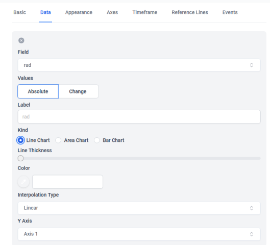

- у вкладці Axis задайте налаштування для усіх осей як на рисунки нижче

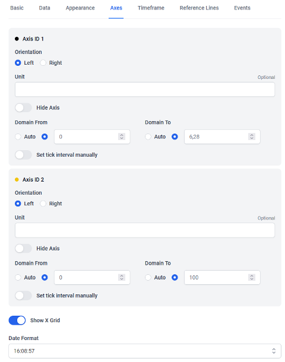

- [ ] Додайте віджет для налаштування плинного значення `sin` та `rad`  (`Add Widget->Value`)
- [ ] Переведіть Dashboard в режим виконання

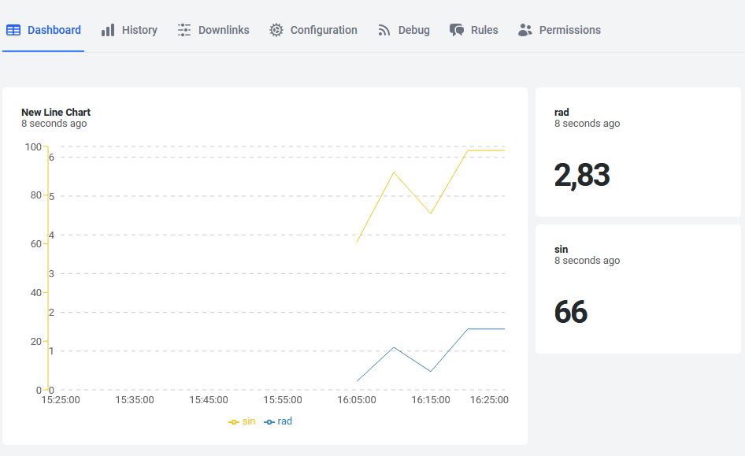 

- [ ] Самостійно додайте різні віджети на Dashboard з прив'язкою до змінних `sin` та `rad` . Зверніть увагу, що деякі віджети вимагають однієї змінної, інші - кількох. Як мінімум додайте та налаштуйте віджети Value у формі стовпчикової діаграми
- [ ] Зупиніть програму `testmqtt2.js` натиснувши `CTRL+C`

### 7.Модифікація програми для зміни завдання

- [ ] У  `testmqtt2.js`  додайте фрагмент програми з підпискою на зміну змінної `setpoint`. Програма матиме вигляд:

```js
const mqtt = require('mqtt');
const client  = mqtt.connect('mqtt://test.mosquitto.org');
let rad = 0;

function simulation () {
	rad = (rad>6.28) ? 0 : rad + 0.314;
	sin = (Math.sin (rad)+1)/2*100; 
	let msg = {"rad": rad,"sin": sin};
	console.log (msg);
	client.publish('GROUP/MyfistnameMylastname/testmqtt', JSON.stringify(msg));//тут задається ваш Topic
}
client.on('connect', function () {
	client.subscribe('GROUP/MyfistnameMylastname/testmqtt/sp', function (err) { //тут задається ваш Topic
        console.log ("Subscribed")
    })
	setInterval(simulation , 60000)
});
client.on('message', function (topic, message) {
  console.log(topic + ": " + message.toString())
})

simulation ();
```

- [ ] Запустіть програму на виконання.

- [ ] У Datacake створіть нове поле `sp` з типом `integer` 

Для відправки даних з Datacake використовується Downlink функція. Для відправки повідомлення необхідно з цієї функції повернути об’єкт для відправки по MQTT, тобто що має поля `topic` та `payload`. 

- [ ] У Datacake Device перейдіть на закладку `Downlinks `
- [ ] Cтворіть нову функцію `SetSP`:

```js
function Encoder(device, measurements) {
    var spvalue = measurements.SP.value;
    return {
        topic: 'GROUP/MyfistnameMylastname/testmqtt/sp', //тут задається ваш Topic
        payload: spvalue
    };
}
```

- [ ] Зробіть тестування функції через `Try Encoder`. Зверніть увагу, саме повідомлення MQTT не буде відправлено! 

- [ ] Збережіть налаштування `Add Downlinks`
- [ ] Натисніть `Send Downlink` щоб відправити повідомлення по MQTT

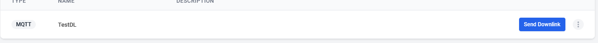

### 8. Додавання віджету для зміни завдання

Для відправки даних з Datacake використовуватиме нове поле завдання `sp`, яке змінюватиметься повзунком та спеціальна кнопка для відправки.

- [ ] На dashboard добавте новий віджет `slider`, привісіть його до поля `sp`

- [ ] Добавте кнопку `Send Downlink` з написом відправити, в налаштуваннях Data виберіть раніше створену функцію `Donwlink`
- [ ] Переведіть Dashboard в режим роботи. 

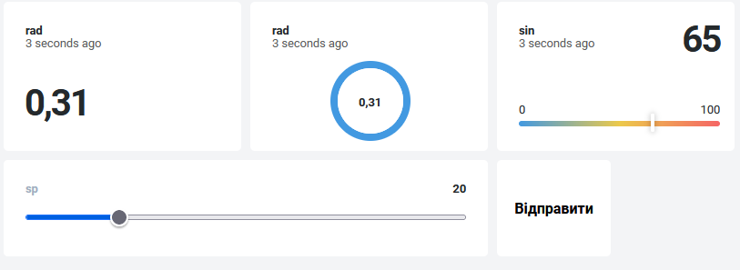 

- [ ] Змініть за допомогою цього віджету завдання і натисніть кнопку Відправити. Перевірте що значення надходить до програми на node.js і виводиться на консолі. 

### 9.Генерування події 

- [ ] На Datacake Device перейдіть на сторінку налаштування подій через правила `Rules`
- [ ] Натисніть `Add Rule`
- [ ] Налаштуйте правила з назвою `Heigh setpoint`  на надсилання поштового повідомлення, якщо `setpoint` перевищує 60. Скористайтеся `Insert Placeholder` для формування повідомлення.

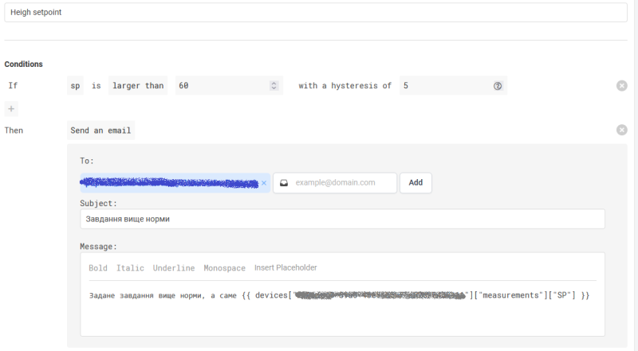

- [ ] Натисніть Create Rule

- [ ] Встановіть завдання `sp` на 70, після перевищення протягом 2 хвилин має надіслати повідомлення на вказану пошту 

### 10. Створення нового пристрою для реалізації контролю установки

У даному пункті необхідно реалізувати обмін даними між імітатором Modbus-серверу та платформою. Для цього треба:

- створити новий пристрій на Datacake з назвою `plant`, який буде відповідати за установку
- модифікувати модуль Node.js, що був зроблений на минулій лабораторній роботі для можливості підключення його до основного модуля обміну з платформою
- реалізувати обмін з платформою

Задача буде реалізована наступним чином:

- 

- [ ] Створіть на Datacake новий пристрій з іменем `myplant` на базі API на основі нового product з free підпискою
- [ ] Добавте MQTT брокер (MQTT Server), який означили раніше 
- [ ] Добавте наступні поля в пристрій:

- `batch` типу `string`
- 

### 10. Реалізація задачі обміну даними між Modbus пристроєм та платформою

- [ ] Запустіть Modrsism2. 
- [ ] Скопіюйте  `modbusapp.js` що був зроблений в минулій лабораторній роботі під іменем `modbusmodule.js`

```
cp modbusapp.js modbusmodule.js
```

- [ ] Запустіть `modbusmodule.js` і переконайтеся що він працює. Якщо виникають помилки, перевірте чи не змінилася IP адреса вашого хоста, і якщо це так, відкрийте код в Notepad++  та змініть її в програмі.
- [ ] Відкрийте код в Notepad++ і зробіть наступні зміни в програмі (підказки для зміни коду наведені нижче):
  - щоб виводилися повідомлення `Modbus task started` після підключення до Modbus Server
  - щоб не виводилися повідомлення при опитуваннях змінних
  - добавте в перелік `io` змінні запуску та зупинки з зовнішнього користувацького інтерфейсу: `cmdstart` та `cmdstop`
  - щоб реагувала на команди `cmdstart` та `cmdstop`
  - щоб з модуля експортувалися змінні `io`

```js
...
let io = {
...
	cmdstart:0, cmdstop:0 //<-- добавити
}
...
function task() {
    //slave 1
	client.setID(1);
	console.log ("Task started") //<-- добавити
    ...
	setInterval(function() {
		io.tstep ++;
		//console.log(io); <-- закоментувати
	}, 1000)
}
...
function logic () {
...
       case states.idle:
       ...
            if (io.sb1Strt === true || io.cmdstart>0) { //<-- змінити
       ... 
       case states.dwnld:
		...
                if (io.sb2Stop || io.cmdstop>0) {  //<-- змінити              
...
module.exports = io;//<--добавити в кінці файлу
```

- [ ] За допомогою WinSCP у папці проекту створіть новий файл `mqttapp2.js` 
- [ ] Запишіть та збережіть наступний код (зверніть увагу на `url`)

```js
const mqtt = require('mqtt');
const modbusio =  require('./modbusmodule.js');
const client  = mqtt.connect('mqtt://test.mosquitto.org');
let rad = 0;
let batch = {
	started : new Date(),
	records:[]
};
let oldmsg;
client.on('connect', function () {
	client.subscribe('GROUP/MyfistnameMylastname/plant/#', function (err) { //тут задається ваш Topic
		if (err) {
			console.log (err)
		} else {
			console.log ("Subscribed to mqtt")
		}
    })
    scanning ();
	setInterval(scanning, 5000)
})

client.on('message', function (topic, message) {
  let ar = topic.split('/');
  let varname = ar[ar.length-1];
  let value = message.toString();
  if (varname === 'cmd') {
	  switch (value) {
		case 'start':
			startbatch (); 
			break
		case 'stop':
			modbusio.cmdstop = 1;
			break
		default:
			console.log (value)
	  }	
  }
  
  console.log (varname + " " + value);
})

function scanning () { 
	record = {
		ts: new Date(),
		te1: modbusio.te1,
		tv1: modbusio.tv1,
		tstep: modbusio.tstep,
		stepmsg: modbusio.msg, 
		ls1lo: modbusio.ls1Lo, 
		ls2mdl: modbusio.ls2Mdl, 
		ls3hi: modbusio.ls3Hi,
		lvs1: modbusio.lvs1, 
		lvs2: modbusio.lvs2, 
		lvs3: modbusio.lvs3,
	};
	batch.records.push (record);
	if (oldmsg && (oldmsg !== modbusio.msg)) {
		console.log (record);
		switch (modbusio.msg) {
			case 'Next cycle: Loading1':
				batch.stopped = new Date();
				client.publish('GROUP/MyfistnameMylastname/plant/batch', JSON.stringify(batch));//тут задається ваш Topic
				startbatch ();
				break				
			case 'Program stopped':
				batch.stopped = new Date();
				client.publish('GROUP/MyfistnameMylastname/plant/batch', JSON.stringify(batch));//тут задається ваш Topic
				break
		}	
	}
	oldmsg = modbusio.msg;
}
function startbatch () {
	modbusio.cmdstart = 1;
	batch.records = [];
	batch.started = new Date();
	delete batch.stopped;
	console.log ('starting production')	
}	
```


todo


### 11. Перевірка обміну з платформою

- [ ] На Ubidots, використовуючи віджети типу `Variables table` та `Switch` зебезпечте віддалене керування та контроль за установкою. Впевніться що кнопки працюють, а дані відображаються.

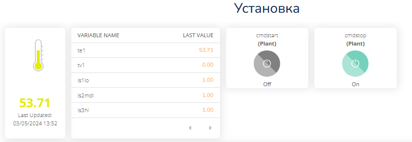

рис.3.13. Відображення даних та керування

## Частина 3. Індивідуальне завдання

- [ ] За Вашим варіантом, що Ви отримали на минулій лабораторній роботі а також на базі програми, що ви зробили в минулій лабораторній роботі, відповідно до прикладу з Частини 2 цієї лабораторної роботи зробіть наступне:
- зробіть копію вашої програми на node.js з лабораторної роботи 2 що реалізовує керування установкою 
- змініть її, щоб змінні `io` експортувалися з модуля 
- на node.js створіть модуль який забепзечує обмін даними по MQTT з платформою Ubidots:
  - усі значення входів з обєкту відправляє на платформу
  - усі значення команд та уставок приймає з платформи та скеровує на модуль керування
- у Ubidots реалізуйте користувацький інтерфейс для контролю та керування за установкою   
- використовуючи можливості Modrsim2 перевірте функціональність рішення
- [ ] Зверніть увагу на обмеження безкоштовної ліцензії (до 10 змінних на пристрій, 3 пристрої), описано [тут](https://help.ubidots.com/en/articles/639806-plans-billing-what-is-the-difference-between-ubidots-and-ubidots-stem?_gl=1*5f5fx8*_ga*OTk2MzQ4OTgwLjE3MDk1NTIyMjk.*_ga_VEME7QQ5EZ*MTcxMDE3MjE5MC44LjEuMTcxMDE3MjY4NS40LjAuMA..) 

- [ ] Розроблену програму та копії екранів з даними зчитування та користувацький інтерфейс відправте у звіті. 

- [ ] Перейдіть до налаштувань Dashboard і згенеруйте посилання для спільного доступу (кнопка `Share`)

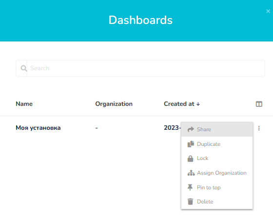

рис.3.14. Надання спільного доступу до Dashboard

- [ ] Перевірте, що посилання відкривається в іншому браузері. Це посилання треба відправити викладачу для перевірки у звіті.


