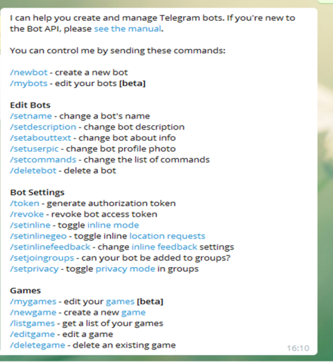
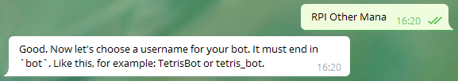
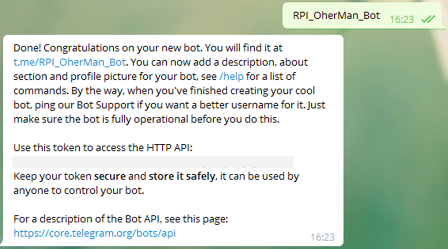

[Лабораторні](README.md)

# ЛАБОРАТОРНА РОБОТА № 4. Розробка IoT застосунків з використанням Google Apps Scripts

Увага! Усі наведені в лабораторній роботі приклади передбачають, що здобувач буде розбиратися з їх функціонуванням.

## Частина 1. Реалізація HTTP серверу з використанням Google сервісів

### 1. Створення документу Google Sheet з розширенням Google Apps Scripts (GAS)

`Google Sheet` - це хмарний застосунок від Google для роботи з електронними таблицями. За функціональністю і принципами роботи він схожий на `Microsoft Excel`. Усі створені таблиці зберігаються на Гугл Диску (`Google Drive`). У даному рішенні електронна таблиця буде виконувати роль простої бази даних куди буде накопичуватися різноманітна інформація з різних пристроїв. Взаємодія з базою даних відбуватиметься через розгорнутий Web Applications на базі сервісів Google Apps Scripts, надалі вживатиметься термін  **GAS**. У цьому пункті необхідно:

- створити таблицю Google Sheet
- створити розширення на Google Apps Scripts
- реалізувати функцію в GAS, яка буде записувати значення у вказані комірки вказаного листа з фіксацією часу   

- [ ] Якщо у Вас немає облікового запису Google - створіть його [на сайті](https://www.google.com/). Це безкоштовно, потребується тільки поштова скринька і номер телефону. 

- [ ] Зайдіть на головну сторінку [Google](https://www.google.com/) і зайдіть в застосунок `Google Sheet`(`Таблиці`)


рис.4.1. Створення таблиці Google Sheet

Альтернативно можна відразу перейти [на сторінку](https://docs.google.com/spreadsheets)  

- [ ] У новому вікні натисніть кнопку "+" (створити) щоб створити нову електронну таблицю

- [ ] Змініть назву документу на якусь більш прийнятну, наприклад `WebAppLaba4`

- [ ] Створіть розширення на Apps Script


рис.4.2. Створення розширення на Apps Script

- [ ] Новостворений проект перейменуйте у `WebAppYourName`, де `YourName` ваше ім'я та прізвище

### 2. Створення функції Google Apps Scripts для запису полів у вказаний лист 

- [ ] Проаналізуйте та впишіть наступний код

```js
//тестовий запис
let smplrecord = {
  device: 'testdevice',
  field1: Math.random(),
  field2: 'this is a text',
  field3: {text: 'this is JSON', n: Math.random()*100.0}
}
//тестування виклику
let result = LogToSheet (smplrecord);
console.log (result);

function LogToSheet (record) {
  if (!record) return 
  let devicename = record.device;
  // якщо імя пристрою не вказане, завершити виконання функції і
  // і повернути відповідний текст 
  if (typeof devicename !== 'string') {
    return 'There is no device field';
  } 
  
  // доступ до активного документу Google Sheet
  let ss = SpreadsheetApp.getActive();
  // доступ до листа - журналу пристрою  
  let sheet = ss.getSheetByName(devicename);
  // якщо такого листа немає - створити
  if (!sheet) {
    sheet = ss.insertSheet(devicename);
  }
  // спочатку вставляємо новий запис в 2-гу позицію
  // усі старі записи зміщуються вниз
  sheet.insertRowBefore(2);
  // доступаємося до перших 2-х клітин в 1-му рядку
  let r = sheet.getRange (1,1,1,2);
  // пишемо назви колонок
  r.setValues ([['TS','DT']]);
  // доступаємося до перших 2-х клітин в 2-му рядку  
  r = sheet.getRange (2,1,1,2);
  // пишемо TS - відмітку часу, DT - дату та часу
  let date = new Date();
  r.setValues ([[date.valueOf() , date.toLocaleDateString('uk-UA') + ' ' + date.toLocaleTimeString('uk-UA')]])
  i=3; // починаємо з 3-го стовпчика
  // перебираємо усі поля
  for (let propname in record){
    // device використовується для назив листа
    if (propname !='device') {
      // виділяємо область i-ї ствопця, 1 та 2 рядки
      r = sheet.getRange(1,i,2,1);
      // у 1-му рядку - назва, у 2-му - значення 
      r.setValues ([[propname],[record[propname]]])
      i++;
    } 
  }
  return (i-3 + ' parameters are recorded')
}
```

- [ ] Збережіть та запустіть на виконання. Перший раз повинно з'явитися повідомлення про необхідність надання доступу застосунку до Google Sheet. Автентифікуйте себе, та надайте дозвіл на доступ.   


рис.4.3. Дозвіл на доступ застосунку до Google Sheet

- [ ] Після успішного виконання у вікні консолі повинно з'явитися повідомлення: 

  ```
  `Інформація 3 parameters are recorded`
  ```

- [ ] Перевірте в документі Google Sheet створилася вкладка `testdevice` з відповідним записом.


рис.4.4. Відображення запису 

- [ ] Запустіть ще кілька раз скрипт, щоб створилося кілька записів в таблиці.

### 3. Створення та перше розгортання Web Application на базі GAS 

У даному пункті необхідно реалізувати HTTP API інтерфейс для доступу до даних для читання. Читання даних передбачатиме доступ до записів в конкретних листів, відповідного `device` з використанням методу GET за шаблоном:

```http
GET baseurl/device
```

Де `baseurl`  - базова частина URL-шляху, яка вказується Google при публікації або тестуванні інетрфейсу  Якщо `device` не вказується, тобто:

```http
GET baseurl
```

то виклик методу повинен повинен повертати перелік листів. В обидвох випадках дані повинні повертатися   у форматі JSON. 

У даній частині лабораторної роботи не проводиметься захист даних і не вимагатиметься автентифікація при доступі до інтерфейсу, а доступ до даних в Google Sheet відбуватиметься через автентифікацію від імені власника застосунку.  

- [ ] Допишіть функцію `doGet(e)` яка повертає зміст вказаного листа або перелік листів, якщо лист не заданий.  

```js
// доступ до даних
function doGet(e) {
  // все що йде після базової частини URL, 
  // тобто праворуч від /dev або /exec
  let path = e.pathInfo;
  // запис для журналу для налагодження
  let record = {device : "APIGET", path: path};
  LogToSheet (record); // закоментувати за відсутності налагодження
  let ss = SpreadsheetApp.getActive();  
  let sheets = ss.getSheets();
  let retob = ['Not Found']; // якщо щось пішло не так
  if (typeof path == 'string') { // якщо параметр є 
    try { // ловимо помилку
      // доступ до вказаного листа 
      let sheet = ss.getSheetByName(path);
      // отримати всі  дані
      retob = sheet.getDataRange().getValues();
    } catch (error) { // якщо зловили помилку
      retob = [error + ' ' + path];
    }
  } else { // якщо без параметрів, тільки базоий URL
    try {
      retob = []; // масив з переліком назв листів
      for (let sheet of sheets){ //перебираємо листи
        retob.push (sheet.getName()) //добавляємо назви в масив 
     }
    } catch (error) {
      retob = [error + ' ' + path];
    }
  }
  // формуємо вихід як JSON 
  return ContentService.createTextOutput(JSON.stringify(retob)).setMimeType(ContentService.MimeType.JSON);
}
```

- [ ] Збережіть проект
- [ ] Опублікуйте скрипт як Веб-застосунок (рис.4.5). 

 

рис.4.5. Публікація скрипту як Веб-застосунку 

Після публікації застосунку його базовий URL матиме вигляд:

```http
https://script.google.com/macros/s/AKfyVOWxGcR9A/exec
```

Зауважте що кожна зміна коду буде приводити до необхідності публікації нового застосунку. Стара адреса буде використовуватися зі старим кодом. Так забезпечується версійність, коли старі застосунки залишаються робочими при зміні реалізації.

Також варто відзначити, що Google Apps Scripts пропонує два інтерфейси:

- для виконання, URL якого завершується `/exec` і постійно змінюється при публікації
- для налагодження, URL якого завершується `/dev` і не змінюється при публікації, є постійною що спрощує налагодження але доступний тільки розробникам. Приклад такого URL:  

```http
https://script.google.com/macros/s/AKfycbzES1LxLzsgWPDm/dev
```

**При цьому варто зауважити що `/dev` працюватиме тільки якщо в браузері увійти з обліковкою Google!**

Таким чином налагоджувати веб-застосунок простіше з URL, що завершується на  `/dev`, однак при цьому треба реєструватися з браузера в якому ви працюєте.

### 4. Тестування Web Application з використанням тестової утиліти

Для тестування API можна скористатися різними безкоштовними утилітами. У даній лабораторній роботі пропонується скористатися доповненням до браузерів `FireFox`  або `Chrome` з назвою  RESTED.

- [ ] Встановіть розширення для браузера RESTED, або аналогічне, яке можна знайти за посиланнями:

- https://addons.mozilla.org/en-US/firefox/addon/rested/
- https://chrome.google.com/webstore/detail/rested/eelcnbccaccipfolokglfhhmapdchbfg

- [ ] Скопіюйте в буфер URL для тестування (закінчується на `\dev`). Вставте в якийсь текстовий файл.


рис.4.6. Отримання посилання на інтерфейс режиму розроблення

- [ ] Запустіть розширення RESTED, як правило іконка на панелі інструментів браузера 

- [ ] У полі URL впишіть скопійовану адресу і натисніть `Send Request`


рис.4.7. Перевірка роботи запиту GET для доступу до переліку листів.

У відповіді повинен прийти список, або повідомлення про помилку.

- [ ] Подивіться Google Sheet. Там повинна з'явитися лист `APIGET` з даними по запитам. 

Увага! Лист `APIGET` призначений в даному розроблювальному застосунку тільки для тестування, варто закоментувати частину коду з викликом запису в даний лист, якщо налагодження не потребується, щоб не збільшувати даремно об'єм файлу.   

- [ ] Передивіться журнал виконання, в якому містяться результати виконання, повідомлення та помилки. 


рис.4.8. Перегляд журналу виконання

- [ ] Повторіть запит з вказівкою назви листа, тобто в кінці URL вкажіть назву листа через косу, наприклад `/testdevice`, щоб URL закінчувався на: 

```http
.../dev/testdevice
```

- [ ] У відповідь повинен прийти зміст листа в форматі JSON. 
- [ ] У RESTED збережіть запит в колекцію (кнопка `+`)

### 5. Реалізація та перевірка методу POST для запису

У даному пункті необхідно реалізувати HTTP API інтерфейс для доступу до даних для запису. Запис даних передбачатиме відправку методу POST на базовий URL тобто за шаблоном:

```http
POST baseurl
```

у якому в якості корисного навантаження передаються дані в форматі JSON в форматі:

```json
{"device": "devicename", "field1": "fieldvalue1", ... "fieldn": "fieldvaluen"}
```

де:

- `devicename` - ідентифікатор пристрою, для якого буде створена окрема вкладка
- `field1` .. `fieldn` - назва параметрів, для яких відбуватиметься запис
- `fieldvalue1` .. `fieldvaluen` - значення параметрів, для яких відбуватиметься запис

- [ ] Проаналізуйте та допишіть в програму шматок коду, що реалізує обробник методу POST: 

```js
// запис даних
function doPost(e) {
 // корисне навантаження 
 let contents = e.postData.contents;
 let retob = {contents: contents};
  try {
    // перетворюємо на об'єкт
    let payload = JSON.parse(contents);
    // якщо є властивість device
    if (payload.device) {
      LogToSheet (payload);
      retob.msg = 'logged succefull'
    } else {
      retob.error = 'device field not found'
    }
  } catch (error) {
    retob.error = error;
  }
 return ContentService.createTextOutput(JSON.stringify(retob)).setMimeType(ContentService.MimeType.JSON);
}
```

- [ ] Збережіть проект
- [ ] Використовуючи RESTED перевірте роботу інтерфейсу
  - виберіть метод POST
  - у якості URL використайте базовий адрес, що зкінчується на `/dev`
  - тип корисного навантаження виберіть JSON 
  - добавте поля: `device` зі значенням `testdevice` та кілька інших полів зі значеннями
  - натисніть `Send requestі перевірте, що:
    - відповідь прийшла позитивна
    - запис добавився на лист `testdevice` у Google Sheet


рис.4.9. Перегляд методу POST за допомогою RESTED 

- [ ] Збережіть запит в колекцію RESTED

### 6. Перевірка роботи через опублікований API

У попередніх пунктах використовувався API режиму розробника, URL якого не змінюється під час зміни проекту та новій публікації. У цьому пункті необхідно протестувати API режиму виконання, URL якого змінюється при кожній публікації нового серверу.    

- [ ] Опублікуйте змінений застосунок, при публікації скопіюйте URL-адесу. 


рис.4.10. Публікація нової версії застосунку

Цю адресу можна також буде знайти у будь який момент часу у пункті "Керування введенням в дію"

- [ ] Протестуйте роботу методів GET і POST з скопійованим URL. 

### 7. Перевірка роботи клієнта Web Application через curl

cURL — назва проєкту і крос-платформового програмного засобу, що служить для передачі даних через HTTP. Його можна використовувати як для тестування так і для реалізації обміну по HTTP через командний рядок.

У даному пункті cURL буде використовуватися як тестова утиліта. Але так само її можна запускати на різноманітних пристроях з ОС, наприклад для запису якихось значень з планувальника.

- [ ] Завантажте cURL для Вашої ОС https://curl.se/download.html. **Завантажуйте архіви з приміткою** **binary** ! 


рис.4.11. 

- [ ] Розархівуйте папку у зручне для Вас місце, наприклад `C:/temp`
- [ ] Запустіть командний рядок. Перейдіть у папку bin розархівованої папки. Для Windows це матиме приблизно такий вигляд:

```shell
cd C:\temp\curl-7.86.0_2-win64-mingw\bin
```

- [ ] Виведіть довідку по cURL :

```shell
curl -h
```

- [ ] Перевірте роботу методу GET наступним чином, де вставте URL вашого API режиму виконання:

```shell
curl -L https://script.google.com/macros/s/AKfycbyPDQrLEi20cmHw/exec
```

- [ ] Перевірте отриманий результат.

Опція `-L`  потрібна для того, щоб у випадку коли сервер повідомляє, що запитану сторінку переміщено в інше місце (позначене заголовком `Location`: і кодом відповіді `3XX`), ця опція змусить curl повторити запит у новому місці ([деталі](https://curl.se/docs/manpage.html#-L)). Google Apps Script працює саме через перенаправлення заради безпеки, тому ця опція потрібна. 

- [ ] Перевірте роботу методу POSTнаступним чином, де вставте URL вашого API режиму виконання:

```bash
curl -L https://script.google.com/macros/s/AKfycbyPDQrLEi20cmHw/exec -H "Content-Type:application/json" -d "{\"device\":\"testdevice\", \"field1\":\"1\", \"field2\":\"2\", \"field3\":\"3\"}"
```

- [ ] Перевірте отриманий результат і що запис був записаний у лист Google Sheet.

У наведеному прикладі використовувалися опції:

- `-H` для вказівки заголовку
- `-d` для вказівки даних що передаються, що автоматично переключає утиліту в режим використання методу POST

Крім того, враховуючи щ в JSON форматі використовуються дужки, необхідно їх дзеркалювати зворотною косою `\`, щоб вони не були прийняті як частина синтаксису команди `curl `   

## Частина 2. Реалізація клієнта HTTP в Node.js

У даній частині необхідно реалізувати HTTP клієнта на віртуальній машині IoT Gateway під Debian, який буде періодично відправляти повідомлення з вказівкою вимірювальних параметрів. Для роботи використовується вбудована в Node.js бібліотека http, методи та властивості якої описані за посиланням  https://nodejs.org/api/http.html. Варто зауважити що є і інші способи реалізації HTTP клієнта в Node.js. 

### 1. Тестовий запит в Node.js

У даному пункті необхідно реалізувати простого HTTP клієнта на віртуальній машині IoT Gateway під Debian, який буде вичитувати сторінку з `example.org`.

- [ ] Запустіть віртуальну машину з Debian, яку встановлювали на минулій лабораторній роботі

- [ ] Перейдіть в папку проекту

```
cd nodejsprj
```

- [ ] За допомогою WinSCP у папці проекту створіть новий файл `testhttpclient.js` 

- [ ] Впишіть туди код програми для перевірки методу GET

```js
const http = require('http');
//опції запиту
const options = {
  hostname: 'www.example.org',
  port: 80, path: '/',
  method: 'GET', headers: {}
};
//створення обробки запиту 
const req = http.request(options, (res) => {
  console.log(`STATUS: ${res.statusCode}`);
  console.log(`HEADERS: ${JSON.stringify(res.headers)}`);
  res.setEncoding('utf8');
  //у res є події:'end', 'data'  
  res.on('data', (chunk) => { //обробник події 'data' -   
    console.log(`BODY: ${chunk}`);
  });
});
// у req є події: 'response', 'socket', 'error'
req.on('error', (e) => { 
  console.error(`problem with request: ${e.message}`);
});
req.end();
```

- [ ] Запустіть програму на виконання

```
node testhttpclient.js
```

- [ ] Ви повинні в консолі побачити результат читанання у вигляді HTML файлу


рис.4.12. 

### 2. Тестовий запит GET в Node.js

- [ ] Змініть фрагмент програми щоб дані вичитувалися з вашого API реалізованого в Google Sheet. Зверніть увагу на url, там має бути url до вашого скрипта.

```js
const https = require('https');
let url = 'https://script.google.com/macros/s/AKfycbyPDQrLEi20cmHw/exec'
//опції запиту
const options = {
  method: 'GET'
};
//формування запиту
let req = https.request(url, options, respCallback);
function respCallback (res) {
	const statusCode = res.statusCode;
	const location = res.headers.location;
  	//перевірка на переадресацію
	if (statusCode >= 300 && statusCode < 400 && location) {
        // якщо є переадресація, формуємо новий запит за новою адресою
		url = location; //нова адреса
		//знову формуємо запит
		req = https.request(url, options, respCallback);
		
		req.end();
	} else {
	  res.setEncoding('utf8');
	  //у res є події:'end', 'data'  
	  res.on('data', (datas) => { //обробник події 'data' -   
	    console.log(datas)
	  })
	}
}	
// у req є події: 'response', 'socket', 'error'
req.on('error', (e) => { 
  console.error(`problem with request: ${e.message}`);
});
//заврешити передачу даних
req.end();
```

- [ ] Запустіть на виконання. результат має бути аналогічним як при тестуванні REST.

### 3. Тестовий запит POST в Node.js

- [ ] Змініть фрагмент програми щоб дані записувалися методом POST. Зверніть увагу на url, там має бути url до вашого скрипта.

```js
const https = require('https');
let url = 'https://script.google.com/macros/s/AKfycbyPDQrLEi20cmHw/exec'
const postData = JSON.stringify({
  device: 'testdevice',
  field1: Math.random()*100.0,	
  field2: "From IoT Gateway",	
  field3: (new Date ()).valueOf() 
});
//опції запиту
const options = {
  method: 'POST',
  headers: {
    'Content-Type': 'application/json',
    'Content-Length': Buffer.byteLength(postData),
  },
};
//формування запиту
let req = https.request(url, options, respCallback);
function respCallback (res) {
	const statusCode = res.statusCode;
	const location = res.headers.location;
  	//перевірка на переадресацію
	if (statusCode >= 300 && statusCode < 400 && location) {
        // якщо є переадресація, формуємо новий запит за новою адресою
		url = location; //нова адреса
		const options = {method: 'GET'};
		//знову формуємо запит
		req = https.request(url, options, respCallback);
		req.end();
	} else {
	  console.log(`STATUS: ${res.statusCode}`);
	}
}	
req.on('error', (e) => { 
  console.error(`problem with request: ${e.message}`);
});
//пересилання даних
req.write(postData);
//заврешити передачу даних
req.end();
```

- [ ] Запустіть на виконання. результат має бути аналогічним як при тестуванні REST.

### 4. Реалізація задачі обміну даними між Modbus пристроєм та платформою

У даному пункті необхідно реалізувати обмін даними між імітатором Modbus-серверу та платформою. Для цього треба використати модифікований модуль `modbusmodule.js`, що був зроблений на минулій лабораторній роботі для можливості підключення його до основного модуля     

- [ ] Запустіть Modrsism2. 

- [ ] Запустіть `modbusmodule.js` і переконайтеся що він працює. 

```
node modbusmodule.js
```

- [ ] Якщо виникають помилки, перевірте чи не змінилася IP адреса вашого хоста, і якщо це так, відкрийте код в Notepad++  та змініть її в програмі.

- [ ] За допомогою WinSCP у папці проекту створіть новий файл `httpapp.js` 
- [ ] Запишіть та збережіть наступний код (зверніть увагу на `token`)

```js
const modbusio =  require('./modbusmodule.js');
const https = require('https');
let posturl = 'https://script.google.com/macros/s/AKfycbyPDQrLEi20cmHw/exec'

function respCallback (res) {
	const statusCode = res.statusCode;
	const location = res.headers.location;
  	//перевірка на переадресацію
	if (statusCode >= 300 && statusCode < 400 && location) {
        // якщо є переадресація, формуємо новий запит за новою адресою
		let url = location; //нова адреса
		//знову формуємо запит
		req = https.request(url, {method: 'GET'}, respCallback);
		req.end();
	} else {
	  console.log(`STATUS: ${res.statusCode}`);
	}
}	
function sendtoserver () {
	let msg = {
		device: "iotgateway",
		msg: modbusio.msg,
		te1: modbusio.te1, 
		tv1: modbusio.tv1,
		tstep: modbusio.tstep,
		ls1lo: modbusio.ls1Lo, 
		ls2mdl: modbusio.ls2Mdl, 
		ls3Hi: modbusio.ls3Hi
	};
	console.log (msg);
	let postData = JSON.stringify(msg);
	let options = {
	  method: 'POST',
	  headers: {'Content-Type': 'application/json', 'Content-Length' : Buffer.byteLength(postData)}
	};
	req = https.request(posturl, options, respCallback);
	req.write(postData);
	req.end();
}	
sendtoserver ();
setInterval(sendtoserver, 10000);

req.on('error', (e) => { 
  console.error(`problem with request: ${e.message}`);
});
```

- [ ] Запустіть програму на виконання. Мають виводитися повідомлення подібні до наведених нижче: 


рис.4.13. Виведення повідомлень

- [ ] Запустіть алгоритм роботи установки на виконання, змінивши в `Modbrsim2` Digital Input  `100001` в логічну 1. 

- [ ] У Google Sheet мають кожні 10 секунд мають фіксуватися параметри роботи.

## Частина 3. Індивідуальне завдання

- [ ] За Вашим варіантом, що Ви отримали на другій лабораторній роботі а також на базі програми, що ви зробили в минулих лабораторних роботах, відповідно до прикладу з Частини 2 цієї лабораторної роботи зробіть наступне:
- зробіть копію вашої програми на node.js з лабораторної роботи 2 що реалізовує керування установкою 
- на node.js створіть модуль який забезпечує передачу даних по HTTP до створеної Google App Scripts в новий лист з назвою вашого Device
- [ ] Розроблену програму та копії екранів з даними зчитування відправте у звіті. 

## Частина 4. Додаткові необов'язкові завдання

Дані завдання виконуються за бажанням.

### 1. Відправки даних з Android 

У даному пункті у якості клієнта використовується мобільний застосунок, який за потребою користувача відправляє географічні координати та текстову примітку, яку він вводить. Таким чином, користувач може фіксувати певну інформацію вдповідно до локації, де він знаходиться.

Даний пункт передбачає використання смартфона під ОС Android з включеною геолокацією. Якщо у здобувача немає такої можливості, пункт можна не виконувати.

- [ ] Встановіть на свій смартфон застосунок [HTTP Shortcuts](https://http-shortcuts.rmy.ch/) 
- [ ] Запустіть застосунок. 
- [ ] Створіть дві глобальні змінні (доступні для всіх ярликів) типу `Static Variable`, в яких вкажіть тільки назву:
- `geolacation`
- `note`


рис.4.14. Створення змінних

- [ ] Створіть новий Shortcut: натисніть `+` для добавлення, для якого (рис.4.14):

- у виборі натисніть `Regular Shorcuts`. 
- надайте ім'я та виберіть піктограму.  

- у `Basic request settiings` вкажіть метод POST, а в рядок заголовку потрібний URL, який можна передати на смартфон наприклад через Telegram (пункт "Збережене")

- у `request body` виберіть тип `application/json` та означте структуру тіла, в якому в якості імені пристрою передається `myphone`, у властивості `location` передається значення `geolocation`, а у властивості `note` значення змінної `note` (**зверніть увагу на лапки!**); для вставлення змінних використовується кнопка `{}`
- у полі `scripting` для `Run Before Execution` (виконується перед запуском HTTP запиту) записати скрипт який буде записувати у значення змінних:
  - `geolocation` значення функції `getGeolocation`, яка повертає плинну позицію телефону
  - `note` результат виклику діалогової функції, яка попросить оператора ввести нотатку


рис.4.15. Створення Shortcut

- [ ] Збережіть Shortcut натиснувши галочку.
- [ ] Запустіть на виконання, натиснувши по назві. Введіть користувацький текст на запрошення.
- [ ] Перевірте чи результат прийшов без помилок. 
- [ ] Перевірте, що відповідний запис з'явився в листі Google Sheet `myphone`. 

### 2. Реєстрація Telegram

- [ ] Якщо у Вас немає облікового запису Telegram - завантажте клієнтський застосунок і створіть обліковий запис [за посиланням](https://telegram.org/). Це безкоштовно, потребується тільки номер телефону. 
- [ ] Знайдіть в телеграмі і додайте до своїх контактів `@BotFather` - це бот, який створює ботів
- [ ] і введіть команду `/start` з'явиться вікно з доступними командами 



рис.4.16. Доступні команди створення телеграм-бота

- [ ] напишіть (або натисніть) команду `/newbot` для створення нового бота


рис.4.17. Команда створення телеграм-бота

- [ ] дайте йому ім'я, наприклад `RPI Ivanenko Ivana`



рис.4.18. Надання імені телеграм-боту

- [ ] тепер треба ввести ім'я користувача для бота, який повинен закінчуватися на ` Bot` , наприклад `RPI_IvanenkoIvana_Bot` . За допомогою цього нікнейма можна знайти й додати вашого бота  до своїх контактів. 



рис.4.19. Надання імені користувача телеграм-боту

- [ ] Збережіть токен, який видав бот, бо він нам  знадобиться згодом для керування.
- [ ] Добавте бота до своїх контактів `t.me/<username>`.
- [ ] Відправте боту повідомлення `/start`

За допомогою `RPI_IvanenkoIvana_Bot` ви зможете завжди відредагувати своїх ботів. Перелік своїх ботів можна подивитися через команду `/mybots` де також можна отримати по ньому всю необхідну інформацію  

### 3. Перевірка роботи з ботом через RESTED

- [ ] Відкрийте RESTED
- [ ] Зробіть запит GET в форматі:

```http
https://api.telegram.org/botXXX:YYYY/getUpdates
```

де замість `XXX:YYYY` підставте маркер (токен) отриманий від бота.

У результаті бот відповість повідомленням з історією останніх повідомлень, наприклад:

```json
{
  "ok": true,
  "result": [
    {
      "update_id": 60872760,
      "message": {
        "message_id": 514,
        "from": {
          "id": 7654321,
          "is_bot": false,
          "first_name": "Oleksandr",
          "last_name": "Pupena",
          "username": "pupena_san",
          "language_code": "uk"
        },
        "chat": {
          "id": 1234567,
          "first_name": "Oleksandr",
          "last_name": "Pupena",
          "username": "pupena_san",
          "type": "private"
        },
        "date": 1670484704,
        "text": "/start",
        "entities": [
          {
            "offset": 0,
            "length": 6,
            "type": "bot_command"
          }
        ]
      }
    }
  ]
}
```

- [ ] Знайдіть в повідомленні `id` у структурі `chat` у прикладі це `1234567` і зробіть наступний запит POST за URL `https://api.telegram.org/botXXX:YYYY/sendMessage` (вставте туди токен) та наступним змістом body та заголовків:


рис.4.20. Приклад відправки повідомлення `sendMessage`

Деталі по sendmsg можна почитати в оригінальному описі [за посиланням](https://core.telegram.org/bots/api#sendmessage)

### 4. Перевірка Telegram бота в GAS

- [ ] Створіть новий файл Google Scripts за допомогою кнопки  `+` "Додати файл", дайте йому назву `telegram`
- [ ] Впишіть туди наступний фрагмент коду і збережіть.

```js
const token = 'XXX:YYYY';
const tgBotUrl = 'https://api.telegram.org/bot' + token;
const chat_id = 1234567

let payload = {
   chat_id: chat_id,
   text: 'Привіт чатботу від Google Scripts!',
}  
sendToTelegram(payload);

function sendToTelegram(payload){
  let options = {
    method : 'post',
    contentType: 'application/json',
    headers: {"Content-Type":"application/json"},
    payload: JSON.stringify(payload),
    muteHttpExceptions: true 
  }
  // відправляє http запит з вказним URL та опціями
  return UrlFetchApp.fetch(tgBotUrl + '/sendMessage', options);
}
```

- [ ] Запустіть код на виконання, погодьтеся з тим, що він буде використовувати доступ до ваших застосунків Google.

### 5. Створення коду для генерування повідомлення про стан IoT Gateway

У цьому пункті необхідно реалізувати фрагмент програми, яка буде перевіряти активність IoT Gateway і повідомляти по Телеграму власника про те, що шлюз з'явився в мережі або зник з неї. Це буде відбуватися за наступним принципом. Оскільки шлюз періодично (раз в 1 хв) відправляє повідомлення про себе, які пишуться в Google Sheet, то відсутнє повідомлення більше ніж за 2 хвилини говорить про його зникнення. При цьому запам'ятовується статус пристрою як відключений  `"isConnected" : "false"`. Коли пристрій з'являється статус знову стає  `"isConnected" : "true"`, а користувачу відправляється відповідне повідомлення.

Перевірка статусу проводиться раз/хвилину, для цього використовується вбудовані в Google Scripts таймерні тригери. Для збереження стану пристрою використовується властивості скрипта, які можна змінювати під час роботи.    

- [ ] вимкніть скрипт на машину Debian, якщо він працює 
- [ ] Закоментуйте в Google Application Scripts усі частини коду, які використовувалися для тестування (тобто поза функціями) щоб вони не викликалися. У Вас повинно залишитися незакоментованими тільки функції, тобто:
- doGet
- doPost
- LogToSheet
- sendToTelegram

- [ ] Додайте у властивості скрипта RouterStatus

```json
{"device" : "router", "isConnected" : "false", "onConnect": "false", "onDisconnect": "false",  "lastupdate" : "", "uptime": ""}
```


рис.4.21. Добавлення властивості скрипта

Це дасть можливість зберігати дані між викликами.

- [ ] У частині файлу `telegram.gs` допишіть наступний фрагмент. 

```js
// зчитуємо стан маршрутизатору зі властивості скрипта
let RouterStatus = JSON.parse (PropertiesService.getScriptProperties().getProperty('RouterStatus'));
// обробляємо плинний статус
GetActivity (RouterStatus);
// зберігаємо плинний статус у властивості скрипта
PropertiesService.getScriptProperties().setProperty('RouterStatus', JSON.stringify(RouterStatus));

// функція обробки плинного статусу 
function GetActivity (status){
  let now = new  Date();
  let ss = SpreadsheetApp.getActive();  
  let sheets = ss.getSheets();
  let sheet = ss.getSheetByName(status.device);
  if (sheet) {
     // у другому рядку знаходиться останній запис від маршрутизатору
     // у другій комірці дата та час запису
     let dt = sheet.getRange (2,2,1,1).getValue();
     if (typeof dt == 'object') {
        let deviceupdate = new Date(dt);
        // різниця між плинною датою і датою фіксації в секундах
        let delta = (now - deviceupdate)/1000;
        // стан "підключео", якщо різниця менше 6 хвилин 
        let isConnected  =  delta < 360; 
        // стан тількино підключився
        status.onConnect =  isConnected === true && status.isConnected === false;
        // стан тількино віддключився        
        status.onDisconnect =  isConnected === false && status.isConnected === true;
        status.isConnected = isConnected;
        status.lastupdate = deviceupdate;
        // також користувачу може бути цікавим час роботи маршрутизатору
        status.uptime = sheet.getRange (2,3,1,1).getDisplayValue();
     }    
  }
  let text = '';
  // значення в локальному форматі дати та часу
  let localenow =  now.toLocaleDateString('uk-UA') + ' ' + now.toLocaleTimeString('uk-UA');
  let localedt = status.lastupdate.toLocaleDateString('uk-UA') + ' ' + status.lastupdate.toLocaleTimeString('uk-UA');
  if (status.onConnect === true) { // тільки но включився
    text = `${status.device} з'явився в мережі о ${localedt} час роботи ${status.uptime}`
  }
  if (status.onDisconnect === true) { // тільки но відключився
    text = `${status.device} зник з мережі десь між ${localedt} і ${localenow}, час роботи ${status.uptime}`
  }
  if (status.onDisconnect==true || status.onConnect == true){
    sendToTelegram({chat_id: chat_id,text}); // відправляємо в Телеграм   
  }
}

```

- [ ] Створіть тригер, який буде викликати скрипт кожну хвилину. Збережіть його. 


рис.4.22. Добавлення тригеру

- [ ] Запустіть там скрипт `httpapp.js`. Дочекайтеся біля 2 хвилин, коли з'явиться повідомлення в Google Sheet. Десь ще через хвилину повинно прийти повідомлення про те, що маршрутизатор з'явився в мережі.
- [ ] Виключіть скрипт. Дочекайтеся біля 2-3 хвилини повинно прийти повідомлення про те, що маршрутизатор зник з мережі.

