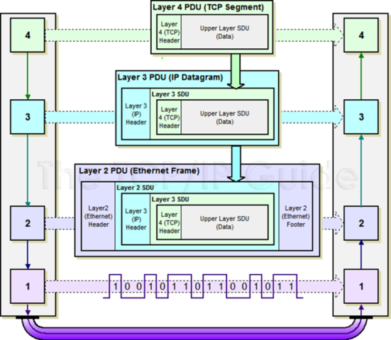
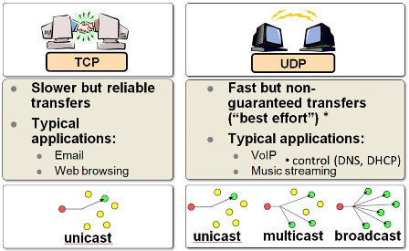
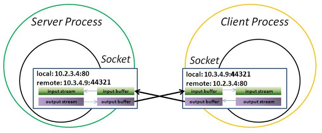

[Зміст](README.md)

# 4. Комунікації IoT та IIoT рівня Edge

## 4.1. Робота з TCP/UDP

### Загальний принцип функціонування обміну між застосунками в мережах

Прикладні програми (застосунки) спілкуються між собою з використанням мереж. Для того щоб потрібна інформація дісталася від одного застосунку до іншого необхідно вирішити ряд завдань. Не достатньо просто передати побітово дані через провідники чи через ефір (бездротова передача), треба забезпечити їх доставку конкретному пристрою (вузлу), та конкретному застосунку на цьому пристрої. Якщо ж пристрої знаходяться в різних мережах, які об'єднані між  собою маршрутизаторами, необхідно також забезпечити маршрутизацію пакетів. Для спрощення цих задач їх вирішують різні протоколи які взаємодіють між собою. Розглянемо це на прикладі функціонування стеку протоколів TCP, IP та Ethernet, взаємодія яких показана на рис.4.1. 



рис.4.1.Функціонування стеку протоколів.

Коли один застосунок відправляє іншому якісь дані він послуговується протоколом транспортного рівня, звертаючись до відповідного драйверу з запитом на відправку даних. У даному випадку показаний протокол TCP, який функціонує умовно на 4-му рівні. Цей протокол не забезпечує доставку даних в мережі, його задача доставити дані від одного застосунку до іншого, у тому числі, якщо вони знаходяться на одному і тому ж пристрою. Для того щоб це зробити, до корисних даних, які треба передати (Upper Layer SDU (Data)) добавляється службова інформація, зокрема адреси застосунку-отримувача та відправника (tcp-порти). Ця інформація передається перед корисними даними разом з ними і називається **пакетом**. Кажуть що пакет TCP включає в себе (**інкапсулює**) дані протоколу верхнього рівня як **корисне навантаження** і має **заголовок** (**header**), в якому передається додаткова службова інформація. Пакет аналізується драйвером пристрою отримувача і за відповідним портом отримувача у заголовку шукає той застосунок, кому призначений даний пакет і віддає йому корисні дані. За необхідності корисне навантаження передається кількома частинами, які називаються сегментами. Тоді драйвер пристрою-отримувача повинен зібрати ці дані разом.

Для того щоб tcp-пакет досяг потрібного пристрою, необхідно вирішити ще кілька задач. По-перше, дані можуть передаватися між пристроями в різних мережах, які об'єднані між собою. Наприклад пристрої можуть спілкуватися через мережу Інтернет. Для цього драйвер TCP, просить передати драйвер IP (3-й рівень) його tcp-пакет конкретному вузлу в об'єднаній мережі. Для драйвера IP цей tcp-пакет інкапсулюється як корисне навантаження, а для його передачі в об'єднаній мережі використовується IP-адреси відправника та отримувача, яка поміщається в заголовок. Про функціонування пакету IP наведено нижче, тут зауважимо, що для передачі IP-пакету по мережі, драйвер IP послуговується послугами драйверу мережного інтерфейсу, наприклад Ethernet чи WiFi.

Задача Ethernet (2-й рівень), забезпечити доставку даних від одного пристрою до іншого (інших), які знаходяться в тій самій мережі. Для цього він інкапсулює IP-пакет в **кадр** (**frame**), який містить заголовок з інформацією про апаратну адресу картки (**MAC-адресу**) відправника та отримувача. Крім того в кінцевику (footer), кадр містить контрольну суму, за допомогою якої контролюється достовірність отримання вмісту кадру. 

Сформований кадр відправляється побітово по мережі (1-й рівень). Всі пристрої прослуховують мережу, і отримавши кадр призначений їм, починають зворотній процес перетворення. За допомогою контрольної суми перевіряють чи кадр прийшов без спотворень. Якщо все гаразд, вилучають корисне навантаження і передають його драйверу IP. За адресою отримувача визначають, чи пакет дійсно призначений їм, якщо ні - очевидно пристрій повинен його відправити на інший порт (див. нижче). Якщо отримувач дійсно цей пристрій, корисне навантаження переправляється драйверу TCP. За адресою tcp-порта той визначає якому застосунку призначене дане корисне навантаження, за необхідністю робить складання сегментів разом і віддає корисне навантаження застосунку. 

У наведеному вище прикладу показаний тільки прямий шлях передач даних між застосунками. Враховуючи, що на кожному етапі перетворення (рівні мережі) в заголовках передається також адреса відправника, застосунок може переслати повідомлення-відповідь до адресату, який ініціював передачу.      

Розглянемо принципи маршрутизації, яка вирішується протоколом IP та засобами рівня 4. Сьогодні є дві версії протоколів IP - `IP v4` (4-байтна адресація) та `IP v6`(16-байтна адресація). У будь якому випадку, адресація передбачає виділення адреси мережі та вузла.  У `IP v4` адреса мережі визначається за маскою, яка задається послідовністю бітів, що виділяє адресу мережі з вказаної адреси. Наприклад в адресі `192.168.1.1` з маскою `255.255.255.0`, перші три байти вказують на адресу мережі. Тобто при такому завданні адреса мережі буде `192.168.1.0` а пристрій буде мати адресу `1`.     


 рис.4.2. Визначення адреси мережі та вузла (пристрою) за маскою

Для маршрутизації пакетів в об'єднаній мережі використовуються **маршутизатори** (**router**). Вони знаходяться в місцях підключень кількох мереж, і забезпечують передачу пакетів з однієї мережі в іншу. Для цього маршрутизатори містять маршрутні таблиці, які містять записи з адресами та портами, куди треба відправляти пакети, якщо їх адреса задовільняє правило маршрутизації. На рис.4.3 показаний приклад маршрутизації. Розглянемо його детальніше.

   

 рис.4.3. Функціонування маршрутизаторів

На пристроях в налаштуваннях драйвера IP вказуються також маршрутні таблиці.  Як мінімум, там повинен бути вказана (або видана автоматично) IP адреса маршрутизатора за замовченням (може називатися "шлюз за замовченням"). Коли драйвер IP повинен відправити пакет за певним призначенням, він спочатку визначає (наприклад за маскою), чи знаходиться цей пакет в цій же мережі. Далі:

- Якщо так, він відправляє цей пакет за відповідно до цієї IP-адреси МАС-адресою
- Якщо ні, він відправляє цей пакет за відповідно до IP-адреси маршрутизатора МАС-адресою    

Для того щоб дізнатися відповідну МАС-адресу до IP-адреси використовуються ARP-таблиці. Ви можете переглянути такі таблиці на вашому пристрої через командний рядок, викликавши команду:  

```bash
arp -a
```

 Ці таблиці як правило формуються автоматично за допомогою протоколу ARP. Це працює наступним чином:

- драйвер IP шукає в ARP-таблиці відповідну до адреси отримувача MAC-адресу
  - якщо запис існує, драйвер IP просить драйвер Ethernet відправити пакет за вказаною  MAC-адресою
  - якщо запису немає: 
    - драйвер IP просить драйвер Ethernet відправити ARP-пакет з широкомовним (усім в мережі) запитом-питанням (у кого такий IP)
    - пристрій з вказаним IP відповідає
    - адреса заноситься в таблицю ARP
    -  драйвер IP просить драйвер Ethernet відправити пакет за вказаною  MAC-адресою 

Слід також зазначити, що є особливі адреси, для яких діють особливі правила адресації. Наприклад `127.0.0.1` - це адреса того самого пристрою, так званий `loopback`.  

Вище описаний дуже короткий принцип функціонування стеку з кількох протоколів.  

### Протоколи TCP та UDP

Як зазначалося вище, протоколи транспортного рівня слугують для забезпечення передачі даних між застосунками. На сьогодні найбільш популярними є протоколи **TCP** (Transmission Control Protocol) та **UDP** - (User Datagram Protocol).

Протокол UDP дуже простий і призначений для доставки пакету до застосунку за вказаним портом udp (рис.4). Він не передбачає контролю доставки, контроль цілісності повідомлення та фрагментацію. За рахунок цього він швидкий, бо не потребує додаткових полів заголовку (які треба обробляти) а найголовніше - додаткового обміну службовою інформацією. Крім того він може використовуватися для широкомовлення (broacast, тобто всім) та мультиадерсної доставки (multicast). Його використовують у тому випадку коли дані повинні надійти швидко, навіть за умови втрати пакетів.



рис.4.4. Порівняння протоколів TCP та UDP

На противагу до UDP протокол TCP призначений для гарантованої доставки даних. Для цього перед обміном даних для застосунків встановлюється сеанс зв'язку, в межах якого буде проводитися обмін. Для встановлення сеансу проводиться домовленість, що передбачає передачу службових повідомлень (потрійне рукостискання), після чого йде обмін пакетами з контролем правильності доставки та підтвердженням отримання. Ці службові пакети роблять передачу надійною, але  набагато повільнішою ніж UDP.    

Обидва протоколи використовують для доставки даних до конкретного застосунку адресацію з використанням номерів портів. Для TCP ініціатор зв'язку називається клієнтом (Client) а застосунок, який очікує з'єднання - сервером (Server). Таким чином, щоб сервер отримав повідомлення від клієнта, клієнту треба вказати в заголовку відправленого пакету, а саме в порті отримувача, той порт, який прослуховує сервер. У свою чергу, сервер зможе відповісти клієнту, використавши з заголовку отриманого пакету адресу порта відправника. Тобто клієнт заздалегідь повинен знати порт, який прослуховує сервер. А серверу інформація про партнера стає відомою після отриманого повідомлення.   

Слід зазначити, що самі по собі протоколи TCP та UDP кінцевими застосунками рідко використовуються, так як не містять інформацію, що тлумачить що значить дані, що передаються. Цими протоколами послуговуються різноманітні протоколи прикладного рівня. Зокрема, дуже відомий протокол HTTP, яким користуються браузери для доступу до WEB-серверів, використовує для доставки запитів та відповідей протокол TCP. Враховуючи популярність протоколів прикладного рівня, для них визначені типові адреси портів, які також називаються **добре відомі** порти (**Well-Known**). Наприклад, за HTTP-сервером закріплений порт `80`. Якщо в браузері не вказати адресу порта (через двокрапку), буде вважатися використання порта 80. Тобто http://example.com та http://example.com:80 будуть доступатися до того ж порту.    


рис.4.5. Номери портів

Клієнтським застосункам при підключенні, як правило виділяються вільні порти, тобто ті, які на даний момент на даному пристрої не використовуються драйвером TCP. Нижче наведений розподіл портів:

- 0-1023 – добре відомі, системні порти (Well-Known, System)
- 1024-49151 – користувацькі (User)
- 49152-65535 – динамічні або приватні порти (Dynamic, Private) 

При побудові власних застосунків з використанням TCP та UDP, як правило користуються бібліотеками, які спрощують обмін з використанням так званих **сокетів** (**Socket**). Сокет - це такий програмний об'єкт, який слугує початковою або кінцевою точкою з'єднання, через який можна передати або отримати дані. Перед обміном даними сокет налаштовується на конкретний мережний інтерфейс та порт (рис.4.6). Таким чином адреса сокету є комбінацією з адреси IP та порту. Клієнтські сокети з'єднуються з серверними з використанням ідентифікатору підключення, який містить протокол, IP адреси та номери портів відправника (src) та отримувача (dst):     

**Protocol** **+** **IPdst** **+** **PORTdst** **+** **IPsrc** **+** **PORTsrc** (5 tuple)



рис.4.6. Принципи роботи сокетів

На рис.4.7. показані етапи роботи сокетів для протоколу TCP. Спочатку в застосунку створюються сокети (примітив `socket`). Далі відбувається зв'язок локальної адреси (IP та порт) з сокетом (примітив `bind`). Серверний сокет вказує на очікування з'єднання від клієнта (примітив `listen`). Клієнтський сокет викликає примітив `connect` для підключення до серверного сокету. В примітиві він вказує адресу серверного сокету. Серверний сокет підтверджує підключення примітивом `accept`, після чого будь який з партнерів може відправляти (`send`) та отримувати (`recv`) дані. Примітив `close`  розриває з'єднання.    


рис.4.7. Етапи роботи сокета

Таблиця 4.1. Примітиви роботи з сокетом.

| **Примітив** | **Призначення**                    |
| ------------ | ---------------------------------- |
| SOCKET       | створити сокет                     |
| BIND         | зв'язати локальну адресу з сокетом |
| LISTEN       | очікувати з'єднання від клієнта    |
| ACCEPT       | підтвердити з'єднання              |
| CONNECT      | підключатися до серверу            |
| SEND         | відправити по каналу               |
| RECEIVE      | отримати з каналу                  |
| CLOSE        | розірвати з'єднання                |

### Утиліти контролю роботи та налагодження

Для контролю станів портів в конкретній ОС можуть використовуватися різноманітні утиліти. Тут коротко розглянемо декілька. 

#### NetStat

Разом з різними ОС у тому числі Windows в комплекті поставляється утиліта NetStat, яка відображає активні підключення TCP, порти, які прослуховуються комп’ютером, статистику Ethernet, таблиці маршрутизації IP, статистику IPv4 (для протоколів IP, ICMP, TCP и UDP). 

Викликана без параметрів, команда netstat відображає встановлені підключенняTCP. Отримати усю довідку можна викликавши `netstat /?`.

Наприклад команда з опцією `-a`:

```bash
netstat -a
```

виведе список активних з'єднань та їх стан в формі:

```bash
C:\Windows\system32>netstat -a

Active Connections

Proto 	Local Address 						Foreign Address 		State
TCP 	192.168.43.15:139 					DESKTOP-A0PM5GD:0 		LISTENING
TCP 	192.168.43.15:52484 				ec2-52-0-252-13:https 		ESTABLISHED
TCP 	192.168.43.15:52532 				ec2-13-228-49-204:https TIME_WAIT
UDP 	[fe80::998c:d2d:17df:65d9%12]:58903 *:*
```

Поля в записах значать: 

- `Proto` –  вказує тип протоколу (TCP, UDP)
- `Local Address` – відображає IP-адресу комп’ютера та порт з локального кінця сокету (тобто цей комп'ютер)
- `Foreign Address` –  відображає віддалений комп’ютер, тобто другу сторону сокета  
- `State` – вказує на стан сокету (LISTENING, ESTABLISHED, CLOSE_WAIT, TIME_WAIT) (див.рис.4.13).

Можна виводити підключення вказавши фільтри, наприклад по стану підключення. Зокрема, для попереднього прикладу команда:

```bash
netstat -a | findstr LISTENING
```

виведе тільки інформацію про сокети, які знаходяться в стані прослуховування:

```bash
C:\Windows\system32>netstat -a | findstr LISTENING
  TCP 192.168.43.15:139 DESKTOP-A0PM5GD:0 LISTENING
```

А ця команда виведе список що містить підключення, що мають в номері порту `502`, та опцією `-o` що виводить також ідентифікатор процесу PID:

```bash
C:\Windows\system32>netstat -a -o | findstr 502
  TCP    0.0.0.0:502            DESKTOP-I8RRH1O:0      LISTENING       2540
  TCP    127.0.0.1:502          DESKTOP-I8RRH1O:7027   ESTABLISHED     2540
  TCP    127.0.0.1:7027         DESKTOP-I8RRH1O:502    ESTABLISHED     17276
```

Виведена вище команда показує, що по одному порту застосунок з PID=2540 має два сокети: 

- по одному відбувається прослуховування з'єднання (LISTENING)
- а по другому встанолене з'єднання з процесом з ID=17276 (ESTABLISHED)  

#### nmap

Для перегляду доступних портів на іншому ПК можна використовувати різноманітні безкоштовні утиліти, типу [nmap](https://nmap.org/download.html#windows). Вона дає можливість сканувати ПК в мережі, виявляти серверні порти та багато інших функцій, про які можна дізнатися з довідки.  Наприклад, якщо у полі `Command` ввести команду nmap з опцією `-p` та вказати діапазон портів що цікавить та адресу IP: 

```bash
nmap -p 0-65535 -T5 192.168.56.101
```

можна отримати результат з відкритими портами (рис.4.13) 


рис.4.13. Вікно сканування портів 

Слід зазначити що за замовченням політики безпеки забороняють доступ до вхідних портів в ОС. Різноманітні брандмауери (вбудовані або встановлені з антивірусним ПЗ) можуть блокувати порти. Тому команда на ПК `netstat -a | findstr LISTENING` може показати порти, що наразі прослуховуються, але при цьому `nmap` їх не покаже. Налаштування брандмауерів розглядатиметься на наступних лекціях.

Також варто відмітити, що сканування мереж та портів не в своїй організації, може бути сприйнято як зловмисні дії. Тому дану утиліту варто використовувати тільки в локальних мережах. 

#### Packet Sender 

Packet Sender <https://packetsender.com/> - безкоштовна утиліта яка дає можливість тестувати приймання та передавання даних (корисного навантаження) поверх TCP та UDP. Він надає можливість як клієнтського так і серверного інтерфейсу, формувати відповідні повідомлення на запити, передавати дані текстом або байт-кодами та багато чого іншого.  

 

рис.4.14. Приклад вікна Packet Sender.  

## 4.2. Робота з послідовними портами

Про стандартні промислові інтерфейси можна почитати за [цим посиланням](https://asu-in-ua.github.io/atpv/filedbus/serial/teor.html) 

### Робота з послідовними портами в node.js

Даний пункт в розробці.

https://serialport.io/docs/10.x.x/api-serialport/


### Утиліти контролю роботи та налагодження

З апаратних засобів можуть знадобитися:

- перетворювачі інтерфейсів RS-232<->RS-485, USB<->RS-485, USB<->RS-232;

- тестер, осцилограф та інше додаткове устатковання. 

В Інтернеті є багато різних платних і безкоштовних програмних утиліт, які можуть допомогти при боротьбі з неполадками для послідовних портів, зокрема:

- утиліти для роботи з COM-портом; 

- Сніфери, аналізатори для прослуховування з аналізом протоколу. 

Ці утиліти показують обмін через СОМ-порт, що може допомогти при ручному візуальному аналізі трафіка. Прикладом такої утиліти є Hercules яку можна завантажити за посиланням <https://www.hw-group.com/software/hercules-setup-utility> . 


*Рис. 4.13* Приклад роботи Hercules

Наведені вище утиліти дають можливість працювати з COM-портом ПК у тому випадку, якщо відправник (отримувач) до нього підключений. Наприклад, якщо необхідно проаналізувати відповідь ПЛК на якийсь запит, який формується з ПК наладчика, або якщо треба "послухати" обмін між пристроями. Інколи виникає необхідність "послухати" COM-порт на тому ж ПК, на якому є програма, що його використовує. Наприклад, треба проаналізувати обмін ПК з пристроєм. Для цього потрібен пасивний режим, який не заважав би основній програмі зайняти COM-порт. У цьому випадку може знадобитися утиліта, що вміє прослуховувати порт, розділяючи його з іншими застосунками. Одна з таких – це Free Serial Analyzer https://freeserialanalyzer.com. Платна версія програми має ще багато різних корисних функцій. На рис. 4.14 показано приклад вікна перегляду повідомлень із СОМ-порта, який використовує SCADA-програма для роботи через протокол Modbus. Альтернативою є добре відома Portmon [[4](https://technet.microsoft.com/ru-ru/sysinternals/bb896644.aspx)], яка має менше можливостей. 

 

*Рис. 4.14* Приклад вікна перегляду повідомлень Free Serial Analyzer

Якщо одну програму необхідно з’єднати з іншою програмою через COM-порт для перевірки працездатності, не обов’язково їх запускати на різних ПК. Можна використати спарені віртуальні COM-порти, створивши їх утилітою [COM0COM](http://sourceforge.net/projects/com0com/?source=navbar)(рис. 4.15). Емуляція портів не є повноцінною, тим не менше може сильно допомогти в налагодженні та пошуку несправностей.    


Рис. 4.15 Принцип роботи COM0COM

## 4.3. Робота з Modbus

Про мережі Modbus можна почитати в [цьому розділі](https://asu-in-ua.github.io/atpv/filedbus/modbusadvanced/teor.html) посібника АТПВ

### Робота зModbus в node.js

Даний пункт в розробці.

https://github.com/yaacov/node-modbus-serial

### Утиліти контролю роботи та налагодження

**Утиліти для імітації Modbus Server/Slave**

За необхідності перевірки роботи Modbus Client бажано мати "еталонний" Modbus Server. Надалі під "***еталонним***" клієнтом (ведучим) або сервером (веденим) будемо розуміти той програмний чи програмно-апаратний засіб, працездатність і обмеження якого перевірені і який надає можливість вільно змінювати і передивлятися будь-які регістри. Таким "еталонним" сервером може стати імітатор контролера або реальний ПЛК, що має вбудовані функції Modbus Server. Якщо такого немає, або є потреба в додаткових функціях (наприклад, перегляд трафіка), можна скористатися спеціальними утилітами-серверами Modbus. Одна з таких утиліт – Modbus serial RTU/ASCII/TCP simulator http://www.plcsimulator.org. Зовнішній вигляд графічної консолі показано на рис. 4.18. Ця утиліта має наступні можливості:

- Modbus RTU/ASCII Slave;

- Modbus TCP/IP Server;

- вікно виводу пакетів;

- імітація роботи усіх Slave на шині; 

- підтримка VB-скриптів для імітації роботи Slave (наприклад програми ПЛК).


*Рис. 4.18*. Зовнішній вигляд Modbus serial RTU/ASCII/TCP simulator

Нижче наведені кілька програмних утиліт Modbus Server:

- з функціями Modbus RTU/ASCII Slave:

- ModLink (http://www.ozm.cz/ivobauer/modlink ) компоненти для Borland Delphi/С++. Є скомпільований демо-проект Modbus RTU/ASCII Slave для 32-х та 64-х бітних платформ; 

- MODBUS Serial RTU+TCP/IP Simulator http://www.plcsimulator.org;  

- Modbus DiagSlave (https://www.modbusdriver.com/diagslave.html) – консольна утиліта Modbus RTU/ASCII Slave (Linux, QNX RTOS 6.0.0, Win32) ;

- Modbus Tools (https://www.modbustools.com) – набір утиліт Modbus Slave (тріал на 30 діб по 10 хв), .NET та ActiveX компоненти;

- Simply Modbus Slave ([http](http://simplymodbus.ca/)[://simplymodbus.ca](http://simplymodbus.ca/)), в демо-режимі обмежена функціональність;

- з функціями Modbus TCP Server: 

- MODBUS Serial RTU+TCP/IP Simulator (http://www.plcsimulator.org/);  

- Modbus DiagSlave (https://www.modbusdriver.com/diagslave.html) консольна утиліта Modbus TCP/IP Server (Linux, QNX RTOS 6.0.0, Win32).

**Утиліти Modbus Client/Master з функціями пошуку** **Slave**

   Тестові програми Modbus Client, очевидно, є найбільш популярними і затребуваними. Як і у випадку з імітаторами Modbus Server, ці програми можна назвати "еталонними" Modbus Client. Вони дають можливість перевірити з’єднання з Modbus Server та визначити реакцію на запити. Прикладом такої програми є  CAS Modbus Scanner [[8](http://www.chipkin.com/products/software/modbus-software/cas-modbus-explorer)]. Програма має такі функції:  

- Modbus ASCII/RTU Master;

- Modbus TCP/IP Client;

- підтримує декілька одночасних з'єднань;

- має вікно виводу пакетів;

- підтримує функцію пошуку (Discover): пошук Modbus Slave (ASCII/RTU/TCP), для кожного пристрою визначення діапазону регістрів. 

Слід виділити наявність такої корисної функції, як Discover, яка дає можливість шукати пристрої Modbus Slave у вказаному діапазоні адрес. Зовнішній вигляд деяких вікон програми показано на рис. 4.19. 

- функції Modbus RTU/ASCII Master:

- ModLink (http://www.ozm.cz/ivobauer/modlink) – компоненти для Borland Delphi/С++. Є скомпільований демо-проект Modbus RTU/ASCII Master для 32-х та 64-х бітних платформ; 

- LibModbus – Linux dynamic library (https://libmodbus.org/) – відкриті бібліотеки (створені на С) для Linux, Mac OS X, FreeBSD, QNX and Win32 для відправлення/приймання даних з використанням протоколу Modbus RTU/ASCII; 

- Modpoll Modbus Polling Tool (https://www.modbusdriver.com/modpoll.html) – консольна утиліта Modbus RTU/ASCII Master (Linux, QNX RTOS 6.0.0, Win32);

- Modbus RTU and TCP ActiveX controls (http://www.sapia-inc.com/) – ActiveX, .NET компоненти (демо на 60 хвилин) для Modbus RTU/ASCII Master;

- Simply Modbus Master ([http://simplymodbus.ca](http://simplymodbus.ca/)), в демо-режимі обмежена функціональність;


 

*Рис. 4.19* Зовнішній вигляд CAS Modbus Scanner

- функції Modbus TCP Client: 

- Modpoll Modbus Polling Tool (https://www.modbusdriver.com/modpoll.html ) – консольна утиліта Modbus TCP/IP Client (Linux, QNX RTOS 6.0.0, Win32) ;

- Modbus RTU and TCP ActiveX controls (http://www.sapia-inc.com/) – ActiveX, .NET компоненти (демо на 60 хвилин) для Modbus TCP/IP Client;

- Simply Modbus TCP Client (http://simplymodbus.ca/), в демо-режимі обмежена функціональність.

Наведені утиліти та засоби можуть знадобитися для вирішення таких завдань:

- перевірити доступ SCADA/HMI на "еталонних" серверах Modbus; 

- перевірити доступ "еталонних" Modbus клієнтів до ПЛК (або іншого джерела даних);

- замінити ПЛК (або інше джерело даних) імітатором Modbus Server для налагодження;

- прослухати канал зв’язку між SCADA/HMI та ПЛК (або іншого джерела даних). 

## Питання для самоперевірки

1. Яке призначення протоколів IP?
2. Як у IPv4 з використанням масок з адреси вузла виділяється адреса мережі?
3. Куди відправляється пакет за замовченням, якщо адреса IPv4 не в даній підмережі?
4. Поясніть що таке протокол ARP та таблиця ARP?    
5. Яке призначення у транспортних протоколів TCP та UDP? 
6. Поверх якого протоколу працюють TCP та UDP?
7. Виділіть основні відмінності в принципах роботи TCP та UDP.
8. Поясніть що таке порти TCP та UDP.
9. Поясніть на прикладі що таке добре відомі (Well-Known) порти TCP та UDP.
10. Які, як правило номери портів виділяються TCP та UDP клієнтам?
11. Поясніть принципи функціонування сокетів.
12. Яка принципова відмінність в роботі клієнтських та серверних сокетів TCP та UDP?
13. 

